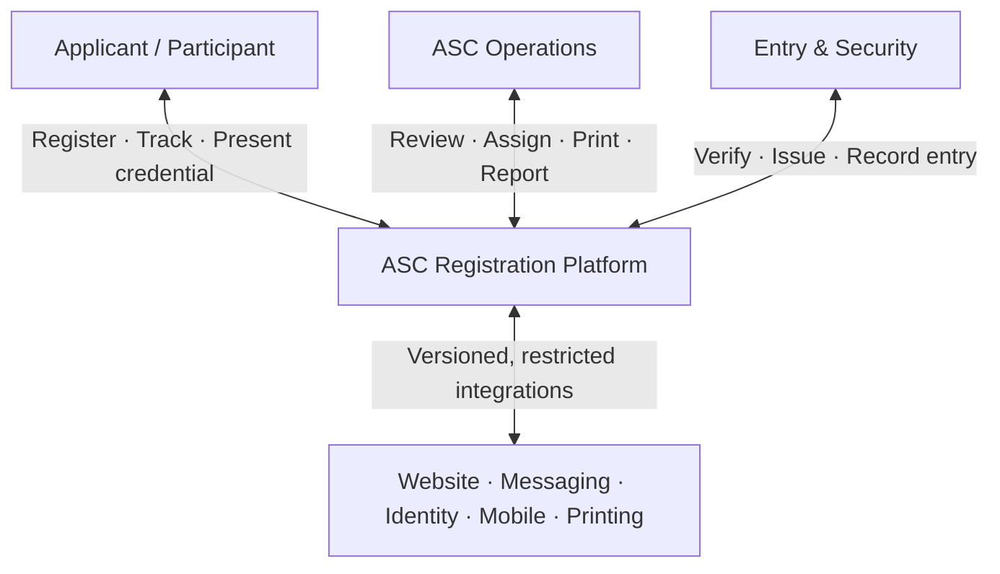
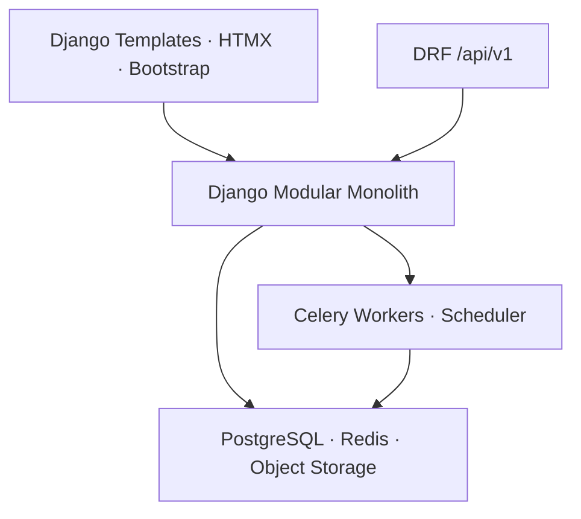
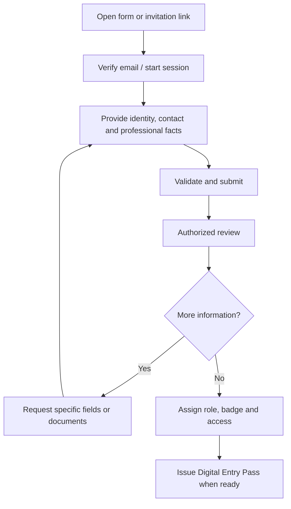
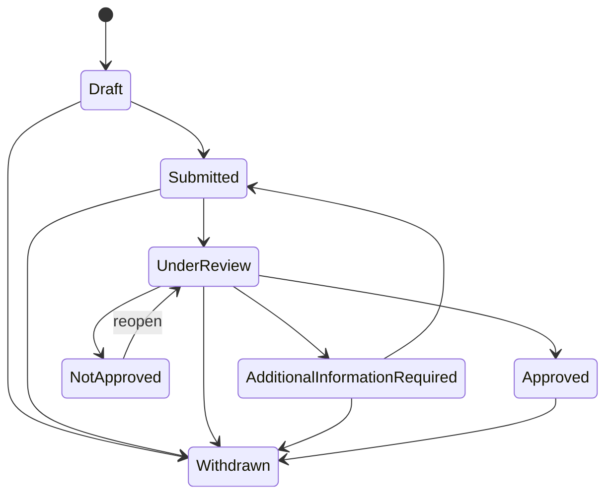
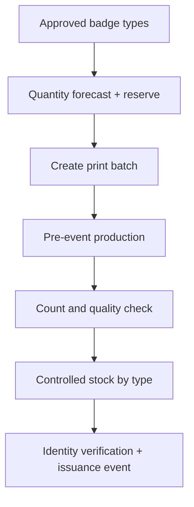
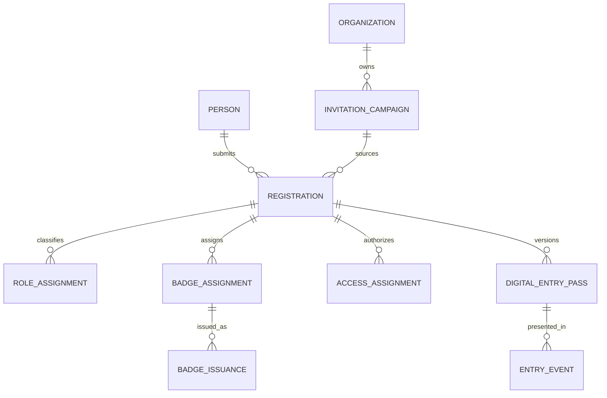
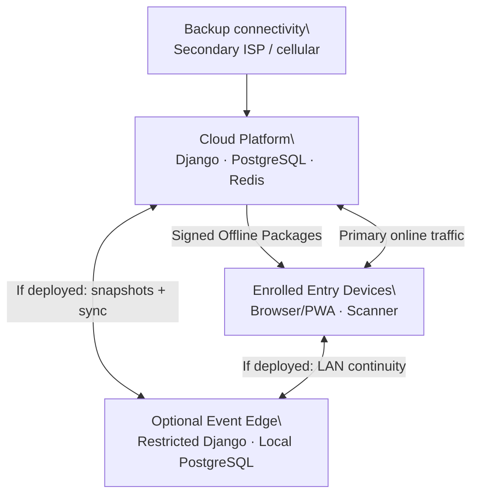
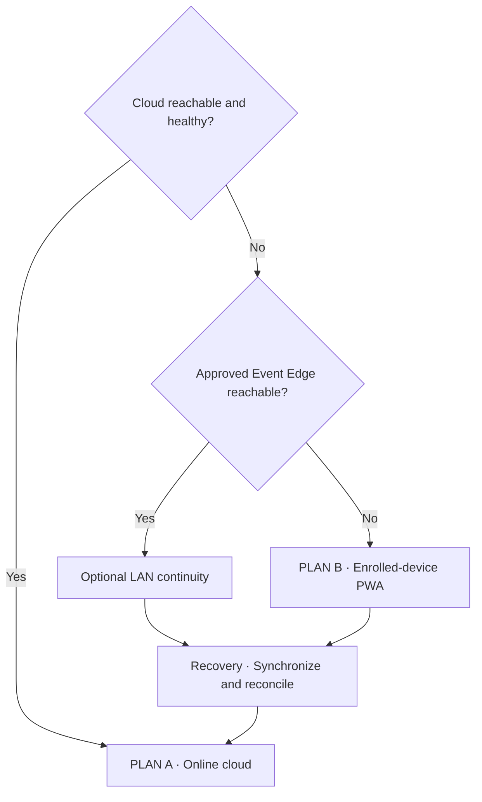
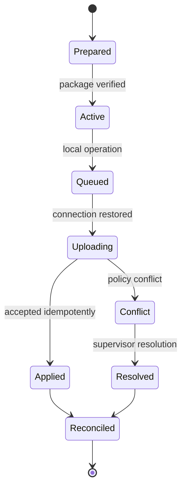
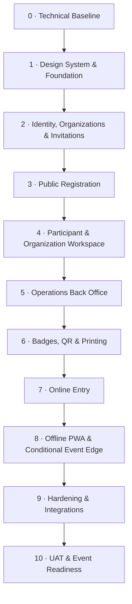

# ASC 2026 Registration Platform

## Technical Requirements Document

**African Startup Conference 2026**  
**Web Registration, Accreditation, Badge and Entry Management Platform**

> **Document purpose**
>
> Define the final technical baseline for implementing, securing, deploying, operating and testing the ASC 2026 Registration Platform.

> **Central product rule**
>
> Registration is universal and neutral. A registrant never selects a participant role, badge type or access level. Authorized users assign those attributes after review.

| Attribute | Value |
| --- | --- |
| Document type | Technical Requirements Document |
| Document identifier | ASC-REG-TRD |
| Status | Final |
| Version | 1.1 |
| Date | September 2026 |
| Document language | English |
| Product languages | English, French and Arabic |
| Primary stack | Django, PostgreSQL, Django Templates, HTMX, Bootstrap 5 |
| Architecture | Cloud-primary modular monolith with enrolled-device PWA continuity and an optional Event Edge |

---

# 1. Document Control

## 1.1 Audience and ownership

| Attribute | Value |
| --- | --- |
| Owner | ASC 2026 Registration Platform Project Team |
| Audience | Architecture, backend, frontend, DevOps, QA, security, operations and integration teams |
| Product source | ASC 2026 Registration Platform PRD |
| Technical authority | Approved architecture decisions and this TRD |
| Change control | Material deviations require an Architecture Decision Record (ADR) and product-impact review |

## 1.2 Normative language

- **MUST** and **MUST NOT** are mandatory release requirements.
- **SHOULD** and **SHOULD NOT** are recommended defaults; exceptions require a documented reason.
- **MAY** indicates an optional capability.

Requirement labels are used consistently:

- `[REQUIRED]`: mandatory for the relevant release gate.
- `[RECOMMENDED]`: preferred implementation or operating practice.
- `[DEFERRED]`: intentionally outside the initial release.
- `[OPEN DECISION]`: a bounded decision that must be closed before the named milestone.
- `[CONDITIONAL]`: required only when the named deployment option or policy is approved.
- `[OUT OF SCOPE]`: excluded from this web-platform project.

## 1.3 Related documents

| Document | Relationship |
| --- | --- |
| ASC Registration Platform PRD | Product scope, user needs, business rules and acceptance baseline |
| UI/UX Design Specification | Screen inventory, responsive behavior and component usage |
| Backend Schema and Data Model Specification | Authoritative logical schema, constraints and implementation rules derived from this TRD |
| Application Flow Specification | Application events, state transitions, alternate paths and permission boundaries |
| Implementation Plan | Tickets, sequencing, evidence and operational handover |

# 2. Executive Summary

The platform MUST be implemented as a secure server-rendered web application built on Django and PostgreSQL. It will support public registration, organization invitations, participant self-service, administrative qualification, badge assignment, pre-event badge production, entry verification and restricted security operations.

The solution uses a **modular monolith** to keep delivery and operations understandable while preserving clear domain boundaries. Django Templates, Bootstrap 5 and HTMX provide the primary web experience. Alpine.js MAY be used for small isolated interactions; the product MUST NOT become a client-side SPA.

Production is **cloud-primary**. When Internet connectivity is healthy, every operation uses the cloud platform as the source of truth. Event continuity is provided by enrolled entry devices that receive a signed, encrypted and minimal offline package. An on-site Event Edge with a restricted application and local PostgreSQL database is optional and is deployed only after the approved operational go/no-go decision. The cloud remains authoritative after synchronization and reconciliation.

The architecture deliberately separates a person, their registrations, badge assignments, credentials, physical badge issuance and entry events. A single person MAY legitimately hold multiple registrations and multiple badge assignments, including different badge types originating from different inviting organizations.

## 2.1 Technical outcomes

| ID | Required outcome |
| --- | --- |
| ARCH-001 | One neutral registration flow for all applicants; no public badge or role selection |
| ARCH-002 | Direct authorized operations governed by roles, groups and permissions; no second-user approval chain |
| ARCH-003 | Minimal collection and storage of sensitive identity material |
| ARCH-004 | Multiple registrations and contextual badge assignments for the same person |
| ARCH-005 | Signed QR credentials with no direct personal or identity-document data |
| ARCH-006 | Cloud-primary operation with tested enrolled-device PWA continuity and conditional Event Edge support |
| ARCH-007 | English, French and Arabic support, including complete RTL behavior |
| ARCH-008 | Auditable security-sensitive actions without secrets or sensitive values in logs |

# 3. Scope and Technical Boundaries

## 3.1 In scope

`[REQUIRED]` The web platform includes:

- public and invitation-linked registration;
- passwordless participant access and participant self-service;
- organizations, memberships, delegations and invitation campaigns;
- review, qualification, status management and direct authorized assignments;
- badge types, contextual badge assignments and signed credentials;
- pre-event print batches and event-time physical badge issuance records;
- online and offline entry verification using QR, NIN, passport or registration reference;
- role/group/permission management and restricted external security access;
- multilingual notifications, controlled exports, dashboards and audit history;
- cloud, Event Edge and enrolled-device continuity capabilities;
- versioned APIs for approved mobile and external integrations.

## 3.2 Outside the technical boundary

- `[OUT OF SCOPE]` Native or cross-platform ASC mobile application development.
- `[OUT OF SCOPE]` Conference agenda, matchmaking, chat, Deal Rooms, stands, payments and lead retrieval.
- `[OUT OF SCOPE]` Public self-selection of participant role, badge or access zone.
- `[OUT OF SCOPE]` A workflow requiring another user to approve ordinary authorized actions.
- `[OUT OF SCOPE]` Default collection of identity-document scans from every participant.
- `[DEFERRED]` General-purpose multi-event SaaS tenancy beyond event-edition isolation.

## 3.3 Boundary contracts

The official ASC website links to the registration platform. The mobile application, if connected, consumes only approved versioned APIs and MUST NOT read the platform database. Identity, messaging and badge-printing providers are adapters behind internal service interfaces.

The web application remains responsible for registration and accreditation even if another team develops a mobile experience.

# 4. Architecture Principles

| ID | Principle | Mandatory interpretation |
| --- | --- | --- |
| ARC-PR-001 | Neutral registration | Forms collect facts, not requested status or prestige |
| ARC-PR-002 | Server authority | All authorization and business rules are enforced server-side |
| ARC-PR-003 | Modular monolith | One deployable codebase with explicit domain modules and service boundaries |
| ARC-PR-004 | Data minimization | Do not collect, expose or retain data without an operational need |
| ARC-PR-005 | Direct authorized actions | Permissioned changes execute immediately and are audited |
| ARC-PR-006 | Append history | Digital Entry Passes, issuance, entry and audit events retain lifecycle history |
| ARC-PR-007 | Public identifiers | URLs, QR payloads and APIs use non-sequential public identifiers |
| ARC-PR-008 | Cloud source of truth | Normal operation and final reconciliation are cloud-authoritative |
| ARC-PR-009 | Graceful continuity | Critical event operations continue at the Edge and, finally, on enrolled devices |
| ARC-PR-010 | Secure defaults | Deny by default, least privilege, MFA for staff and redacted observability |
| ARC-PR-011 | Progressive enhancement | Core web workflows work without large client-side frameworks |
| ARC-PR-012 | Testable decisions | Business rules live in services/policies and have automated tests |

# 5. System Context



## 5.1 Actors and trust zones

| Zone | Actors/components | Trust rule |
| --- | --- | --- |
| Public Internet | Applicants, participants, official website | Untrusted; rate-limited and validated |
| Staff application | ASC staff and authorized delegates | Authenticated; permission checked per action |
| Security operations | Internal or external security personnel | Restricted dataset and task-specific permissions |
| Integration boundary | Messaging, identity, mobile and print services | Explicit contract, credentials and audit trail |
| Event network | Edge Server, enrolled devices, scanners and workstations | Segmented network; devices enrolled and identifiable |
| Data services | PostgreSQL, Redis, object storage, backup store | Private network; encryption and managed access |

## 5.2 Interface spaces

The platform MUST expose four clearly separated interface spaces:

1. **Public Registration** — neutral registration and invitation entry.
2. **Participant Workspace** — status, corrections, requested information and credentials; organization capabilities appear only when permissioned.
3. **Operations Back Office** — review, assignments, campaigns, badges, printing, reporting and configuration.
4. **Entry & Security** — fast verification, badge issuance and entry recording with minimum necessary data.

# 6. Solution Architecture



## 6.1 Runtime components

| Component | Responsibility | Requirement |
| --- | --- | --- |
| Reverse proxy / load balancer | TLS termination, routing, request limits, static caching | `[REQUIRED]` |
| Django web application | HTML routes, domain services, staff/security UI | `[REQUIRED]` |
| Django REST Framework | Device, mobile and external integration APIs only | `[REQUIRED]` |
| PostgreSQL | Transactional system of record | `[REQUIRED]` |
| Redis | Cache, rate-limit state and task broker where appropriate | `[REQUIRED]` |
| Celery workers | Email/SMS, document generation, exports, Offline Package builds and long-running tasks | `[REQUIRED]` |
| Object storage | Private documents, generated exports and print artifacts | `[REQUIRED]` |
| Observability stack | Metrics, structured logs, traces and error reporting | `[REQUIRED]` |
| Event Edge | Optional restricted operational application and local database | `[CONDITIONAL]` after the operational go/no-go decision |

## 6.2 Deployment shape

`[REQUIRED]` The cloud web tier MUST be horizontally scalable and stateless. Session state MUST use signed/encrypted cookies or shared server-side storage; local disk MUST NOT hold authoritative uploads or generated artifacts.

`[REQUIRED]` Database changes MUST use reviewed Django migrations. Destructive or long-locking migrations require a staged expand/migrate/contract procedure.

`[RECOMMENDED]` Use containerized deployments, immutable images and environment-based configuration with secrets supplied by a secret manager.

## 6.3 Architectural exclusions

- No microservice split during initial delivery.
- No React/Next.js/Tailwind rewrite of the purchased Finder template.
- No generic offline caching of the public or back-office application.
- No direct database integration for mobile or external systems.
- No business-critical rule hidden only in a template, JavaScript or Django signal.

# 7. Frontend Architecture

## 7.1 Technology baseline

| Layer | Choice | Rule |
| --- | --- | --- |
| Rendering | Django Templates | Primary page rendering |
| Design system | Finder HTML edition v2.0.0 / Bootstrap 5 | Reuse selectively as a design system |
| Dynamic interactions | HTMX | Server-rendered fragments and progressive enhancement |
| Small client state | Alpine.js | Sparingly, isolated by component |
| Styling | Bootstrap utilities plus project tokens | No parallel utility framework |
| Icons/fonts | Locally hosted approved assets where licensing permits | Inventory and minimize shipped assets |

`FE-001 [REQUIRED]` The Finder package MUST be treated as a component source, not copied wholesale into production.

`FE-002 [REQUIRED]` An asset inventory MUST identify retained CSS, JavaScript, fonts, icons and licenses. Unused demo pages and plugins MUST be removed.

`FE-003 [REQUIRED]` Project overrides MUST live in project-owned source files and design tokens; vendor files MUST remain traceable and replaceable.

## 7.2 Template structure

```text
templates/
  layouts/          base_public, base_workspace, base_operations, base_entry
  components/       form fields, alerts, tables, cards, status chips, modals
  partials/         HTMX fragments
  public/
  workspace/
  operations/
  entry/
static/
  vendor/finder/    approved minimal vendor assets
  src/              project SCSS/CSS and JavaScript
  dist/             versioned production build
```

`FE-004 [REQUIRED]` Template inclusion and component macros MUST keep markup consistent across languages and spaces.

`FE-005 [REQUIRED]` HTMX endpoints MUST enforce normal CSRF, authentication, permission and validation rules. An HTMX request is not a trusted request.

`FE-006 [REQUIRED]` The entry workflow MUST support keyboard-only operation, scanner input and immediate visual feedback.

## 7.3 PWA boundary

The service worker MUST be scoped only to the Entry & Security origin or path. It MAY cache the restricted shell and approved offline data. It MUST NOT control the public registration or general back-office pages.

Application updates MUST NOT interrupt an active verification or issuance operation. Pending local operations are synchronized before an operator is prompted to refresh.

# 8. Registration and Invitation Workflows

## 8.1 Registration journey



## 8.2 Core workflow requirements

- `REG-001 [REQUIRED]` The public form MUST NOT expose badge type, internal participant role or access profile choices.
- `REG-002 [REQUIRED]` Draft data MUST be saved explicitly or automatically with visible status and safe retry behavior.
- `REG-003 [REQUIRED]` Submission MUST be idempotent and return a public registration reference.
- `REG-004 [REQUIRED]` A person match MAY link a new registration to an existing Person; it MUST NOT silently discard the new registration.
- `REG-005 [REQUIRED]` Multiple registrations for the same person are valid and remain independently auditable.
- `REG-006 [REQUIRED]` Additional-information requests MUST identify the exact fields or documents requested and their status.
- `REG-007 [REQUIRED]` Identity documents MUST NOT be requested by default. A document request is explicit, purpose-bound and access-restricted.
- `REG-008 [REQUIRED]` Participant-visible status MUST be simpler than internal workflow status.
- `REG-009 [REQUIRED]` Authorized on-site registration uses the same universal rules and audit controls. It operates against the cloud by default; offline creation is available only when the optional Event Edge is approved and active. Otherwise, the operational runbook uses a controlled manual contingency until cloud service returns.
- `REG-010 [REQUIRED]` Verified email is mandatory for participant self-service. Mobile is required for Algerian participants and optional for international participants unless an approved operational policy requires it.

## 8.3 Organization invitations

An invitation targets an organization, ministry, authority, delegation or campaign—not necessarily a named individual. A link MAY be reusable within configured dates and limits.

- `INV-001 [REQUIRED]` The invitation token MUST be unguessable, hashed at rest and revocable.
- `INV-002 [REQUIRED]` Registration created from a valid link MUST retain the invitation, campaign and inviting-organization provenance.
- `INV-003 [REQUIRED]` The participant's own organization and the inviting organization MUST remain separate fields.
- `INV-004 [REQUIRED]` Invitation provenance MUST NOT automatically determine badge type or accreditation outcome.
- `INV-005 [REQUIRED]` Authorized organization delegates MAY see and manage only registrations within their granted organization scope.
- `INV-006 [REQUIRED]` Usage count, expiration, status and optional domain restrictions MUST be configurable.

## 8.4 State model



This diagram shows only the participant-facing Registration status. Internal processing status, accreditation decision status and Digital Entry Pass status are separate state machines and MUST NOT be collapsed into this field. Operational cancellation is recorded internally and is presented to the participant as `Withdrawn`.

All transitions MUST be performed by a domain service, permission checked, timestamped and audited. Transition reasons are required for not-approved decisions, cancellation, revocation and manual overrides.

# 9. Participant and Organization Workspace

## 9.1 Participant capabilities

The workspace MUST provide:

- current public status and outstanding actions;
- profile correction within policy-controlled fields;
- response to additional-information requests;
- credential display/download for each active badge assignment;
- communication preferences and language choice;
- withdrawal request and support contact path;
- clear separation when several contextual badge assignments exist.

`WORK-001 [REQUIRED]` A participant MUST see only their own records unless granted an organization capability.

`WORK-002 [REQUIRED]` Sensitive identity values MUST be masked after initial entry and must require a controlled re-verification flow to change.

## 9.2 Organization delegate capabilities

Organization functionality is permission-based within the same workspace; it is not a separate identity system.

| Capability | Default delegate behavior |
| --- | --- |
| View campaign registrations | Organization scope only |
| Invite or register a participant | Allowed only when granted |
| Correct participant data | Limited fields; changes audited |
| View badge assignment | Status/type only when permitted |
| Decide accreditation | Denied by default |
| Export data | Denied unless specifically granted |

`WORK-003 [REQUIRED]` Delegates MUST NOT infer access to every participant associated with an organization. Scope comes from explicit memberships and permissions.

# 10. Operations Back Office

## 10.1 Operational modules

The back office MUST include queues and detail views for:

- new, incomplete, duplicate-suspected and additional-information registrations;
- organizations, memberships, campaigns and invitations;
- qualification, internal roles, badge types and access profiles;
- credentials, revocations and replacements;
- print batches, badge stock and issuance exceptions;
- entry events, denied attempts and device status;
- communications, exports, dashboards and audit events.

## 10.2 Action model

`OPS-001 [REQUIRED]` A user with the correct permission performs an action directly. The application MUST NOT add a second-user approval workflow for ordinary operations.

`OPS-002 [REQUIRED]` Destructive or high-impact actions require a confirmation dialog, a reason where applicable and an audit event. Confirmation is not a second-person approval.

`OPS-003 [REQUIRED]` Every list MUST support server-side filtering, pagination and export only when the caller has the separate export permission.

`OPS-004 [REQUIRED]` Bulk actions MUST validate every target. The result MUST distinguish succeeded, skipped and failed records; partial execution MUST be explicit.

`OPS-005 [REQUIRED]` Operators MUST be able to see the source registration and invitation provenance when assigning a contextual badge.

## 10.3 Safe concurrency

Review and assignment services SHOULD use optimistic locking or a current-version check. Conflicting edits MUST produce a visible conflict response rather than silently overwriting a newer decision.

# 11. Badge and Printing Architecture

## 11.1 Concept separation

| Concept | Meaning |
| --- | --- |
| Badge Type | Configurable category such as General, VIP or Staff |
| Participant Role Assignment | Contextual functional or protocol classification for one Registration |
| Badge Assignment | Contextual decision connecting a Registration to one generic Badge Type |
| Access Assignment | Contextual Access Profile containing zone, gate and time rules |
| Digital Entry Pass | Signed digital proof for one Registration and assignment snapshot |
| Physical Badge | Generic printed stock or template identified primarily by Badge Type |
| Print Batch | Controlled pre-event production unit |
| Badge Issuance Event | Record that a physical badge was handed to a verified person |

`BADGE-001 [REQUIRED]` A Person MAY have more than one active Badge Assignment. The system MUST NOT impose a unique Person–Badge Type or Person–Event constraint that invalidates legitimate contextual assignments.

`BADGE-002 [REQUIRED]` Every Participant Role, Badge and Access Assignment MUST retain the source Registration, assigning actor, reason/context, status and timestamps in its own independently permissioned history.

`BADGE-003 [REQUIRED]` One Registration MAY have multiple historical Digital Entry Pass versions, but no more than one current Ready or Active pass at a time.

`BADGE-004 [REQUIRED]` Revoking or replacing one Digital Entry Pass MUST NOT automatically revoke unrelated assignments or passes for the same Person.

## 11.2 Pre-event printing

Official physical badges are produced before the event in generic designs by Badge Type. They SHOULD avoid participant-specific printing unless a later approved operational decision requires it.



- `PRINT-001 [REQUIRED]` Print batches MUST record type, quantity, template version, supplier/printer, creator and status.
- `PRINT-002 [REQUIRED]` Received, spoiled, reserved and issued quantities MUST reconcile.
- `PRINT-003 [REQUIRED]` Badge stock adjustments require a reason and audit event.
- `PRINT-004 [REQUIRED]` On-site printing is an exception capability, not the standard entrance flow.
- `PRINT-005 [RECOMMENDED]` A limited exception printer and tested consumables should be available on site.

## 11.3 Digital Entry Pass payload

The QR MUST carry a compact signed envelope with minimal claims. The preferred baseline is JWS using an asymmetric ES256 signing key; an alternative compact standard requires an ADR.

| Claim | Purpose |
| --- | --- |
| `v` | Payload schema version |
| `eid` | Event-edition public code |
| `pid` | Event-scoped pseudonymous participant reference |
| `bai` | Badge Assignment public reference |
| `btc` | Badge Type code |
| `jti` | Unique credential identifier |
| `nbf`, `exp` | Validity window |
| `kid` | Signing-key identifier |

`QR-001 [REQUIRED]` The QR MUST NOT contain name, email, phone, NIN, passport number, document image, database primary key or authorization role.

`QR-002 [REQUIRED]` Online validation MUST confirm signature, event, time window, active status, revocation and assignment status. The server response is authoritative.

`QR-003 [REQUIRED]` Offline validation MUST verify the signature using a trusted public key and resolve the public references in the active Offline Package.

`QR-004 [REQUIRED]` A valid QR proves credential integrity, not physical identity. The operator MAY require NIN, passport or another approved identity check.

`QR-005 [REQUIRED]` Copy/replay risk MUST be mitigated through status checks, entry-event visibility, identity confirmation and operator warnings; a copied visual code cannot be made physically uncopyable.

## 11.4 Key lifecycle

Signing private keys MUST reside in a managed key service or protected secret store and MUST NOT be placed in source control, environment files committed to the repository or Offline Packages. Verification public keys MAY be distributed in a signed key set. Rotation MUST preserve validation for Digital Entry Passes still within their accepted lifecycle.

# 12. Entry and Security Operations

## 12.1 Verification paths

Entry personnel can locate and verify a participant using:

1. signed QR credential;
2. NIN entry;
3. passport number entry;
4. registration reference;
5. restricted manual search when separately permissioned.

`ENTRY-001 [REQUIRED]` Entry screens MUST expose only operationally necessary fields: display name, optional approved photograph, masked identity hint, badge type, access result, status and concise reason.

`ENTRY-002 [REQUIRED]` Full identity values, documents, notes, exports and unrelated registrations MUST remain hidden from ordinary security users.

`ENTRY-003 [REQUIRED]` The operator MUST see the active mode—Online, Offline Edge or Device Offline—and the freshness time of local data.

`ENTRY-004 [REQUIRED]` Every verification and entry decision MUST record source device, Gate, operator where available, time, mode, result and idempotency identifier.

`ENTRY-005 [REQUIRED]` Denied or suspicious attempts MUST be visible to authorized supervisors without disclosing unnecessary personal data.

## 12.2 Identity lookup without stored clear-text indexes

Normalized NIN and passport values MUST be encrypted at field level when retained. A separate keyed fingerprint MAY support exact matching:

```text
lookup_fingerprint = HMAC(lookup_key, identity_type || issuer || normalized_value)
```

The lookup key MUST be separate from database encryption keys. Fingerprints MUST NOT be usable for display. Offline Packages MAY include device-scoped fingerprints and masked hints, but never the full values.

## 12.3 Device and entry-point management

Each device MUST be enrolled, named, assigned to a Gate or checkpoint scope, and capable of revocation. Device records include public identifier, platform/browser version, last synchronization, Offline Package version, operator/session status and health.

Dedicated USB 2D QR scanners are recommended for high-throughput desks. Camera scanning MAY be provided as a backup.

# 13. Backend Application Architecture

## 13.1 Django application boundaries

| Django app | Primary responsibility |
| --- | --- |
| `core` | Shared primitives, public IDs, configuration and common utilities |
| `accounts` | Users, authentication, groups, permissions, sessions and MFA |
| `events` | Event editions, dates, venues, zones and Gates |
| `people` | People, identity references, matching and contact data |
| `organizations` | Organizations, memberships and delegations |
| `invitations` | Campaigns, invitation links, usage and provenance |
| `registrations` | Registration profile, workflow, requests and qualification |
| `badges` | Badge types, assignments, credentials, printing and issuance |
| `entry` | Devices, Offline Packages, verification, synchronization and entry events |
| `communications` | Templates, localization and message delivery |
| `documents` | Purpose-bound requests, private files and lifecycle |
| `audit` | Append-oriented audit events and authorized search |

`BE-001 [REQUIRED]` Apps MUST communicate through documented service functions and selectors rather than arbitrary cross-app model mutation.

## 13.2 Internal layers

```text
models.py / models/       persistence and local invariants
services.py / services/   commands, transactions and state changes
selectors.py              optimized read queries and projections
policies.py               permission and scope decisions
forms.py / serializers.py input validation and presentation contracts
tasks.py                  idempotent asynchronous work
admin.py                  limited technical administration only
```

- `BE-002 [REQUIRED]` State changes MUST occur in service-layer functions wrapped in explicit database transactions where atomicity is required.
- `BE-003 [REQUIRED]` Complex side effects MUST use an outbox or `transaction.on_commit` pattern so messages are not sent for rolled-back data.
- `BE-004 [REQUIRED]` Django signals MUST be limited to simple technical hooks; they MUST NOT contain hidden cross-domain workflows.
- `BE-005 [REQUIRED]` Selectors MUST prevent N+1 queries in operational lists and detail pages.
- `BE-006 [REQUIRED]` Celery tasks MUST be idempotent, retry-safe and observable.

## 13.3 Identifier strategy

Internal database keys MAY use integers for storage efficiency. Every externally exposed resource MUST also have a random public identifier, such as UUIDv7 or another approved non-sequential format. Human-facing references SHOULD be short, checksummed and event-scoped.

## 13.4 Transaction boundaries

The following commands require a single atomic transaction or compensating outbox design:

- submit registration and allocate reference;
- perform status transition and record audit;
- create badge assignment and issue credential;
- revoke/replace credential;
- issue physical badge and decrement stock;
- record entry event and duplicate-entry indicator;
- stage offline operation and local result.

# 14. Domain and Data Model

## 14.1 Core relationship model



This model intentionally permits one Person to have many Registrations and many Badge Assignments. Duplicate detection informs operators; it does not collapse valid contexts.

## 14.2 Entity catalogue

| Entity | Essential fields/notes |
| --- | --- |
| EventEdition | public ID, code, dates, timezone, status |
| ParticipantAccount | one active account per Person in V1, one or more verified login-enabled email ContactPoints, state and locale |
| OperationalUser | named staff/external account, authentication source, MFA state and validity |
| Person | public ID, names, contacts, preferred locale, minimal profile |
| IdentityReference | type, issuer/country, encrypted value, fingerprint, masked value, verification state |
| Organization | public ID, canonical name, type, country, status |
| ScopedGroupMembership | operational user, group, event/organization/gate scope and validity |
| InvitationCampaign | organization, token hash, validity, limit, usage and status |
| Registration | person, event, source, invitation, public reference, public/internal status, version |
| RegistrationProfile | structured answers, objectives, organization facts, provenance |
| PersonMatch | candidate pair, evidence, score, decision and actor |
| BadgeType | code, localized name, visual reference, active state |
| RoleAssignment | registration, participant role, context, lifecycle and audit actor |
| BadgeAssignment | registration, badge type, context, lifecycle and audit actor |
| AccessAssignment | registration, access profile, context, lifecycle and audit actor |
| DigitalEntryPass | registration, assignment snapshots, version, signed payload hash, key ID, validity and status |
| PrintBatch | badge type, template version, quantity and lifecycle |
| PrintBatchItem | optional serial/stock unit and status |
| BadgeIssuanceEvent | assignment, stock/batch, verifier, method, time, mode |
| EntryDevice | public ID, enrollment, Gate/checkpoint scope, status and sync state |
| Gate | event, venue, zone, name, policy and active state |
| OfflinePackage | version, device scope, signature, encryption, validity and data cutoff |
| SyncOperation | device operation ID, type, payload, local result and sync state |
| EntryEvent | registration/pass, gate, device, result, mode and time |
| InformationRequest | registration, participant-safe request, items, status and deadline |
| Document | registration, request item, purpose, protected object and lifecycle |
| MessageTemplate | channel, language, event and version |
| CommunicationMessage | template/version, recipient reference, status and provider ID |
| AuditEvent | actor, action, target, result, time, reason and redacted changes |

## 14.3 Data constraints

- `DATA-001 [REQUIRED]` Do not enforce uniqueness on Person plus EventEdition in Registration.
- `DATA-002 [REQUIRED]` Do not enforce uniqueness on Person plus BadgeType.
- `DATA-003 [REQUIRED]` Enforce one current Ready or Active Digital Entry Pass per Registration with a conditional database constraint.
- `DATA-004 [REQUIRED]` Public IDs, Digital Entry Pass identifiers, registration references and device operation IDs are unique.
- `DATA-005 [REQUIRED]` Entry and audit events are append-oriented. Corrections create linked events rather than destructive edits.
- `DATA-006 [REQUIRED]` Organization provenance on a submitted Registration cannot be silently replaced.
- `DATA-007 [REQUIRED]` All event-time timestamps are stored in UTC and rendered in the event timezone.

## 14.4 Matching and duplicate handling

Person matching SHOULD combine exact keyed identity fingerprints, verified email/phone and normalized biographical signals. Automated matching produces candidates and confidence evidence. It MUST NOT automatically merge conflicting people. Merge and split operations are restricted, reversible through recorded linkage and fully audited.

# 15. API and Integration Architecture

## 15.1 API boundary

The server-rendered web interface MUST call domain services directly. Django REST Framework is reserved for approved external or device boundaries:

| Namespace | Consumer | Examples |
| --- | --- | --- |
| `/api/v1/entry/` | Enrolled devices and optional Event Edge | Offline Packages, verification, operations and synchronization |
| `/api/v1/mobile/` | Separate mobile project | approved participant status/profile subset |
| `/api/v1/integrations/` | Trusted services | identity checks, callbacks, controlled exchange |
| `/api/v1/webhooks/` | Approved providers | delivery and verification callbacks |

## 15.2 Contract requirements

- `API-001 [REQUIRED]` All APIs MUST be versioned and documented in OpenAPI.
- `API-002 [REQUIRED]` APIs MUST expose public identifiers, never raw internal primary keys.
- `API-003 [REQUIRED]` Mutating endpoints used by devices/integrations MUST accept an idempotency key.
- `API-004 [REQUIRED]` Errors MUST use a consistent machine-readable structure with correlation ID and safe human message.
- `API-005 [REQUIRED]` Pagination, filtering, ordering and field visibility MUST be explicit.
- `API-006 [REQUIRED]` Rate limits MUST vary by public, authenticated, device and integration client class.
- `API-007 [REQUIRED]` Breaking changes require a new API version or a documented compatibility period.

## 15.3 Integration adapters

Messaging, identity verification, object storage and printing MUST be represented by internal adapter interfaces. Provider-specific payloads MUST not leak into core domain models.

Inbound callbacks require signature/authentication checks, timestamp/replay protection, schema validation and idempotent processing. Outbound calls use bounded timeouts, retry policies and a dead-letter/reconciliation view.

## 15.4 Mobile boundary

The mobile application MAY receive an approved minimal profile and credential/status information. It MUST NOT receive identity-document values, document images, internal review notes, broad organization lists, permission assignments or unrestricted entry history.

# 16. Authentication and Access Control

## 16.1 Authentication methods

| Actor | Baseline authentication |
| --- | --- |
| Applicant/participant | Email OTP or magic link; step-up check for sensitive changes |
| ASC staff | Named account, strong password or SSO, mandatory MFA |
| Organization delegate | Named account, verified email, MFA when elevated |
| External security user | Named, time-bounded account with MFA |
| Entry device / Edge | Device enrollment credential plus operator session where applicable |
| System integration | Rotatable client credential or signed service identity |

Shared staff or security accounts MUST NOT be used.

## 16.2 Authorization model

Permissions are granted directly or through Django Groups representing operational roles. Object scope is evaluated separately.

```text
allow = authenticated
        AND permission_granted(action)
        AND object_in_scope(user, object)
        AND contextual_policy_allows(action, object, mode)
```

Example role groups:

| Group | Typical capabilities |
| --- | --- |
| Registration Reviewer | View and review scoped registrations; request information |
| Qualification Manager | Assign internal role, badge type and access profile |
| Invitation Manager | Manage organizations, campaigns and links |
| Badge Operations | Print batches, stock and issuance |
| Entry Operator | Verify and record entry only |
| Entry Supervisor | Resolve exceptions and view device/entry status |
| Security Auditor | Read restricted entry and audit evidence |
| Platform Administrator | Technical configuration; not automatic access to all sensitive data |

`AUTHZ-001 [REQUIRED]` Every view, HTMX endpoint, task-trigger, API endpoint and export MUST enforce authorization server-side.

`AUTHZ-002 [REQUIRED]` Staff privilege changes, MFA resets and device enrollment/revocation MUST be audited.

`AUTHZ-003 [REQUIRED]` External security access MUST be least-privileged, event-bounded and easy to disable.

`AUTHZ-004 [REQUIRED]` Django superuser access is break-glass technical access, not an ordinary operational role.

# 17. Security and Privacy

## 17.1 Data classification

| Class | Examples | Control baseline |
| --- | --- | --- |
| Public | Event dates, public guidance | Normal integrity controls |
| Internal | Operational counts, non-sensitive configuration | Authenticated access |
| Personal | Contact data, applications and assignments | Least privilege, encryption, scope control and audit |
| Restricted | NIN/passport values, photograph, identity documents, security restrictions and protected audit content | Field/object encryption, purpose-bound permission, masking and strong audit |
| Secret | Signing keys, API credentials, recovery codes | Secret manager/HSM, rotation, never logged |

Security-restricted, audit-protected and temporary-sensitive are handling tags applied in addition to the base class. Temporary imports, exports, Offline Packages and generated files require approved expiry and removal rules.

## 17.2 Security controls

- `SEC-001 [REQUIRED]` TLS is mandatory for every cloud and event-network web/API connection.
- `SEC-002 [REQUIRED]` Cookies MUST use Secure, HttpOnly and appropriate SameSite settings; session rotation follows authentication and privilege change.
- `SEC-003 [REQUIRED]` CSRF protection is mandatory for browser mutations; CORS is denied unless explicitly configured.
- `SEC-004 [REQUIRED]` Content Security Policy, clickjacking protection, MIME sniffing protection and a strict referrer policy MUST be configured.
- `SEC-005 [REQUIRED]` User input is validated server-side and output escaped by default. HTML input is rejected unless a controlled sanitizer is justified.
- `SEC-006 [REQUIRED]` Uploads use allow-listed types, size limits, malware scanning, private object storage and time-limited signed access.
- `SEC-007 [REQUIRED]` Secrets MUST come from managed runtime configuration and undergo rotation.
- `SEC-008 [REQUIRED]` Dependencies and container images MUST be scanned; Critical/High exploitable findings block release.
- `SEC-009 [REQUIRED]` Audit and application logs MUST redact credentials, tokens, NIN, passport values and document URLs.
- `SEC-010 [REQUIRED]` Production data MUST NOT be copied into developer laptops, test fixtures or AI-assistant conversations.

## 17.3 Privacy engineering

For this platform, the Ministry of Knowledge Economy, Start-ups and Micro-enterprises is the Data Controller and platform operator. Processing controls shall support compliance with Algerian Law No. 18-07 on the protection of natural persons with regard to the processing of personal data, as amended and supplemented by Law No. 25-11. Final notices, legal bases, contact details and multilingual wording require legal and data-protection validation before public launch.

Identity-document upload is exceptional. An InformationRequest and its RequestItems record the purpose, requester, allowed type and lifecycle. Document access is separate from ordinary registration access.

Retention durations remain configurable and are finalized by the project owner with legal/data-protection input. The initial build MUST support expiry flags, removal/anonymization jobs and legal-hold exceptions without embedding an unnecessarily complex policy engine.

## 17.4 Threats requiring explicit tests

The security test plan MUST cover invitation-link guessing and leakage, account takeover, OTP abuse, authorization bypass, IDOR, export abuse, malicious upload, QR tampering, QR replay, device theft, stale offline data, sync forgery, audit tampering and privileged-insider misuse.

# 18. Offline and Business Continuity Architecture

## 18.1 Operating topology



## 18.2 Plan A and Plan B



Plan B supplements rather than replaces Plan A. Enrolled-device PWA continuity is mandatory for V1. The Event Edge is optional and is deployed only when the approved go/no-go criteria justify its operational cost and complexity. Primary and backup Internet connections MUST be prepared. The cloud remains the normal source of truth.

## 18.3 Supported modes

| Mode | Authority during operation | Capabilities |
| --- | --- | --- |
| Online | Cloud | Full authorized workflows |
| Device Offline | Enrolled device local store | Required V1 fallback for verification and queued entry events; no broad administration |
| Offline Edge | Optional Event Edge on LAN | Conditional verification, entry, issuance, controlled on-site registration and exception handling |
| Recovery | Cloud plus reconciliation service | Upload operations, resolve conflicts, publish refreshed snapshots |

`OFF-001 [REQUIRED]` Mode changes MUST be visible and based on repeated health checks, not one failed request.

`OFF-002 [REQUIRED]` An in-progress operation MUST complete against one authority. The application MUST NOT silently switch authority mid-transaction.

`OFF-003 [REQUIRED]` Every offline mutation MUST have a globally unique operation ID, device ID, local sequence, recorded time, operation type, schema version and integrity protection.

## 18.4 Offline Package

The Offline Package is a signed, encrypted, versioned, expiring and device/edition-scoped dataset. It contains only data needed for verification:

- event-scoped public participant reference;
- Badge Assignment and Digital Entry Pass public references and states;
- Badge Type/access result needed at assigned Gates;
- display name and optional approved small photograph;
- masked identity hints and device-scoped lookup fingerprints;
- Digital Entry Pass revocations and validity windows;
- package version, issue/expiry time and signing-key set.

It MUST NOT include full NIN/passport values, document images, email, phone, internal notes, full profiles or unrelated registrations. At rest on the device, the package MUST be encrypted using device-bound storage where available and removed on expiry, revocation or event closure.

## 18.5 Synchronization lifecycle



## 18.6 Conflict policy

| Data/operation | Default reconciliation rule |
| --- | --- |
| EntryEvent | Append and deduplicate by device operation ID |
| Verification attempt | Append; no destructive merge |
| Badge issuance | First valid issuance retained; conflicting issuance flagged for supervisor |
| Digital Entry Pass revocation | Newer valid cloud revocation wins; Edge event remains in history |
| Person/profile edit | Cloud value wins by default; an Edge correction becomes a review item |
| On-site registration | Operate online by default; if the Event Edge is deployed, create idempotently using Edge public IDs and match after upload without deleting provenance |
| Stock adjustment | Replay ledger events; discrepancy requires reconciliation |

`OFF-004 [REQUIRED]` Sync transport MUST authenticate the Edge/device, encrypt traffic, verify schema versions and process operations idempotently.

`OFF-005 [REQUIRED]` Recovery MUST present counts for uploaded, accepted, duplicate, rejected and conflict operations.

`OFF-006 [REQUIRED]` A cloud-loss, device-offline and recovery rehearsal is a release gate. Event Edge failover is included only when the Edge has been approved for deployment.

# 19. Infrastructure and Hardware Requirements

## 19.1 Cloud baseline

The production cloud environment MUST include:

- at least two stateless Django application instances during critical periods;
- managed or professionally operated PostgreSQL with point-in-time recovery;
- Redis with persistence/availability appropriate to its selected uses;
- separately scalable Celery workers and scheduler;
- private object storage with versioning or equivalent recovery protection;
- load balancer/reverse proxy, TLS certificates, DNS and web-application firewall/rate controls;
- centralized logs, metrics, traces, error reporting and alerting;
- encrypted backup storage in a separate failure domain.

Final instance sizes are determined by measured load tests. Vertical numbers in this document are minimum planning inputs, not a substitute for testing.

## 19.2 Event Edge baseline

This baseline applies only if the Event Edge go/no-go decision approves deployment. Event readiness does not otherwise depend on procuring or operating an Edge Server.

| Item | Recommended baseline |
| --- | --- |
| Primary Edge Server | 6–8 modern CPU cores, 16 GB RAM, 512 GB NVMe SSD, dual Ethernet |
| Backup Edge Server | Equivalent prepared unit or tested rapid-restore replacement |
| Power | Online UPS sized for server, core switch and router; safe shutdown capability |
| Database | Local PostgreSQL on encrypted storage |
| Network | Wired server/core paths, managed switches, isolated operational VLANs |
| Time | Local NTP with upstream synchronization when connectivity exists |
| Physical protection | Restricted, ventilated location with accountable access |

The Edge is not a general public server. It hosts only the functions and scoped data required for event continuity.

## 19.3 Connectivity and event network

- dual-WAN router with independent primary and backup Internet providers;
- business-grade wired switching and Wi-Fi 6 or better access points;
- separate networks/VLANs for servers, operations, entry devices and guests;
- firewall rules denying guest-to-operational and lateral device access;
- monitored link health and clear failover procedure;
- spare cables, switches, power adapters and scanner units.

## 19.4 Operator hardware

| Station | Minimum practical equipment |
| --- | --- |
| Entry desk | Modern laptop/desktop, 8 GB RAM, current supported browser, USB 2D scanner, wired network preferred |
| Security supervisor | Same plus access to exception/reconciliation dashboard |
| Badge issuance | Entry equipment plus controlled badge stock and optional receipt/label device |
| Exception printing | Tested badge printer, correct drivers, spare media/ribbon and calibrated template |
| Mobile fallback | Managed tablet/phone with tested camera, local encryption and charging plan |

## 19.5 Capacity sizing

The number of entry stations MUST be derived from the peak arrival rate and tested service time:

```text
stations = ceil((peak_arrivals_per_minute × average_service_seconds)
                / (60 × target_utilization))
```

Use a target utilization of at most 0.70 and add at least 20% spare capacity. A separate exception lane prevents complex cases from blocking normal verification.

`INFRA-001 [OPEN DECISION]` Registration volume, peak ten-minute arrivals, entry-point count and badge quantities must be confirmed before the performance-test baseline.

# 20. Deployment and Environments

## 20.1 Required environments

| Environment | Purpose | Data rule |
| --- | --- | --- |
| Local | Developer implementation and unit tests | Synthetic fixtures only |
| Staging | Integrated QA, UAT rehearsal and load preparation | Synthetic or explicitly sanitized data |
| Production Cloud | Authoritative public and operational service | Production controls and monitoring |
| Event Edge | Conditional continuity during the event | Scoped synchronized operational dataset only when approved |

## 20.2 Configuration and secrets

Configuration MUST be environment-specific and validated at startup. Secrets MUST use an approved secret store and MUST NOT be committed. Security-sensitive defaults MUST fail closed.

## 20.3 Delivery pipeline


- `DEP-001 [REQUIRED]` Main-branch changes require review and passing automated checks.
- `DEP-002 [REQUIRED]` Build artifacts are immutable and traceable to a commit and dependency lock.
- `DEP-003 [REQUIRED]` Database backup/restore and rollback steps are documented before production migrations.
- `DEP-004 [REQUIRED]` Static assets use content hashes and safe cache headers.
- `DEP-005 [REQUIRED]` Release health checks cover web, database, tasks, storage, messaging adapters and entry APIs.
- `DEP-006 [RECOMMENDED]` Use rolling or blue/green deployment when infrastructure permits.

## 20.4 Edge release process

If the Event Edge is approved, its software, schema, Offline Packages, public keys and configuration MUST be version-compatible. The Edge release package MUST be prepared and rehearsed before the event, with a signed checksum and offline installation procedure. Edge updates during live operations require explicit supervisor action.

# 21. Internationalization and Accessibility

## 21.1 Language implementation

Django gettext catalogs are the source of interface translations. Content templates store distinct English, French and Arabic variants with an explicit fallback policy.

- `I18N-001 [REQUIRED]` No user-facing string is hard-coded in Python, JavaScript or templates.
- `I18N-002 [REQUIRED]` Locale selection persists across public and authenticated sessions.
- `I18N-003 [REQUIRED]` Arabic pages set `lang="ar"` and `dir="rtl"`; mixed identifiers use deliberate direction isolation.
- `I18N-004 [REQUIRED]` Dates, numbers, names and phone values use locale-aware formatting without changing stored canonical values.
- `I18N-005 [REQUIRED]` Email/SMS templates are versioned and tested in all three languages.
- `I18N-006 [RECOMMENDED]` Use Noto Sans Arabic or IBM Plex Sans Arabic with an approved Latin companion and tested font loading.

## 21.2 Accessibility baseline

The product MUST target WCAG 2.2 AA. Required controls include semantic headings, explicit labels, keyboard access, visible focus, adequate contrast, error summaries, status announcements, logical reading order, minimum target sizes and no color-only meaning.

Entry and operations workflows MUST be tested with keyboard-only input and at least one screen reader. Responsive layouts MUST remain usable at 200% zoom.

# 22. Non-Functional Requirements

| ID | Requirement | Target / acceptance method |
| --- | --- | --- |
| NFR-PERF-001 | Ordinary page and synchronous UI action | p95 within 2 seconds under the approved capacity profile, excluding file transfer and external-provider delay |
| NFR-PERF-002 | Draft save, submission, permitted search and ordinary filtered list | p95 within 3 seconds under the approved capacity profile, excluding external-provider delay |
| NFR-PERF-003 | Online Digital Entry Pass or identity-reference validation | p95 result within 1.5 seconds under the approved checkpoint load |
| NFR-PERF-004 | Release load test | Pass at no less than 2 times the approved forecast peak concurrent load and transaction rate |
| NFR-OFF-PERF-001 | Offline QR verification | Local result within 500 ms on approved device class |
| NFR-CAP-001 | Peak capacity | Pass at 2× forecast peak arrival/registration load |
| NFR-AVL-001 | Normal availability | 99.5% monthly target excluding approved maintenance |
| NFR-AVL-002 | Critical event window | 99.9% cloud service target plus tested enrolled-device continuity; Event Edge continuity when deployed |
| NFR-DR-001 | Recovery point | Initial cloud RPO target: 15 minutes |
| NFR-DR-002 | Recovery time | RTO of 60 minutes during the event-critical window and 4 hours outside it |
| NFR-SEC-GATE-001 | Vulnerability gate | No unresolved Critical or High exploitable issue |
| NFR-A11Y-001 | Accessibility | WCAG 2.2 AA target with automated and manual evidence |
| NFR-I18N-001 | Languages | Complete tested English, French and Arabic journeys |
| NFR-AUD-001 | Audit coverage | 100% of listed sensitive commands create attributable audit evidence |
| NFR-SYNC-001 | Offline recovery | 100% of accepted local operations become applied, duplicate or explicit conflict |

These targets are the initial engineering baseline. Any changed target requires documented load evidence and an ADR/product decision.

## 22.1 Reliability rules

- External-provider failure MUST NOT corrupt the local transaction.
- Retryable background work uses exponential backoff with maximum attempts and visible terminal failure.
- User submissions and device operations are idempotent.
- Database constraints protect critical invariants in addition to application validation.
- Timeouts, circuit breakers or provider-disable switches protect core registration from slow integrations.

# 23. Monitoring, Backup and Recovery

## 23.1 Observability

The platform MUST emit structured logs, metrics, traces and error events with a common correlation ID. Logs MUST be redacted and MUST distinguish cloud, edge and device-originated operations.

Required dashboards include:

- request rate, latency, status codes and saturation;
- database connections, slow queries, locks, storage and replication/backup health;
- Celery queue depth, task latency, retries and failures;
- registrations, submissions, decisions, credential issuance and message delivery;
- QR/identity lookup rate, decision latency and denied/duplicate attempts;
- device enrollment, last sync, Offline Package age and offline operation backlog;
- integration availability and callback errors.

## 23.2 Alerting

Alerts MUST have an owner, severity, threshold and runbook. Critical alerts include public unavailability, database/storage failure, authentication anomaly, Offline Package expiry, high entry latency and backup verification failure. Edge synchronization alerts apply when the Event Edge is deployed.

## 23.3 Backup and restoration

- PostgreSQL uses encrypted automated backups and point-in-time recovery.
- Object storage uses versioning or an equivalent recoverable lifecycle.
- Configuration, templates and infrastructure definitions are version-controlled.
- Edge data is backed up locally during operation and synchronized as connectivity allows.
- Restore tests MUST be performed before launch and again before the event readiness gate.
- Backup success alone is insufficient; recovery evidence must confirm usable restored data.

## 23.4 Operational runbooks

Runbooks are required for cloud outage, ISP failover, device revocation, expired Offline Package, signing-key incident, message-provider outage, database recovery, stock discrepancy and recovery reconciliation. Event Edge activation is included only when the Edge is deployed.

# 24. Testing and Acceptance Strategy

## 24.1 Test layers

| Layer | Required coverage |
| --- | --- |
| Unit | Domain services, policies, validators, QR signing/verification and conflict rules |
| Model/database | Constraints, indexes, migrations and encrypted/fingerprint fields |
| Integration | PostgreSQL, Redis, Celery, storage and provider adapters |
| Web/E2E | Public, participant, delegate, operations and entry journeys |
| Permission matrix | Positive and negative action/object-scope checks for every group |
| Localization | Complete EN/FR/AR flow, RTL, messages, PDFs and emails |
| Accessibility | Automated scan plus keyboard, focus and screen-reader checks |
| Security | SAST, dependency/container scan, DAST and manual authorization abuse tests |
| Performance | Public submission, back-office queues, QR verification and sync at 2× forecast |
| Offline | Cloud loss, stale/invalid Offline Package, queue/retry/conflict/recovery, plus Edge loss when deployed |
| Printing | Template version, counts, scanner readability, stock and exception flow |
| Recovery | Database/object restore, Edge rebuild and key/config restoration |
| UAT | Product and operations scenarios with evidence |

## 24.2 Critical acceptance scenarios

1. A public applicant registers without seeing badge or participant-role choices.
2. An organization link associates the new Registration with the correct campaign and inviting organization.
3. The same Person is retained with multiple Registrations and both General and VIP Badge Assignments when authorized.
4. An authorized user assigns a badge directly; an unauthorized user is denied.
5. A QR reveals no personal identity data and validates online and offline.
6. Entry lookup succeeds by QR and by entered NIN/passport fingerprint without storing the clear value in an Offline Package.
7. Cloud loss moves operations to the Edge without losing accepted operations.
8. Edge loss allows enrolled-device verification and queued entry events.
9. Recovery synchronizes operations idempotently and exposes conflicts.
10. Arabic registration, workspace and entry screens render correctly in RTL.
11. A restricted security account cannot access documents, exports or unrelated registrations.
12. Backup restoration meets the approved recovery target.

## 24.3 Release gates

The release is blocked when any of the following remains:

- unresolved Critical/High defect or exploitable security issue;
- failed permission-matrix case;
- failed core English, French or Arabic journey;
- failed load target for critical registration or entry operations;
- untested backup restore, Edge failover or reconciliation;
- expired/invalid signing or Offline Package configuration;
- missing event runbook, device inventory or responsible owner.

# 25. Risks, Assumptions and Open Decisions

## 25.1 Principal risks

| Risk | Impact | Mitigation |
| --- | --- | --- |
| Peak arrival congestion | Long queues | Measure service time, size stations, use dedicated scanners and exception lanes |
| Internet instability | Entry interruption | Dual connectivity, enrolled-device PWA fallback and optional Event Edge when justified |
| Duplicate/copy QR use | Unauthorized entry | Online state checks, identity verification, replay warnings and audit |
| Overexposed identity data | Privacy/security incident | Minimal fields, encryption, restricted views and redacted logs |
| Incorrect merge of repeat registrant | Lost contexts/badges | PersonMatch review; preserve every Registration and Badge Assignment |
| Stale offline data | Incorrect access result | Short Offline Package validity, freshness indicator, revocation deltas and supervisor rules |
| Sync conflict after outage | Operational inconsistency | Idempotent outbox, conflict policy and reconciliation dashboard |
| Finder template bloat | Performance/maintenance cost | Curated asset inventory and project-owned components |
| External provider outage | Failed communication/verification | Adapter isolation, timeout, retry and manual fallback |
| Inadequate rehearsal | Event-day failure | Full-scale failover, printing, entry and recovery exercises |

## 25.2 Assumptions

- The web platform owns registration, accreditation, badges and entry records.
- The separate mobile project consumes only an approved integration contract.
- Badge types and access zones are configurable before final print production.
- Named staff/security accounts and MFA-capable contact methods are available.
- The venue permits a managed operational network and UPS; Event Edge hosting is required only if the conditional deployment is approved.
- Legal/product owners will confirm notices and practical retention durations before launch.

## 25.3 Open decisions

| ID | Decision | Must close by |
| --- | --- | --- |
| OD-001 | Forecast registrations, peak arrivals and entry-point distribution | Before performance test design |
| OD-002 | Final badge types, access zones and generic badge artwork | Before Badge Ready milestone |
| OD-003 | Production printing method/vendor and on-site exception printer | Before print rehearsal |
| OD-004 | Email/SMS providers and sender identities | Before Registration Ready |
| OD-005 | Availability and contract of any external NIN verification service | Before identity integration build |
| OD-006 | Approved Algerian hosting provider, data location and managed service choices | Before production infrastructure provisioning |
| OD-007 | Final retention durations for restricted records/documents | Before production launch |
| OD-008 | Event network layout and exact hardware quantities | Before Event Readiness rehearsal |
| OD-009 | Event Edge deployment go/no-go based on connectivity, throughput and rehearsal evidence | After Rehearsal 1 and before final event topology freeze |

# 26. Implementation Roadmap

## 26.1 Delivery sequence



## 26.2 Phase outputs and gates

| Phase | Essential output | Gate |
| --- | --- | --- |
| 0 Technical Baseline | Repository, ADRs, environments, CI, security baseline | Architecture accepted |
| 1 Design System & Foundation | Finder inventory, layouts, components, i18n/RTL shell | UI foundation accepted |
| 2 Identity, Organizations & Invitations | Accounts, people, identity refs, orgs, campaigns | Domain tests pass |
| 3 Public Registration | Draft, submit, status, notifications | **Registration Ready** |
| 4 Participant & Organization Workspace | Self-service and scoped delegate capabilities | Workspace UAT |
| 5 Operations Back Office | Queues, review, assignments, audit, exports | Operations UAT |
| 6 Badges, QR & Printing | Assignment, key lifecycle, credential, print/stock | **Badge Ready** |
| 7 Online Entry | Device enrollment, QR/identity lookup and entry events | Online entry load gate |
| 8 Offline PWA & Conditional Event Edge | Offline Packages, device outbox, conflicts and recovery; Edge only if approved | Offline rehearsal passes |
| 9 Hardening & Integrations | Mobile/provider boundaries, performance and security | Release candidate |
| 10 UAT & Event Readiness | Restore, failover, full operational rehearsal and training | **Event Ready** |

## 26.3 Implementation rules

- Build vertical slices that include migration, domain service, policy, interface, audit and tests.
- Keep tickets small and give each one explicit acceptance criteria.
- Add tests in the same change as behavior.
- Review every migration for locks, reversibility, backfill and index impact.
- Require an ADR for a framework, provider or architecture change.
- Do not place secrets, production records or restricted participant data in source code, issue trackers or AI prompts.
- AI-generated code is treated as untrusted input: review, test, scan and understand it before merge.
- The PRD and TRD remain the source of truth; implementation prompts must cite the relevant requirement IDs.

# 27. Appendices

## 27.1 Requirement family index

| Prefix | Area |
| --- | --- |
| ARCH / ARC-PR | Architecture outcome and principle |
| FE | Frontend and design system |
| REG / INV / WORK / OPS | Registration, invitations, workspace and operations |
| BADGE / PRINT / QR / ENTRY | Badge, credential, printing and entry |
| BE / DATA / API | Backend, data and integration |
| AUTHZ / SEC | Access control, security and privacy |
| OFF | Offline and continuity |
| INFRA / DEP | Infrastructure and deployment |
| I18N / NFR | Localization and quality attributes |

## 27.2 Glossary

| Term | Definition |
| --- | --- |
| Person | Reusable human identity record with minimal profile data |
| Registration | One application/context for an Event Edition |
| Inviting Organization | Entity whose campaign/link sourced a Registration |
| Participant Organization | Organization represented or entered by the participant |
| Badge Type | Configured category such as General or VIP |
| Badge Assignment | Contextual assignment of one Badge Type to a Registration; access is represented separately by Access Assignment |
| Digital Entry Pass | Signed digital proof linked to one Registration and assignment snapshot |
| Physical Badge | Generic printed artifact issued after verification |
| Event Edge | Optional on-site restricted server used when approved and the cloud is unreachable |
| Offline Package | Signed, encrypted and minimal offline verification dataset |
| Operation ID | Globally unique identifier used for idempotent offline synchronization |
| Public ID | Non-sequential identifier safe for URLs/APIs and references |

## 27.3 Initial architecture decisions

| ADR | Decision |
| --- | --- |
| ADR-001 | Django and PostgreSQL modular monolith |
| ADR-002 | Django Templates, Finder/Bootstrap and HTMX; Alpine.js sparingly |
| ADR-003 | DRF only at device/external boundaries |
| ADR-004 | Person, Registration and Badge Assignment are separate entities |
| ADR-005 | Asymmetrically signed minimal QR credential |
| ADR-006 | Cloud-primary with mandatory enrolled-device PWA fallback and optional Event Edge |
| ADR-007 | Role/group/permission authorization with direct authorized actions |
| ADR-008 | English, French and Arabic with first-class RTL support |

## 27.4 Definition of technical completion

The platform is technically complete for the event only when:

- mandatory requirements are implemented or formally waived with an accepted ADR/product decision;
- all core journeys pass in English, French and Arabic;
- permission, security, performance, recovery and offline evidence is accepted;
- badges and scanners pass an end-to-end physical rehearsal;
- runbooks, device inventory, support ownership and monitoring are operational;
- cloud-to-edge-to-device failover and final reconciliation have been demonstrated using production-equivalent infrastructure.
