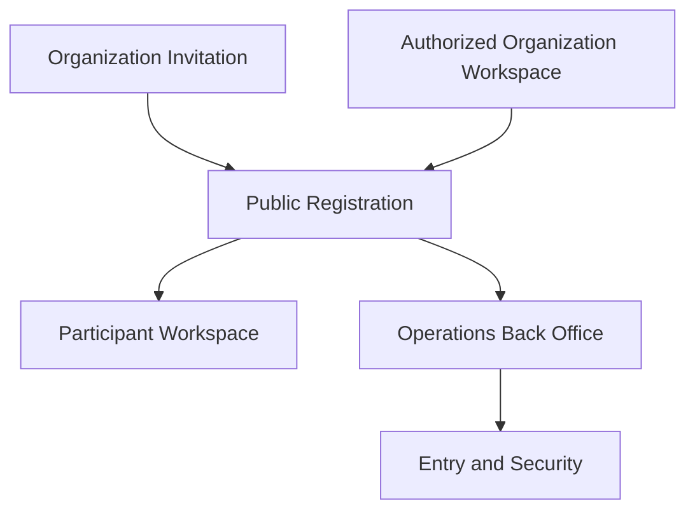
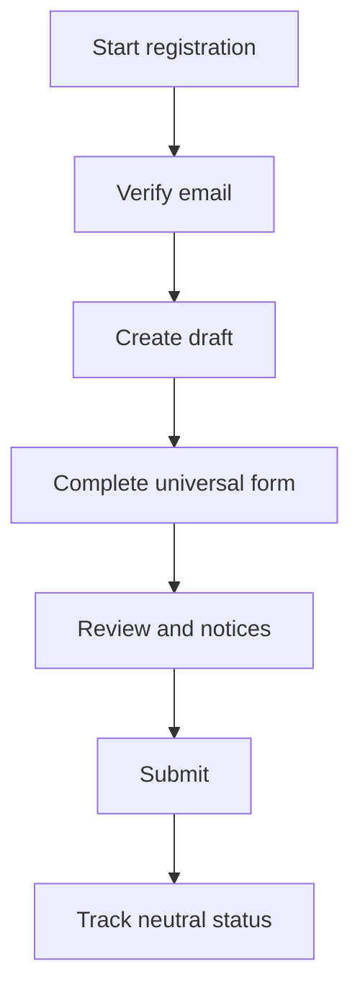
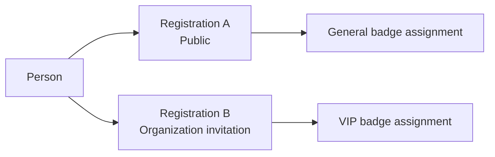
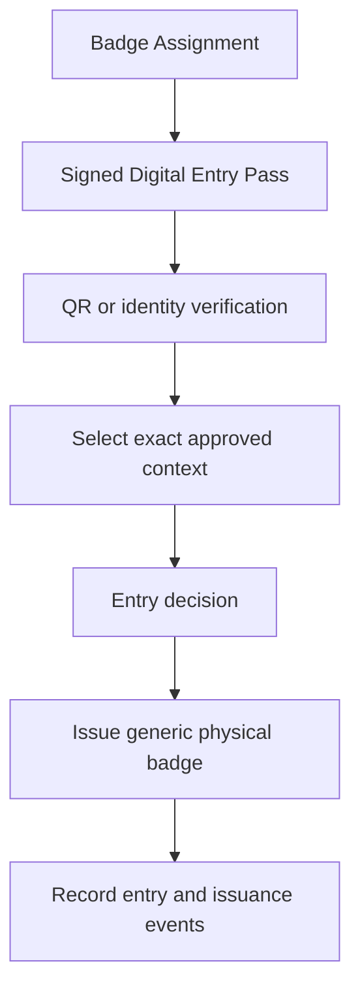
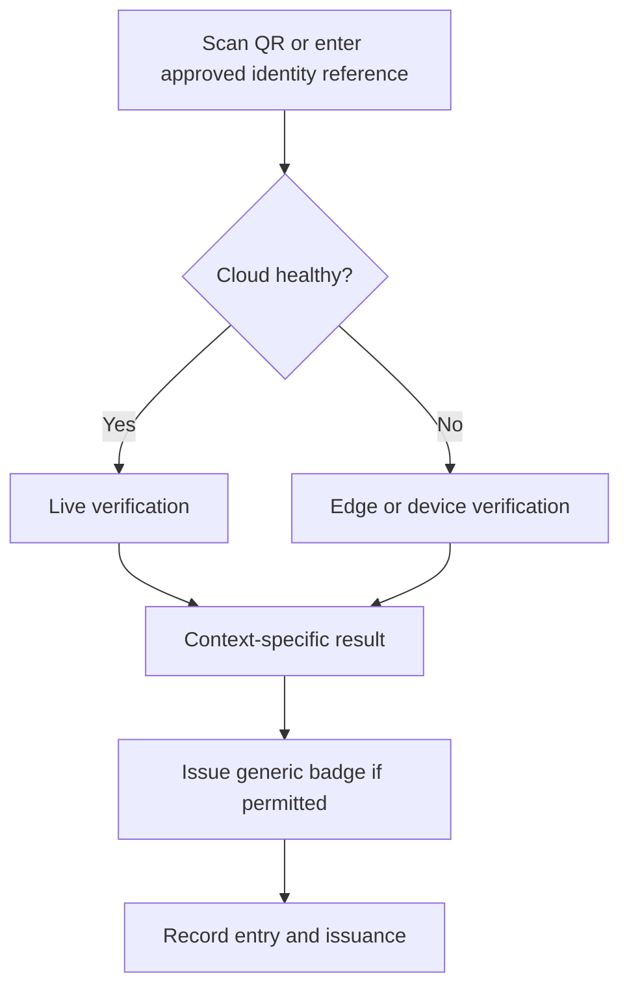

# ASC 2026 Registration Platform

## UI/UX Design Specification

**African Startup Conference 2026**  
**Web Registration, Accreditation, Badge and Entry Management Platform**

> **Document purpose**
>
> Define the information architecture, user journeys, screen behavior, reusable interface patterns, responsive rules, multilingual and right-to-left behavior, accessibility baseline, content guidance, prototype plan and design handoff for the ASC 2026 Registration Platform.

> **Central experience rule**
>
> Registration is universal and neutral. A registrant never selects a participant role, badge type or access level. Authorized users assign these attributes after review.

| Attribute | Value |
| --- | --- |
| Document type | UI/UX Design Specification |
| Document identifier | ASC-REG-UIUX |
| Status | Final |
| Version | 1.1 |
| Date | September 2026 |
| Document language | English |
| Product languages | English, French and Arabic |
| Product scope | Web platform only |
| Accessibility target | WCAG 2.2 AA |

---

# 1. Document Control

## 1.1 Ownership and audience

| Attribute | Value |
| --- | --- |
| Owner | ASC 2026 Registration Platform Project Team |
| Intended audience | Product, design, engineering, QA, operations, registration, badge and entry teams |
| Product authority | ASC Registration Platform PRD |
| Technical authority | ASC Registration Platform TRD |
| Design authority | This specification after product review |

## 1.2 Decision labels

- **[CONFIRMED]**: approved product or interaction rule that design and implementation must follow.
- **[PROPOSED]**: preferred design direction that requires prototype validation.
- **[OPEN DECISION]**: bounded decision that must be closed before the affected screen is approved for implementation.

## 1.3 Relationship to other documents

| Document | Relationship |
| --- | --- |
| Product Requirements Document | Defines product scope, business rules, status models and acceptance baseline. |
| Technical Requirements Document | Defines architecture, security, offline continuity, integrations and technical quality requirements. |
| Application Flow Specification | Defines application events, alternate paths and permission boundaries. |
| Backend Schema and Data Model Specification | Defines authoritative persistence entities, constraints and implementation rules. |
| Implementation Plan | Sequences implementation, acceptance evidence, deployment and operational readiness. |

## 1.4 Document boundary

This document defines how users navigate and operate the web platform. It does not define database tables, complete API payloads, infrastructure, final legal text or the separate ASC mobile application.

## 1.5 Alignment baseline and remaining decisions

| ID | Item | Current treatment |
| --- | --- | --- |
| BL-01 | International participant mobile number | Confirmed optional for international participants; required for Algerian participants. Verified email remains mandatory for self-service. |
| BL-02 | Passport identity-page upload | Confirmed conditional: request only under approved policy or a targeted additional-information request. Passport facts remain part of the international identity path. |
| OD-03 | Final visual system | The ASC visual direction in this document is proposed. Final colors, typography and component appearance require prototype review. |
| BL-04 | Physical badge serialization | Quantity-ledger tracking is the default. Optional serial numbers must not turn the generic badge into the primary identity credential. |

# 2. Experience Principles

| Principle | Required interpretation |
| --- | --- |
| Universal neutral registration | All public, invited and on-behalf registrations use the same core flow. No public role, badge or access selector exists. |
| Facts before classification | Applicants provide identity, contact and professional facts. Authorized staff classify registrations. |
| Direct authorized action | A permitted user executes the action directly. The interface does not invent secondary approval chains. |
| Permission-aware simplicity | Users see only the spaces, data and actions required by their roles or groups. |
| Data minimization | Sensitive fields and documents appear only when a defined rule requires them. |
| Context preservation | A person may have multiple registrations and badge assignments. The interface never collapses distinct contexts. |
| Credential separation | Registration, Badge Assignment, Digital Entry Pass, generic Physical Badge and Entry Event are distinct concepts. |
| Online first, continuity ready | Cloud operation is primary. Enrolled-device PWA continuity is the required fallback; Event Edge states appear only when that optional deployment is approved. |
| Trilingual by design | English, French and Arabic, including genuine RTL behavior, are designed and tested from the start. |
| Accessible by default | Every critical path targets WCAG 2.2 AA and does not rely on color, pointer input or vision alone. |

# 3. Users and Application Spaces

## 3.1 Public Registration

For new or returning applicants using open registration, an organization invitation, a delegation completion link or an authorized on-site path.

Primary outcomes:

- verify email and start or resume a registration;
- complete the universal form;
- submit, track and withdraw a registration;
- provide specifically requested information;
- access approved Digital Entry Passes.

## 3.2 Participant Workspace

For authenticated participants managing one or more registration contexts.

Primary outcomes:

- see all registrations without merging them;
- understand public status and next action;
- retrieve an active Digital Entry Pass;
- review notifications, language and privacy preferences.

## 3.3 Organization Workspace

This space is available only through an explicit permission. Receiving or using an invitation link does not grant organization access.

Primary outcomes:

- create or manage permitted invitation campaigns;
- register a participant on behalf of the participant;
- view organization-linked records only when explicitly authorized;
- monitor invitation usage without receiving unrelated participant data.

## 3.4 Operations Back Office

For registration, review, protocol, badge, communication, reporting and technical administration users.

Primary outcomes:

- work through searchable queues;
- review identity and submitted information;
- request specific information;
- record accreditation decisions and assignments;
- manage invitations, badge stock, communications and reports;
- execute permitted actions directly with complete audit evidence.

## 3.5 Entry and Security

For restricted internal or external security users and entry operators.

Primary outcomes:

- verify a selected registration context using an approved lookup method;
- make a clear admit, re-entry, deny or manual-check decision;
- issue the correct generic physical badge from controlled stock;
- record entry events online or through approved continuity modes.

# 4. Information Architecture and Navigation

## 4.1 Space map

## 4.2 Public navigation

The registration application is not a replacement for the official conference website. Its public header should contain only:

- ASC identity;
- a link back to the official website;
- Help;
- language switcher;
- Sign In or My Registration;
- a prominent Start Registration action where appropriate.

The public registration interface must not duplicate the full marketing-site navigation.

## 4.3 Participant navigation

- Overview
- My Registrations
- My Passes
- Notifications
- Profile and Privacy
- Help

Organization capabilities are inserted only when the current user holds the relevant permission:

- Organization
- Invitations
- Registrations on Behalf

## 4.4 Operations navigation

- Dashboard
- Registrations
- Organizations and Invitations
- Badge Assignments
- Badge Stock and Print Batches
- Communications
- Entry Operations
- Reports
- Users and Access
- Settings
- Audit Log

Navigation items and page actions use the same permission policy. Hiding an item is not an authorization control by itself.

## 4.5 Entry navigation

- Scan QR
- Identity Search
- Recent Entry Events
- Badge Issuance
- Sync Status
- Device Status

The entry shell must prioritize scanning and verification, not general administration.

## 4.6 Page anatomy

Every operational page uses a predictable structure:

1. space-level navigation;
2. page title and one-sentence purpose;
3. connection or synchronization state when relevant;
4. primary action;
5. filters or context controls;
6. main content;
7. inline help or escalation path.

Breadcrumbs are used in back-office hierarchies and omitted from simple public steps.

# 5. Core User Journeys

## 5.1 Open registration

Design rules:

- create a draft only after verified email or an authorized internal action;
- show one clear step at a time;
- autosave valid progress;
- permit previous-step navigation;
- show no badge, role or access choice;
- preserve entered values after validation or service failure.

## 5.2 Organization invitation

The invitation link resolves an invitation campaign and source organization before the form starts. The registration remains universal.

- Show the inviting organization as read-only context.
- Keep Professional Organization separately editable.
- Never imply that an invitation guarantees approval or a specific badge.
- A reusable link may serve multiple people.
- Do not expose campaign capacity or internal notes to the applicant.

## 5.3 Registration on behalf

An authorized user creates a draft for another person. The participant receives a secure completion or claim link and confirms contact data, accuracy and required notices.

Participant confirmation is not a second administrative approval. It establishes participant control and privacy acknowledgement.

## 5.4 Authorized on-site registration

An authorized operational user starts the same universal registration flow in an assisted mode. The interface identifies the operator and `ON_SITE` source, collects only the approved required facts, performs the same identity and duplicate checks and never exposes a role, Badge Type or Access Profile choice to the participant.

The assisted flow operates online by default. Offline creation is shown only when the optional Event Edge has been approved and is active. Without an Event Edge, the unavailable-state screen directs the operator to the controlled manual contingency runbook and does not create an unsafe browser-only registration.

## 5.5 Multiple registrations

- A strong identity match may reuse the Person record.
- A valid distinct context creates another Registration.
- Each Registration keeps its own source, status, decision, assignments and history.
- One assignment must not overwrite or silently invalidate another context.

## 5.6 Review and qualification

1. Authorized user opens a queue or filtered list.
2. The user reviews the registration, invitation source and identity result.
3. The user may request targeted information.
4. The user records the permitted decision directly.
5. The user assigns role, Badge Type and Access Profile as separate values.
6. The interface records actor, time and material change history.

## 5.7 Badge and entry

The generic physical badge is not secure identity proof by itself.

# 6. Registration Experience

## 6.1 Proposed step model

| Step | Purpose | Core contents |
| --- | --- | --- |
| Start | Explain eligibility and process | Event identity, approximate effort, language, sign-in/start action |
| Identity | Establish the person | Official name, nationality, residence, date of birth where required, NIN or passport path |
| Contact | Establish communication | Verified email, mobile number according to approved policy, preferred language |
| Professional | Capture neutral qualification facts | Professional Organization, country, type, job title, biography, interests and objectives |
| Additional | Collect conditional operational facts | Only configured fields that have a defined purpose |
| Review | Confirm accuracy | Read-only summary with edit links and source context |
| Notices | Present required legal content | Privacy Notice acknowledgement, Registration Terms and separate optional choices |
| Confirmation | Confirm receipt | Registration Reference, public status and next steps |

Step grouping may change after wireframe testing, but field meaning and product rules must not change implicitly.

## 6.2 Identity method behavior

| Context | Default path | Document behavior |
| --- | --- | --- |
| Approved Algerian NIN path | 18-character NIN, treated as text | Successful verification removes the default identity-card-copy requirement. |
| International passport path | Passport number, issuing country and expiry date | Identity-page upload is conditional on approved policy or a targeted request. |
| Inconclusive or unavailable verification | Manual examination | Explain that additional review is required; do not present automatic rejection. |
| Exceptional case | Authorized assistance | Preserve source and reason without adding a public badge or role path. |

## 6.3 Field behavior

| Element | Required behavior |
| --- | --- |
| Labels | Persistent visible label; placeholder is never the only label. |
| Required state | Required by default only when the approved field catalog says so. Mark optional fields explicitly. |
| Validation timing | Validate format after field exit or step continuation; avoid errors on every keystroke. |
| Error placement | Place a specific message by the field and include a step-level error summary. |
| Draft save | Save valid changes without pretending the registration was submitted. |
| Conditional fields | Insert predictably after the controlling answer and move focus only when requested. |
| Dates | Support accessible manual input and date selection; store canonical values. |
| Names | Accept Unicode, spaces, hyphens and apostrophes; do not impose English-only patterns. |
| NIN | Display and store as an 18-character string; never use a numeric input control. |
| Passport | Preserve meaningful letters and digits; show format guidance without country-specific overvalidation. |
| Phone | Use country code and an international-format control. It is required for Algerian participants and optional for international participants unless an approved operational policy requires it. |
| Upload | Explain purpose, accepted types, size, progress, scan state, replacement and removal behavior. |

## 6.4 File upload pattern

The secure upload component must show:

- exact requested document and purpose;
- accepted file types and maximum size;
- upload progress;
- processing or security-scan state;
- accepted, failed and replacement states;
- a method to remove an unsubmitted upload;
- no thumbnail exposure in general administrative lists.

Passport handling should request the identity page only when the approved policy requires it. The interface must not invite upload of a complete passport, visa or unrelated travel document.

## 6.5 Save, resume and session behavior

- Show the last saved state without interrupting every edit.
- Warn before session expiry and allow an accessible extension action.
- Preserve local form state during a recoverable request failure.
- A Save and Exit action returns the user to a clear resume path.
- Do not submit automatically when a draft reaches an age threshold.
- Changing language must preserve current form values and step.

## 6.6 Duplicate handling

Public messages must not reveal whether another person exists in the system.

- A possible match triggers a secure verification or recovery path.
- A distinct valid context creates another Registration.
- An accidental draft in the same context is resumed rather than duplicated.
- Back-office users with permission see matching evidence and provenance, not a destructive merge shortcut.

## 6.7 Review and submission

- Group the read-only summary by form step.
- Provide an Edit action for each permitted section.
- Show Invitation Source separately from Professional Organization.
- Omit all internal role, Badge Type and Access Profile values.
- Require explicit final submission.
- Prevent repeated clicks from creating duplicate submissions.
- Return a Registration Reference and neutral applicant-facing status.

# 7. Participant and Organization Workspaces

## 7.1 Participant overview

The overview prioritizes current action:

1. items requiring participant action;
2. current registrations and public statuses;
3. active Digital Entry Passes;
4. recent notifications;
5. help and privacy controls.

## 7.2 My Registrations

Each card or row must show:

- Registration Reference;
- event edition;
- registration source or inviting organization where appropriate;
- public status;
- submitted or last-updated date;
- required next action;
- Digital Entry Pass availability when applicable.

Multiple registrations remain visually separate. The interface must not use a single person-level status.

## 7.3 Digital Pass

An active Digital Entry Pass view contains:

- selected registration context;
- signed QR image;
- human-readable Registration Reference;
- validity and status;
- participant display name;
- clear instruction that identity may still be checked;
- offline-friendly display after secure retrieval where approved.

Direct personal identity values must not appear inside the QR payload or as unnecessary text beside it.

## 7.4 Organization invitation management

Authorized users may view:

- organization and campaign name;
- active period;
- optional capacity;
- campaign status;
- registration count;
- link-copy action;
- suspend, resume or close action according to permission.

Invitation usage does not prove employment or affiliation and does not grant automatic access to participant records.

# 8. Operations Back Office

## 8.1 Dashboard

The dashboard shows actionable operational counts:

- new submissions;
- registrations under review;
- additional information outstanding;
- identity verification pending;
- possible duplicates requiring review;
- approved registrations without required assignments;
- badge stock and issuance indicators;
- entry volume by day;
- synchronization or device alerts.

Every metric links to the corresponding filtered workspace. Decorative metrics without an operational action should be omitted.

## 8.2 Registration table

Default columns:

| Column | Rule |
| --- | --- |
| Registration Reference | Always visible and copyable. |
| Full Name | Visible according to participant-data permission. |
| Country | Use name, not flag alone. |
| Professional Organization | Distinct from Invitation Source. |
| Invitation Source | Blank for open registration. |
| Applicant Status | Use text and semantic status treatment. |
| Processing State | Internal users only. |
| Badge Assignment | Summary only; preserve multiple contexts. |
| Submitted At | Locale-aware display, sortable canonical value. |
| Actions | Only permitted actions; no inaccessible hover-only controls. |

Full NIN and passport values must not appear in the default table.

## 8.3 Search and filters

Supported filter groups:

- applicant-facing status;
- internal processing status;
- country;
- invitation source;
- Professional Organization;
- registration source;
- Badge Type assignment;
- missing or requested information;
- identity verification state;
- date range;
- entry state.

General search supports name, Registration Reference and permitted contact fields. NIN and passport lookup require a specific permission and should use an exact or tightly constrained search.

Use server-side pagination. Preserve filters in the URL where safe and preserve the list state when the user returns from a record.

## 8.4 Registration detail

Recommended tabs:

- Overview
- Identity
- Professional Information
- Invitation Source
- Review and Decision
- Badge Assignments
- Communications
- Entry History
- Activity Log

A side panel may support fast inspection, but full review and editing use the record page.

## 8.5 Direct actions

Possible actions, subject to permission and current state:

- begin or assign review;
- record manual verification;
- request additional information;
- approve or record not approved;
- reopen when permitted;
- assign role, Badge Type or Access Profile;
- generate, revoke or replace a Digital Entry Pass;
- cancel or withdraw according to policy;
- send a permitted notification.

A confirmation dialog is required for material destructive or access-affecting actions. Confirmation is not a second-person approval.

## 8.6 Bulk operations

Bulk operations may include:

- send a notification;
- export selected permitted fields;
- apply an authorized assignment to selected registrations;
- resend a completion request;
- operate on an approved organization-linked set.

Before execution, show:

- selected count;
- whether the current page or all filtered results are selected;
- affected fields or action;
- records that will be skipped and why;
- confirmation for high-impact actions.

## 8.7 Sensitive data and exports

- Mask identity and contact values by default.
- Reveal protected values only within a permitted task.
- Keep document access behind a separate permission.
- Record protected-document view or download events.
- Restrict export permission independently from screen view permission.
- Require explicit field selection and show the sensitivity of the result.
- Never include protected content in general logs, URLs or notification text.

# 9. Badge and Entry Experience

## 9.1 Concept separation

| Concept | UI meaning |
| --- | --- |
| Badge Type | Configured category used for operations and physical stock. |
| Badge Assignment | Contextual decision linking a Registration to a Badge Type and Access Profile. |
| Digital Entry Pass | Signed digital credential for one approved assignment context. |
| Physical Badge | Generic pre-produced artifact grouped by Badge Type. |
| Badge Issuance Event | Immutable record that generic stock was given after verification. |
| Entry Event | Immutable record of an admission or related checkpoint operation. |

## 9.2 Assignment interface

The assignment panel shows:

- selected Registration and source context;
- Badge Type;
- Access Profile;
- assignment state;
- actor and time;
- optional internal reason where policy requires it;
- other assignments held by the same Person without merging them.

The primary action is Add Assignment, not Replace Person Badge. A change retains the prior value in history.

## 9.3 Generic stock and pre-event batches

Badge stock views show quantities rather than personalized print jobs:

- planned;
- produced;
- available;
- issued;
- damaged;
- adjusted with reason.

Print batches are prepared before the event by Badge Type. Standard batches contain no participant name, photograph or personalized QR.

## 9.4 Entry verification flow

Verification methods:

- Digital Entry Pass QR;
- NIN;
- passport number;
- Registration Reference;
- authorized manual lookup.

## 9.5 Verification result pattern

| Result | Visual and textual treatment | Primary action |
| --- | --- | --- |
| Verified | Green semantic panel, check icon, explicit context | Admit |
| Already admitted / re-entry | Blue informational panel, prior time and context | Record permitted re-entry or escalate |
| Manual verification required | Amber panel, concise reason category | Start manual check |
| Invalid, expired or revoked | Red critical panel, no sensitive internal detail | Do not admit / call supervisor |
| Offline verified | Visible offline label and last-sync time | Admit only under approved offline policy |

Do not use color alone. Provide an icon, heading, explanation and focused action. Optional sound or haptic feedback must have a non-audio equivalent.

## 9.6 Minimum security view

The entry user sees only what is necessary for the current verification:

- participant display name;
- nationality where necessary;
- masked document hint;
- selected Registration Reference and context;
- valid assignments for that context;
- entry result and prior relevant entry;
- permitted issuance action.

Protected values may be revealed temporarily only when the user has the specific permission and is performing a defined verification task.

## 9.7 Online and offline states

The connection indicator is persistent in Entry and Security:

- Online;
- Offline — Local Data Available;
- Changes Queued;
- Synchronizing;
- Synchronized;
- Sync Failed.

Always show the last successful synchronization time in offline mode. If data freshness is insufficient for a confident decision, use Manual Verification Required rather than presenting false certainty.

# 10. Status, Notifications and Errors

## 10.1 Applicant-facing status model

Use the PRD status vocabulary exactly:

| Status | Participant message pattern |
| --- | --- |
| Draft | Your registration has not been submitted. |
| Submitted | Your registration has been received. |
| Under Review | Your registration is being reviewed. |
| Additional Information Required | Additional information is required to continue. |
| Approved | Your registration has been approved. Pass readiness is shown separately. |
| Not Approved | We are unable to approve this registration. Restricted reasons are not exposed. |
| Withdrawn | This registration has been withdrawn. |

Internal processing, decision, pass and invitation statuses remain separate and must not be collapsed into one UI field.

## 10.2 Digital Entry Pass status

- Not Generated
- Ready
- Active
- Revoked
- Replaced
- Expired

Display pass state per assignment context, not per Person.

## 10.3 Notifications

Required notification families:

- OTP and account access;
- draft reminder when configured;
- submission receipt;
- additional-information request;
- approved or not-approved outcome;
- Digital Entry Pass availability or replacement;
- withdrawal or cancellation confirmation;
- material event update;
- on-behalf completion or claim link.

Email is the primary channel. SMS is reserved for approved verification or urgent operational messages. Do not put NIN, passport number, identity-document content or restricted notes in an email or SMS.

## 10.4 Error structure

Every error should answer:

1. What happened?
2. What can the user do next?
3. Was entered information preserved?
4. Is support or a reference code needed?

Error families:

- correctable field error;
- identity result requiring review;
- unsupported or failed upload;
- connectivity failure;
- external service unavailable;
- authorization failure;
- session expiry;
- synchronization failure;
- unexpected system error.

# 11. Responsive and Multilingual Design

## 11.1 Device strategy

| Space | Primary approach | Required coverage |
| --- | --- | --- |
| Public Registration | Mobile first | Mobile and desktop |
| Participant Workspace | Adaptive | Mobile and desktop |
| Organization Workspace | Adaptive | Desktop, tablet and usable mobile |
| Operations Back Office | Desktop first | Desktop and tablet |
| Entry and Security | Tablet first | Tablet, desktop and approved mobile |

## 11.2 Responsive rules

- Use a single-column registration form on narrow screens.
- Pair only closely related fields on wider screens.
- Use a compact step indicator on mobile and expanded progress on desktop.
- Make primary public actions full-width on narrow screens where helpful.
- Keep administrative tables as tables when comparison matters; use column priority, horizontal containment and detail disclosure rather than converting every row into an unrelated card.
- Do not hide critical actions behind hover behavior.
- Maintain a minimum practical target size consistent with WCAG 2.2 guidance.
- Keep status, validation and connection information visible after reflow.

## 11.3 Locale behavior

- English and French use LTR.
- Arabic uses full RTL page direction.
- Locale selection persists across public and authenticated sessions.
- Changing locale preserves the current registration context and unsent form values.
- Email addresses, NIN, passport values, telephone numbers, Registration References and QR values use direction isolation and remain LTR where appropriate.
- Directional arrows and previous/next layout mirror in RTL.
- Logos, QR codes and non-directional symbols do not mirror.
- Dates and numbers display according to locale without changing canonical stored values.
- Do not use national flags as language selectors.

## 11.4 Translation rules

- Keep one controlled terminology glossary.
- Use stable translation keys, not English sentences as implementation identifiers.
- Support plural and grammatical variants through the localization framework.
- Avoid constructing sentences by concatenating translated fragments.
- Review legal, security and entry text manually in all languages.
- Test French expansion and Arabic reflow in every reusable component.

# 12. Accessibility

The platform targets WCAG 2.2 AA.

## 12.1 Required controls

- semantic landmarks and heading hierarchy;
- explicit form labels and programmatic descriptions;
- complete keyboard navigation;
- visible focus indicators;
- adequate text and component contrast;
- error summaries with links to invalid fields;
- status announcements that do not interrupt unrelated work;
- logical reading and focus order in LTR and RTL;
- accessible dialogs with focus containment and return;
- no color-only, sound-only or pointer-only meaning;
- usable layout at 200% zoom;
- reduced-motion support;
- accessible upload, OTP, date, table and scanner alternatives.

## 12.2 Entry accessibility

- Provide keyboard or manual entry when scanning is unavailable.
- Pair color with text, icon and optional sound.
- Keep the result heading and primary action prominent.
- Do not auto-dismiss critical results.
- Provide sufficient time for manual identity checks.
- Announce connection and sync changes without repeatedly disrupting the operator.

## 12.3 Accessibility evidence

Before release, retain evidence for:

- automated checks on representative pages;
- keyboard completion of all critical journeys;
- one screen-reader test for public registration and one for operations/entry;
- 200% zoom and reflow;
- color-contrast verification;
- English, French and Arabic reading and focus order.

# 13. Proposed Visual Direction

This section is **[PROPOSED]** and must not be treated as final brand approval.

## 13.1 ASC identity cues

The supplied ASC identity uses:

- deep navy event surfaces;
- cyan, blue and green brand accents;
- white high-contrast event typography;
- diagonal repeated strokes as the principal graphic motif;
- real conference imagery with a strong blue overlay.

The registration platform should feel related to the official website without copying a dense promotional hero into operational forms.

## 13.2 Proposed color roles

| Token | Initial value | Intended role |
| --- | --- | --- |
| Brand Cyan | `#029CBC` | Decorative brand accent; not white-text body buttons without contrast validation |
| Brand Green | `#65B54D` | Decorative growth accent and limited emphasis |
| Brand Light Cyan | `#63C5E3` | Light accent, illustration and non-text surfaces |
| Brand Deep Blue | `#326EB5` | Candidate interactive brand color where contrast passes |
| Proposed Navy | `#102B3A` | Header, sidebar, footer and high-contrast institutional surface |
| Proposed Background | `#F7FAFC` | Public form and workspace background |

Semantic success, warning, error and information colors must be selected for accessibility and must not depend on the logo palette alone.

## 13.3 Typography

Candidate direction:

- IBM Plex Sans for English and French;
- IBM Plex Sans Arabic for Arabic;
- system-font fallback with metrics tested in all three languages.

Noto Sans and Noto Sans Arabic remain acceptable fallback candidates. Final font choice depends on prototype rendering, performance and approved licensing/hosting.

## 13.4 Surface treatment

- Light registration and participant content surfaces.
- Navy header and operations sidebar.
- Medium corner radius, restrained shadow and an 8-pixel spacing rhythm.
- Brand gradients and conference photography limited to landing or communication surfaces.
- Diagonal logo motif used sparingly in the hero, progress accents, pass presentation or section dividers.
- No full dark mode in the initial release.

## 13.5 Logo variants required before final design

- full-color primary mark;
- approved white/reversed mark;
- compact mark for favicon and small navigation contexts;
- monochrome mark for administrative print use;
- clear-space and minimum-size guidance.

## 13.6 Finder adaptation

Finder may provide layout and Bootstrap component foundations. The implementation should retain useful responsive and component structure while replacing marketplace-style visual language with the ASC institutional identity.

Avoid excessive rounded cards, decorative gradients, image-heavy operational pages and icon-only actions. A feasibility prototype must confirm RTL, component-state and accessibility behavior before Finder is treated as final.

# 14. Design System and Components

## 14.1 Token groups

- brand and semantic colors;
- text, surface and border colors;
- typography families, sizes, weights and line heights;
- 8-pixel spacing scale;
- radii;
- subtle elevation;
- breakpoints and content widths;
- motion duration and reduced-motion alternatives;
- focus ring;
- z-index layers.

## 14.2 Core component inventory

### Navigation

- Public Header
- Application Header
- Admin Sidebar
- Language Switcher
- Breadcrumbs
- User Menu
- Connection and Sync Indicator

### Forms

- Text, Email and International Phone Input
- Country and Organization Selector
- Date Input
- Identity Method Selector
- Secure Document Upload
- OTP Input
- Checkbox and Consent Block
- Registration Stepper
- Save, Continue and Exit Actions

### Feedback

- Inline Validation
- Error Summary
- Alert Banner
- Toast Notification
- Loading and Skeleton State
- Empty State
- Confirmation Dialog
- Submission Confirmation

### Operations

- Data Table
- Search and Filter Panel
- Status Label
- Pagination
- Bulk Selection Bar
- Side Drawer
- Tabs
- Activity Timeline
- Export Dialog

### Entry

- QR Scanner
- Identity Search
- Verification Result
- Assignment Context Card
- Badge Issuance Panel
- Entry History
- Sync Queue
- Device Status

## 14.3 Component state contract

Every interactive component documents:

- default;
- hover where relevant;
- focus;
- active or selected;
- disabled;
- loading;
- error;
- success;
- read-only;
- offline, queued, synchronizing or failed where relevant.

## 14.4 Reusable screen patterns

| Pattern | Use |
| --- | --- |
| Registration Wizard | Universal public and on-behalf form flow |
| Review Summary | Confirmation before submission or direct action |
| Record Detail | Structured operational review |
| Filtered Data Table | Queue and bulk operations |
| Direct Action Confirmation | Destructive or access-affecting action |
| Activity Timeline | Immutable operational history |
| Verification Result | Fast entry decision |
| Offline Banner | Mode, data freshness and queued operations |

# 15. Content and Microcopy

## 15.1 Voice and tone

- formal but plain;
- calm and direct;
- respectful in negative outcomes;
- action-oriented;
- neutral before an accreditation decision;
- precise in security and entry contexts.

The official website may use promotional language. Registration and operations should prioritize comprehension.

## 15.2 Controlled terminology

| Term | Meaning |
| --- | --- |
| Registration | One participation context for an event edition |
| Registration Reference | Human-readable reference for one Registration |
| Invitation Source | Organization/campaign through which the Registration originated |
| Professional Organization | Organization with which the participant identifies professionally |
| Badge Assignment | Internal contextual Badge Type and access decision |
| Digital Entry Pass | Signed digital credential linked to one assignment context |
| Identity Verification | Automated or manual identity examination result |
| Entry Event | Recorded admission/checkpoint operation |

Do not use Choose Your Badge, Select Your Role or equivalent public phrasing.

## 15.3 Action labels

Preferred action labels include:

- Start Registration
- Save and Continue
- Save and Exit
- Review Registration
- Submit Registration
- Provide Requested Information
- Assign Badge
- Change Assignment
- Verify Identity
- Admit
- Start Manual Check

Avoid generic OK or Proceed when the result can be named.

## 15.4 Legal and preference text

The final text requires legal approval. The interface must separate:

- acknowledgement that the Privacy Notice was read;
- acceptance of Registration Terms;
- optional marketing communication preference;
- optional public-profile visibility preference when offered.

The Privacy Notice should identify the Ministry of Knowledge Economy, Startups and Micro-enterprises as Data Controller for this platform and describe processing under Algerian Law No. 18-07, as amended and supplemented by Law No. 25-11, together with approved purposes, recipients, retention, rights and contact channels.

Do not use one broad consent checkbox to imply that all mandatory processing relies on consent. The legal basis and final wording must be confirmed by the responsible legal and data-protection functions. The designated data-protection contact must be configured before public launch.

## 15.5 Notification writing

- Put the required action in the subject and opening sentence.
- Include the Registration Reference where useful.
- Link to the secure platform for protected information.
- Do not expose sensitive values or internal notes.
- Use the participant's preferred communication language.
- Version and test templates in all three languages.

# 16. Screen Inventory and Wireframe Plan

## 16.1 Screen inventory

| ID | Space | Screen / template | Priority |
| --- | --- | --- | --- |
| PUB-01 | Public | Registration landing | P0 |
| PUB-02 | Public | Start or resume / email OTP | P0 |
| PUB-03 | Public | Registration wizard template | P0 |
| PUB-04 | Public | Secure upload state | P0 |
| PUB-05 | Public | Review and notices | P0 |
| PUB-06 | Public | Submission confirmation | P0 |
| PUB-07 | Public | Privacy Notice and Terms | P0 |
| PAR-01 | Participant | Overview | P0 |
| PAR-02 | Participant | My Registrations | P0 |
| PAR-03 | Participant | Registration detail / action required | P0 |
| PAR-04 | Participant | Digital Entry Pass | P0 |
| PAR-05 | Participant | Notifications and privacy settings | P1 |
| ORG-01 | Organization | Organization overview | P1 |
| ORG-02 | Organization | Invitation list and detail | P1 |
| ORG-03 | Organization | Create invitation campaign | P1 |
| ORG-04 | Organization | Register on behalf | P1 |
| OPS-01 | Operations | Dashboard | P0 |
| OPS-02 | Operations | Registrations table | P0 |
| OPS-03 | Operations | Registration detail | P0 |
| OPS-04 | Operations | Request information | P0 |
| OPS-05 | Operations | Organization and invitation management | P1 |
| OPS-06 | Operations | Badge assignment | P0 |
| OPS-07 | Operations | Badge stock and print batches | P1 |
| OPS-08 | Operations | Communications | P1 |
| OPS-09 | Operations | Reports and controlled export | P1 |
| OPS-10 | Operations | Users, roles and groups | P1 |
| OPS-11 | Operations | Settings | P2 |
| OPS-12 | Operations | Audit Log | P1 |
| OPS-13 | Operations | Assisted on-site registration | P0 |
| ENT-01 | Entry | Device and sync readiness | P0 |
| ENT-02 | Entry | QR scan and identity search | P0 |
| ENT-03 | Entry | Verification result | P0 |
| ENT-04 | Entry | Generic badge issuance | P0 |
| ENT-05 | Entry | Recent entry events | P1 |
| ENT-06 | Entry | Offline queue and conflicts | P0 |
| SYS-01 | Common | Access denied / session expired | P0 |
| SYS-02 | Common | Offline / service unavailable | P0 |
| SYS-03 | Common | Not found / maintenance / unexpected error | P1 |

Priority identifies wireframe sequence, not automatic exclusion from the release scope.

## 16.2 Wireframe sequence

### Wave 1 — end-to-end critical path

- Registration landing and OTP
- Registration wizard
- Review and submission
- Participant status
- Registrations table and detail
- Badge assignment
- Entry scan, result and offline state

### Wave 2 — organization and operations

- organization invitation management;
- registration on behalf;
- badge stock and print batches;
- communications and reports.

### Wave 3 — administration and support

- users and groups;
- settings and audit;
- complete empty, loading, failure and legal-support states.

## 16.3 Wireframe rules

- Begin in grayscale.
- Use realistic trilingual content, not lorem ipsum.
- Include normal, error, loading, empty, unauthorized and offline states.
- Produce mobile and desktop registration views.
- Produce desktop/tablet operations views.
- Produce tablet/mobile entry views.
- Connect critical flows in a clickable prototype.
- Do not treat a screenshot without behavior and state notes as a completed design.

# 17. Prototype Testing

## 17.1 Representative participants

- local applicant using the NIN path;
- international applicant using the passport path;
- organization-invited applicant;
- participant completing an on-behalf draft;
- registration reviewer;
- badge operator;
- external security user;
- keyboard or screen-reader user.

## 17.2 Critical scenarios

1. Complete and submit an open registration.
2. Complete an international flow with the configured document policy.
3. Change language without losing entered values.
4. Resume a saved draft.
5. Create a distinct registration for an existing Person.
6. Complete a registration through an organization invitation.
7. Create and claim an on-behalf registration.
8. Request and provide additional information.
9. Assign different badges to distinct registrations for one Person.
10. Verify entry by QR and by identity reference.
11. Continue entry during Internet loss and synchronize afterward.
12. Confirm that a user cannot see or execute an unauthorized action.

## 17.3 Success criteria

- Participants complete the flow without selecting or inferring a badge choice.
- Users understand current status and next action.
- Legitimate multiple registrations are not blocked.
- Language switching and responsive reflow do not lose data.
- Errors are discoverable, specific and recoverable.
- Permission boundaries are visible and enforced.
- Entry users reach a clear result quickly.
- Critical journeys pass in English, French and Arabic.
- Offline entry operations become applied, duplicate or explicit conflict after synchronization.

## 17.4 Finder feasibility prototype

Before final visual approval, implement a narrow prototype containing:

- one public registration step;
- the shared form and validation pattern;
- one operations table and detail page;
- the operations shell and sidebar;
- one entry verification result;
- English, French and Arabic/RTL;
- proposed ASC colors and typography.

The prototype decides whether Finder customization remains efficient and accessible. It is not production implementation.

# 18. Design Handoff and Quality Assurance

## 18.1 Required handoff package

- approved sitemap and user journeys;
- screen inventory and linked wireframes;
- approved high-fidelity key screens;
- token definitions;
- component inventory and state specifications;
- responsive and RTL rules;
- accessibility acceptance notes;
- field and validation matrix;
- status and transition matrix;
- role/action/visibility matrix;
- notification and error copy;
- offline state and reconciliation behavior;
- approved logo and icon assets;
- screen-level acceptance criteria.

## 18.2 AI-ready implementation rules

When this specification is used with an AI development assistant:

- cite screen IDs and relevant PRD/TRD requirements in implementation tasks;
- distinguish confirmed requirements from proposed visual choices;
- never allow generated code to invent public badge selection;
- never expose fields merely because they exist in the backend;
- implement permission checks on the server, not only in navigation;
- preserve separate Person, Registration, Badge Assignment and credential contexts;
- keep translated strings outside code and templates where the framework expects catalogs;
- treat AI-generated UI and validation as untrusted until reviewed, tested and scanned;
- never include production participant data, credentials or protected documents in prompts.

## 18.3 Definition of design-ready

A screen is ready for implementation when:

- its purpose and user are clear;
- required and optional fields are mapped to the approved catalog;
- actions are mapped to permissions;
- normal, loading, empty, validation, error and offline states are defined where relevant;
- mobile/desktop or tablet behavior is defined;
- English, French and Arabic behavior is understood;
- keyboard, focus and announcement behavior is specified;
- open decisions affecting the screen are closed or explicitly isolated;
- acceptance criteria are testable.

## 18.4 Design QA checkpoints

Design QA occurs after:

1. shared shell and components;
2. public registration;
3. participant and organization workspaces;
4. operations review and assignment;
5. badge and online entry;
6. offline/Edge continuity;
7. release candidate localization and accessibility review.

# 19. Appendices

## 19.1 Role and visibility matrix

The exact roles are configurable. The matrix below defines capability boundaries, not mandatory role names.

| Capability | Applicant | Organization-authorized user | Reviewer | Badge operator | Entry/security user | Access administrator |
| --- | --- | --- | --- | --- | --- | --- |
| Own registrations | Yes | Own + explicitly authorized scope | As permitted | Minimum required | Current verification only | No implicit access |
| Organization invitations | No | As permitted | As permitted | No | No | Configure permission only |
| Review identity evidence | Own submitted data | No by default | Specific permission | No | Temporary minimum view | No implicit access |
| Record accreditation decision | No | No | Specific permission | No | No | Configure permission only |
| Assign badge/access | No | No | Specific permission | Specific permission | No | Configure permission only |
| Manage generic stock | No | No | Optional | Specific permission | Issue-only permission | Configure permission only |
| Verify entry | Own pass display | No | Optional | Optional | Specific permission | Configure permission only |
| Export data | Own copy only | Restricted scope | Separate permission | Restricted | No by default | No implicit access |
| Manage users/groups | No | No | No | No | No | Specific permission |

## 19.2 Public status mapping

| Internal situation | Public presentation |
| --- | --- |
| Draft exists | Draft |
| Submitted, not yet actively reviewed | Submitted |
| Review in progress or verification pending | Under Review |
| Targeted request outstanding | Additional Information Required |
| Accreditation decision approved | Approved |
| Accreditation decision not approved | Not Approved |
| Participant withdrew or authorized cancellation completed | Withdrawn |

## 19.3 Entry state matrix

| Connectivity | Verification data | Result behavior |
| --- | --- | --- |
| Cloud online | Current | Normal live decision and immediate recording |
| Cloud unavailable, approved Event Edge available | Valid signed Offline Package | Edge decision, queued or Edge-recorded operation |
| Cloud unavailable, enrolled device ready | Valid unexpired Offline Package | Required PWA fallback: restricted device verification and queued operation |
| Local data missing, expired or insufficient | Inadequate | Manual Verification Required; no false verified result |
| Connectivity restored | Queued operations | Synchronize and show applied, duplicate, rejected or conflict outcome |

## 19.4 Open decision register

| ID | Decision | Required owner / milestone |
| --- | --- | --- |
| OD-03 | Approve visual palette, typography and logo variants after prototype review. | Product and communications before high-fidelity sign-off |
| OD-05 | Confirm final participant-facing visibility of assigned Badge Type. | Product and protocol before Participant Workspace sign-off |
| OD-06 | Approve final legal notice, terms, data-protection contact and optional preference wording in all languages. | Legal/data protection before public launch |

## 19.5 Definition of UI/UX completion

The UI/UX work is complete when critical journeys and screen states are approved; proposed visual choices are resolved; the trilingual responsive prototype passes usability and accessibility review; permission, privacy, duplicate-context and offline behavior are represented accurately; the handoff package is complete; and implementation acceptance criteria can be traced to the PRD, TRD and this specification.
