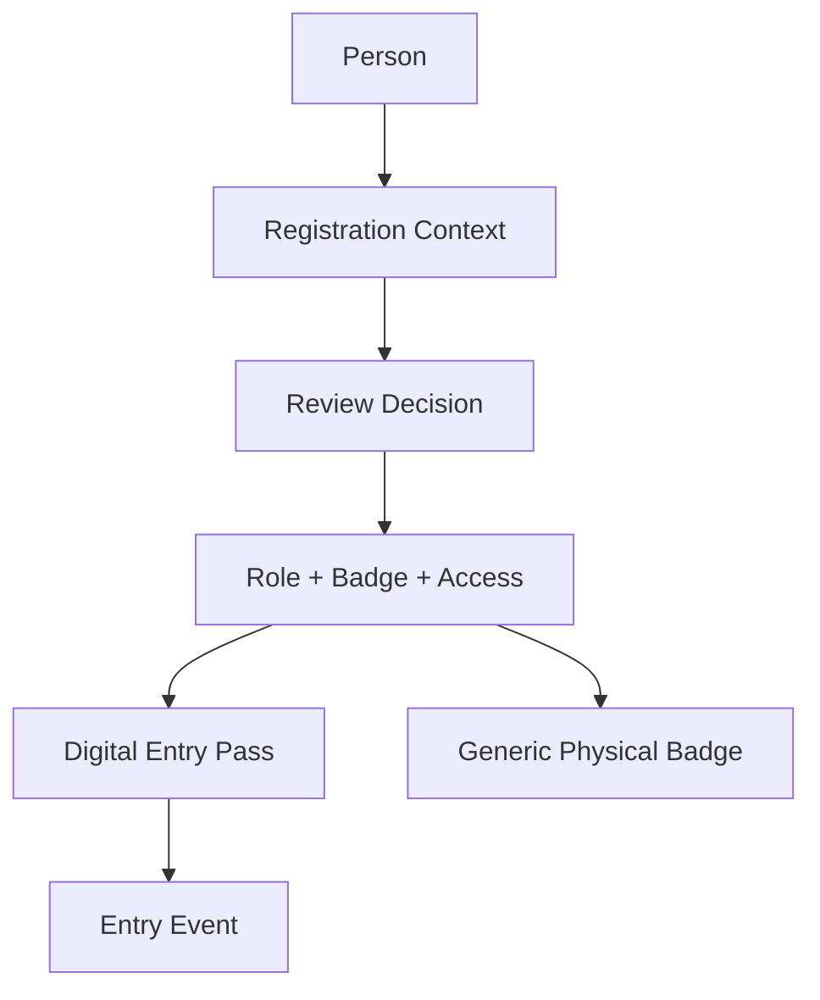
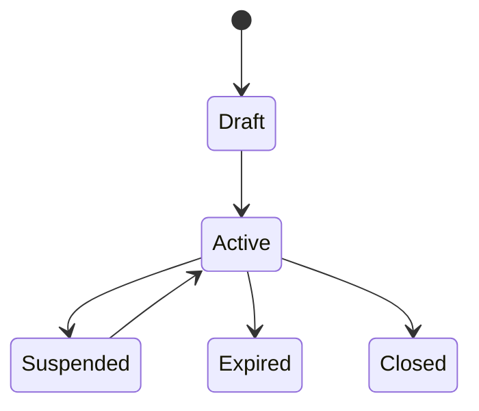
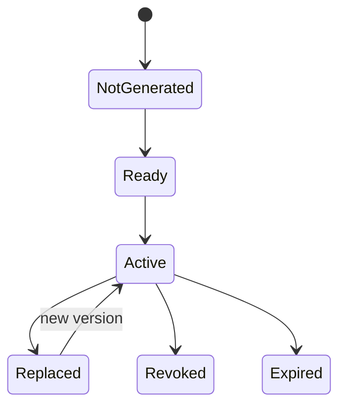
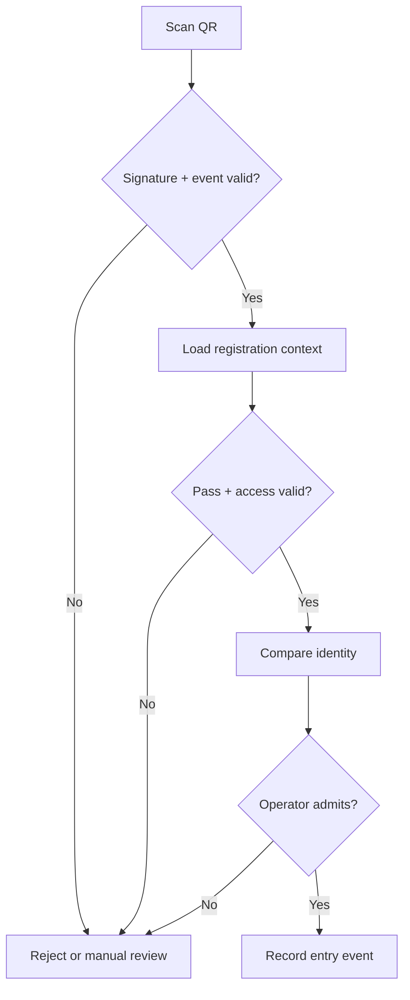
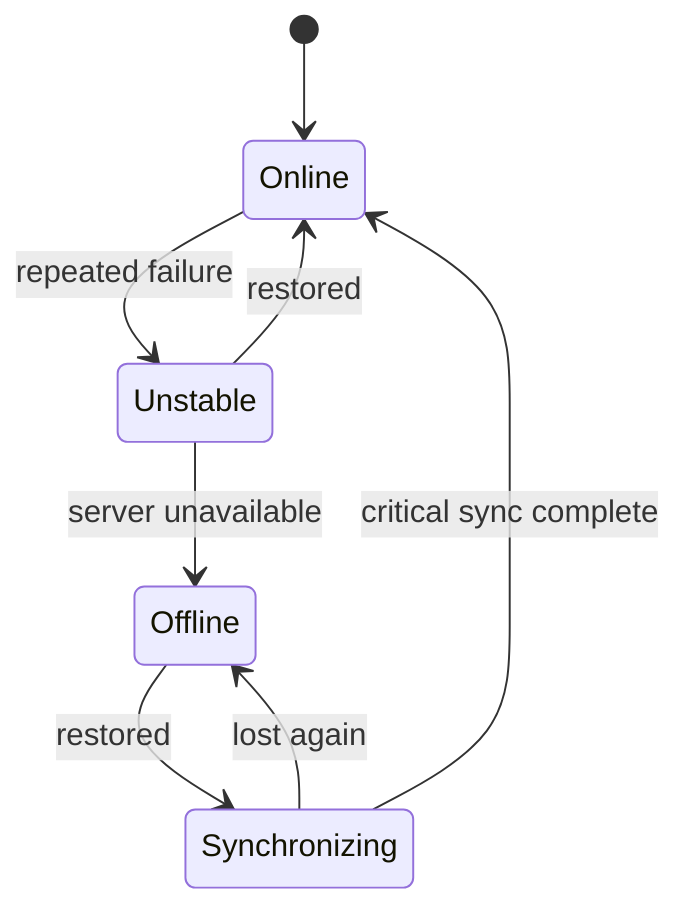
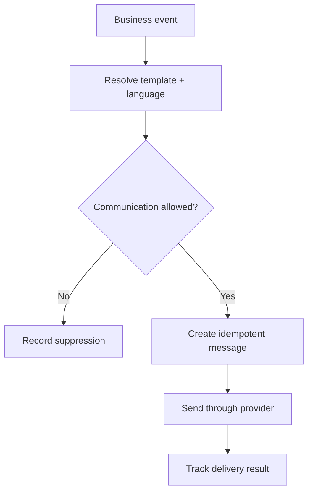
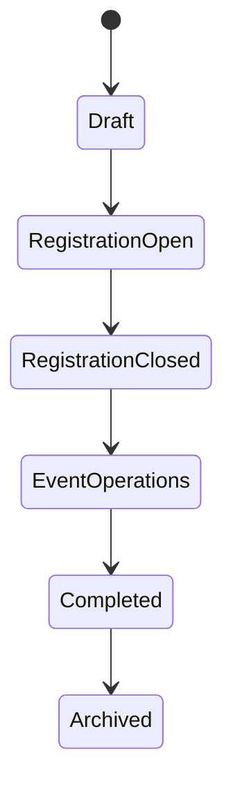

# ASC 2026 Registration Platform

## Application Flow Specification

**African Startup Conference 2026**  
**Web Registration, Accreditation, Badge and Entry Management Platform**

> **Document purpose**
>
> Define the application-level business flows, actors, triggers, preconditions, state transitions, alternate paths, permission boundaries, notifications, audit events and completion conditions for the ASC 2026 web registration platform.

> **Central product rule**
>
> Registration is universal and neutral. A registrant never selects a participant role, badge type or access level. Authorized users assign these attributes after review.

| Attribute | Value |
| --- | --- |
| Document type | Application Flow Specification |
| Document identifier | ASC-REG-APPFLOW |
| Status | Final |
| Version | 1.1 |
| Date | September 2026 |
| Document language | English |
| Product languages | English, French and Arabic |
| Product scope | Web platform only |

---

# 1. Document Control

## 1.1 Ownership and audience

| Attribute | Value |
| --- | --- |
| Owner | ASC 2026 Registration Platform Project Team |
| Intended audience | Product, engineering, QA, security, registration, badge, entry and support teams |
| Product authority | ASC Registration Platform PRD |
| Technical authority | ASC Registration Platform TRD |
| Interaction authority | ASC Registration Platform UI/UX Design Specification |
| Change control | Material flow changes require product review and synchronized updates to affected documents and tests |

## 1.2 Document boundary

This specification defines what happens from one application event to the next. It does not define:

- final screen appearance or visual styling;
- database tables and physical persistence design;
- complete API request and response payloads;
- source-code organization;
- infrastructure deployment details;
- the separate ASC mobile application;
- final legal wording for notices, terms or consent statements.

## 1.3 Normative terms

- **MUST / MUST NOT**: mandatory behavior.
- **SHOULD / SHOULD NOT**: preferred default unless a documented reason justifies another behavior.
- **MAY**: optional behavior.
- **Authorized User**: an authenticated operational user whose group, permissions, scope and active dates permit the action.
- **Registration Context**: one distinct Registration for one Event Edition and source context. A Person may have several valid Registration Contexts.
- **Public Status**: participant-facing status.
- **Internal Status**: operational status that is not necessarily visible to the participant.

## 1.4 Standard flow record

Implementation and tests SHOULD represent each flow using the following fields:

| Field | Meaning |
| --- | --- |
| Flow ID | Stable identifier such as `AF-REG-01` |
| Actors | Human or system participants |
| Trigger | Event that starts the flow |
| Preconditions | Conditions required before execution |
| Main path | Expected successful sequence |
| Alternate paths | Valid variations and recoverable failures |
| Permission | Required action-level permission and scope |
| State changes | Public and internal transitions |
| Notifications | Messages or tasks created by the flow |
| Audit | Evidence that MUST be retained |
| Completion | Observable end condition |

# 2. Shared Flow Principles

## 2.1 Product-wide rules

| Rule | Required behavior |
| --- | --- |
| Universal registration | Open, invited and on-behalf registrations share one neutral core flow. |
| Facts before classification | Applicants provide facts. Authorized users assign Participant Role, Badge Type and Access Profile. |
| Direct authorized action | A permitted user executes an action directly; no unnecessary second-person approval is introduced. |
| Permission and scope | Authorization depends on permission, group, event scope, organization scope, location and active dates. |
| Context preservation | Multiple Registrations, assignments and passes for the same Person remain distinct. |
| Data minimization | Collect, display, cache and export only what the current purpose requires. |
| Credential separation | Registration, Badge Assignment, Digital Entry Pass, generic Physical Badge and Entry Event are separate records. |
| Online first | The cloud service is Plan A. Offline continuity is Plan B and never replaces normal online operation. |
| Idempotency | Repeated submissions or synchronization attempts MUST NOT duplicate the same business operation. |
| Append-only evidence | Decisions, issuance, entry, stock and audit evidence are corrected through linked actions, not silent deletion. |
| Trilingual operation | English, French and Arabic, including RTL behavior, apply to public and operational flows. |
| Legal alignment | Privacy processing follows the approved Privacy Notice, Terms and applicable Algerian data-protection requirements. |

## 2.2 Primary actors

| Actor | Primary responsibility |
| --- | --- |
| Applicant / Participant | Complete, submit and track one or more Registration Contexts |
| Organization User | Manage explicitly permitted organization invitations or on-behalf drafts |
| Registration Reviewer | Review submissions and request targeted information |
| Decision User | Record an approval or not-approved outcome when permitted |
| Classification User | Assign Participant Role, Badge Type and Access Profile |
| Badge Operator | Manage generic badge production, stock and issuance |
| Entry Operator | Verify identity and record entry at an assigned checkpoint |
| Entry Supervisor | Resolve entry exceptions, overrides and synchronization conflicts |
| External Security User | Perform restricted, time-bound entry duties |
| Communication Manager | Manage templates and permitted individual or bulk messages |
| Platform Administrator | Manage users, groups, event settings and devices |
| Privacy Officer | Handle data-subject and privacy requests |
| System | Apply rules, send messages, synchronize data and write audit evidence |

## 2.3 End-to-end context model

One Person may own several independent Registration Contexts. Each context may produce its own decision, assignment, pass and entry history.

## 2.4 Public and internal status separation

The participant MUST see a simple public status. Operational users MAY see a more precise internal status.

| Public status | Example internal statuses |
| --- | --- |
| Draft | Draft, Unclaimed Draft, Response Draft |
| Submitted | Pending Assignment, Queued, Awaiting Review |
| Under Review | Review in Progress, Identity Review, Duplicate Review |
| Additional Information Required | Request Sent, Awaiting Applicant, Response Overdue |
| Approved | Approved, Qualification Pending, Pass Pending |
| Not Approved | Decision Recorded, Notification Pending |
| Withdrawn | Participant Withdrawn, Operationally Cancelled |

Operational cancellation retains its internal reason, timestamp and decision history but maps to the participant-facing `Withdrawn` status.

# 3. Access and Authentication Flows

## 3.1 Flow index

| ID | Flow | Primary actor |
| --- | --- | --- |
| AF-AUTH-01 | Applicant email OTP access | Applicant |
| AF-AUTH-02 | Resume destination resolution | System |
| AF-AUTH-03 | Operational user sign-in and MFA | Operational user |
| AF-AUTH-04 | Session expiry and re-authentication | Any authenticated user |
| AF-AUTH-05 | Temporary external account access | External security user |
| AF-AUTH-06 | Enrolled-device session continuity | Entry operator |

## 3.2 Applicant email OTP - `AF-AUTH-01`

**Trigger:** an applicant starts, resumes or opens a protected participant action.

**Main path:**

1. The applicant enters an email address.
2. The system returns a generic response that does not disclose whether an account exists.
3. The system creates a short-lived, single-use OTP and sends it through the approved channel.
4. The applicant submits the OTP.
5. The system validates expiry, attempt count, request rate and prior use.
6. A participant session is created and the resume resolver is called.

V1 maintains at most one active Participant Account per Person. More than one verified email may be enabled as a login destination for that account; authenticating through an alias does not create another account or merge Registration Contexts.

**Controls:**

- The OTP value MUST NOT appear in application logs or audit content.
- Resend cooldown, request throttling and temporary lock rules MUST apply.
- Successful use invalidates the OTP.
- Expired or exhausted codes require a new request.

## 3.3 Resume destination - `AF-AUTH-02`

After successful authentication, the system resolves the first relevant destination in this order:

1. active Additional Information Request requiring action;
2. explicit invitation or on-behalf context from the current link;
3. resumable Registration Draft;
4. Participant Workspace with multiple existing contexts;
5. a new Registration Draft when the user explicitly chose to start one.

The resolver MUST NOT merge contexts or overwrite an invitation source.

## 3.4 Operational sign-in - `AF-AUTH-03`

Operational authentication is separate from participant OTP access.

- The primary method may be local secure authentication, approved SSO or both.
- MFA is mandatory for operational users.
- The system evaluates account status, group membership, scope and active dates after authentication.
- Suspended, expired or disabled accounts do not receive an operational session.
- High-risk actions MAY require recent re-authentication or a new MFA challenge.

## 3.5 Session and device continuity

- Participant and operational sessions have separate inactivity and absolute lifetimes.
- Expired participant sessions return to OTP without discarding saved work.
- An entry device MUST be enrolled online before offline use.
- No new operational sign-in is allowed while the device is offline.
- A previously authenticated device session may continue offline only within its preconfigured time and scope limits.

**Audit events:** successful and failed operational sign-in, MFA enrollment and challenge, account suspension, device enrollment, scope change and session termination.

# 4. Public Registration Flows

## 4.1 Flow index

| ID | Flow | Outcome |
| --- | --- | --- |
| AF-REG-01 | Start or resume registration | Correct Draft context opened |
| AF-REG-02 | Complete universal form | Required facts saved |
| AF-REG-03 | NIN verification | Minimal result stored or manual review flagged |
| AF-REG-04 | International identity path | Passport facts captured under policy |
| AF-REG-05 | Duplicate and context resolution | Correct context preserved |
| AF-REG-06 | Review notices and submit | Immutable submission snapshot created |
| AF-REG-07 | Authorized on-site registration | Universal assisted Draft created safely |

## 4.2 Universal registration - `AF-REG-02`

The core steps are:

1. Identity and personal information.
2. Contact information.
3. Professional information.
4. Interests and participation objectives.
5. Conditional additional information.
6. Review and correction.
7. Privacy Notice, Terms and optional communication choices.
8. Submission confirmation.

The public form MUST NOT contain a Participant Role, Badge Type or Access Profile selector.

The Registration Source is retained as one of: open registration, invitation, delegation, on-behalf draft or authorized on-site registration. Invitation Source and Professional Organization remain separate facts.

## 4.3 Draft behavior

- Each step saves automatically.
- The applicant can resume from another supported device after authentication.
- A version check prevents one browser from silently overwriting newer data from another session.
- A conflict shows both the saved and attempted state and requires a deliberate resolution.
- Abandoned Drafts remain non-submitted and do not enter review queues.

## 4.4 Algerian NIN path - `AF-REG-03`

1. Validate NIN format locally.
2. Call the approved identity verification service when available.
3. Store the minimum verification result and service reference required for evidence.
4. Do not collect an identity-card copy after a conclusive successful verification by default.
5. Route unavailable, inconclusive, unidentified or inconsistent results to manual review.

An unavailable or inconclusive identity service MUST NOT automatically reject a Registration.

## 4.5 International passport path - `AF-REG-04`

- Capture passport number, issuing country and expiry date for the approved international identity path.
- Request the passport identity page only when the approved registration policy or a targeted information request requires it.
- Do not request a full passport, visa or unrelated travel documentation by default.
- Mobile is optional for international participants. A verified email remains mandatory for self-service.

## 4.6 Duplicate handling - `AF-REG-05`

| Situation | Required action |
| --- | --- |
| Same Person, same source context, existing Draft | Resume the Draft |
| Same Person, same source context, submitted record | Show the existing context; do not duplicate silently |
| Same Person, different invitation or valid context | Create another Registration Context |
| Possible match with insufficient evidence | Create an internal duplicate-review task |
| Clearly different people | Keep separate Person records |

Duplicate detection is an aid, not an automatic merge decision.

## 4.7 Submission - `AF-REG-06`

**Preconditions:** all currently required fields are valid; required acknowledgements are accepted; required verification or manual-review flags are recorded.

**Main path:**

1. Show the complete review summary.
2. Present versioned Privacy Notice and Terms acknowledgements separately from optional communications consent.
3. The applicant submits.
4. The system creates an immutable submission snapshot.
5. Public status becomes `Submitted`; internal status becomes `Pending Assignment` or its configured intake equivalent.
6. The system generates a Registration Reference and sends confirmation.

Repeated clicks or retries MUST return the same successful result rather than create a second Registration.

## 4.8 Authorized on-site registration - `AF-REG-07`

**Preconditions:** the operational user holds the on-site registration permission; the Event Edition accepts on-site registrations; the universal field and legal-notice configuration is active.

The user creates or resolves a Person and Registration through the same universal rules, records `source_kind = ON_SITE`, captures the minimum required facts and completes identity, duplicate, notice and audit controls. The interface does not offer Participant Role, Badge Type or Access Profile choices.

The cloud is the normal authority. Offline on-site creation is available only when the optional Event Edge has been approved and is active. Without an Event Edge, cloud unavailability triggers the controlled manual contingency runbook; an enrolled browser device does not create an unrestricted offline Registration.

# 5. Organization and Invitation Flows

## 5.1 Flow index

| ID | Flow | Outcome |
| --- | --- | --- |
| AF-ORG-01 | Create invitation campaign | Reusable organization invitation created |
| AF-ORG-02 | Use invitation link | Source-linked Registration opened |
| AF-ORG-03 | Register on behalf | Unclaimed Draft created |
| AF-ORG-04 | Claim on-behalf Draft | Participant-owned flow resumed |
| AF-ORG-05 | Bulk delegation import | Validated Drafts created per row |
| AF-ORG-06 | Suspend, rotate or close campaign | Link behavior changed with audit evidence |

## 5.2 Invitation campaign - `AF-ORG-01`

An authorized user creates a campaign with organization, Event Edition, languages, validity period, optional capacity and permitted registration mode.

Campaign lifecycle:

The link is opaque, reusable within policy and rotatable. It MUST NOT encode a Badge Type, Participant Role or Access Profile, and using it MUST NOT grant organization workspace access.

## 5.3 Invitation-linked registration - `AF-ORG-02`

- Preserve the campaign and inviting organization as Registration Source.
- Keep the participant's Professional Organization as a separate field.
- Follow the same universal registration steps as open registration.
- Do not automatically approve or classify the Registration.
- If capacity is enforced, reserve a place briefly during final submission and count only the configured qualifying status.

Fallback to open registration after an invalid, expired or exhausted link remains configurable.

## 5.4 Register on behalf - `AF-ORG-03` and `AF-ORG-04`

1. An authorized organization or internal user creates a source-linked Unclaimed Draft.
2. The system sends a secure claim link to the participant.
3. The participant verifies the email address by OTP.
4. The participant reviews and corrects entered information.
5. The participant completes missing fields and accepts notices personally.
6. The participant submits through the standard submission flow.

The creator cannot accept privacy terms for the participant and cannot access the participant's unrelated Registration Contexts.

## 5.5 Bulk delegation import - `AF-ORG-05`

- Accept a constrained CSV template.
- Validate the file before creating records.
- Show a preview and per-row result.
- Create only Drafts, not submitted or approved registrations.
- Do not allow Badge Type, Access Profile, decision, identity documents or security data in the import.
- Preserve a batch identifier and source organization.

## 5.6 Campaign control - `AF-ORG-06`

Authorized users may suspend, reactivate, rotate or close a campaign directly. Rotation invalidates the previous link without deleting existing Registration Contexts. Every action records actor, time, reason, old state and new state.

# 6. Additional Information Flows

## 6.1 Flow index

| ID | Flow | Outcome |
| --- | --- | --- |
| AF-INFO-01 | Create and send targeted request | Participant action requested |
| AF-INFO-02 | Save response Draft | Partial response preserved |
| AF-INFO-03 | Submit response | Immutable response snapshot created |
| AF-INFO-04 | Review response | Request closed or another round issued |
| AF-INFO-05 | Cancel or expire request | Request lifecycle ended without silent rejection |

## 6.2 Request information - `AF-INFO-01`

An authorized reviewer selects only the fields or documents needed to resolve the identified issue. The request includes a participant-safe explanation, optional deadline and response language.

Lifecycle:

`Draft -> Sent -> Response In Progress -> Submitted -> Closed`

Alternate terminal states are `Cancelled` and `Overdue`.

The preferred default is one active request per Registration, with multiple sequential rounds when needed.

On send:

- public status becomes `Additional Information Required`;
- internal status becomes `Awaiting Applicant`;
- an operational message is queued;
- requested fields become editable in the participant workspace.

## 6.3 Participant response - `AF-INFO-02` and `AF-INFO-03`

- The participant sees only requested fields and permitted explanatory text.
- A response may be saved as a Draft.
- Secure uploads are purpose-bound and restricted by type and size.
- Sensitive identity changes trigger the relevant verification again.
- Submission creates an immutable response snapshot.
- Public status returns to `Submitted`; internal status returns to the review queue.

## 6.4 Reviewer resolution - `AF-INFO-04`

The reviewer compares previous and new values, reviews only authorized documents and either:

- closes the request and continues review;
- records that the response is insufficient and issues a new targeted request;
- routes the record to a permitted specialist or identity review.

An overdue response does not automatically create a not-approved decision. Cancelling or changing a request is direct for a permitted user and is fully audited.

# 7. Administrative Review Flows

## 7.1 Flow index

| ID | Flow | Outcome |
| --- | --- | --- |
| AF-REV-01 | Intake and queue routing | Registration placed in the correct queue |
| AF-REV-02 | Assign review | User or group receives responsibility |
| AF-REV-03 | Perform review | Checklist and evidence evaluated |
| AF-REV-04 | Resolve duplicate case | Person and contexts preserved correctly |
| AF-REV-05 | Record decision | Approved or Not Approved recorded |
| AF-REV-06 | Reopen decision | New decision action created with history preserved |
| AF-REV-07 | Withdraw or cancel context | One Registration Context ended |

## 7.2 Intake and assignment - `AF-REV-01` and `AF-REV-02`

After submission, the system routes the Registration using simple configured criteria such as source, country, organization, language or review type. A permitted user may assign it directly to a user or group.

Starting review changes public status to `Under Review` and internal status to `Review in Progress`. A version or active-editor indicator SHOULD prevent silent concurrent decisions.

## 7.3 Review checklist - `AF-REV-03`

The checklist covers, as applicable:

- required field completeness;
- identity-verification result;
- permitted identity documents;
- consistency across submitted facts;
- professional information;
- invitation and organization context;
- possible duplicate contexts;
- active information requests;
- known security restrictions.

Automated verification is evidence only. It does not replace the authorized user's decision.

## 7.4 Duplicate review - `AF-REV-04`

Allowed outcomes are:

- same Person with another valid context;
- accidental duplicate of the same context;
- different Person;
- insufficient evidence;
- escalation to a restricted specialist.

Merging or relinking MUST preserve all original references and audit history.

## 7.5 Decision - `AF-REV-05`

An authorized user records either `Approved` or `Not Approved` directly. A not-approved decision requires an internal reason; participant-facing reason visibility follows the approved policy.

Approval alone does not complete qualification. Qualification becomes complete only when required Participant Role, Badge Type, Access Profile and pass readiness conditions are satisfied.

## 7.6 Reopen, withdrawal and cancellation

- Reopening creates a new decision action and does not overwrite the previous decision.
- Participant withdrawal affects only the selected Registration Context.
- Operational cancellation requires permission and a recorded reason.
- A Person-level security restriction is separate and MUST NOT be represented as cancellation of all registrations.
- V1 SHOULD NOT support bulk approval, bulk not-approved decisions, bulk Person merges or bulk document access.

# 8. Classification and Badge Assignment Flows

## 8.1 Domain separation

| Concept | Meaning |
| --- | --- |
| Participant Role | Functional or protocol classification |
| Badge Type | Generic physical or visible badge category |
| Access Profile | Zones, gates and time rules |
| Digital Entry Pass | Signed digital credential for one context and version |

These concepts are related but MUST remain separately assignable and auditable.

## 8.2 Flow index

| ID | Flow | Outcome |
| --- | --- | --- |
| AF-CLS-01 | Assign role, badge and access | Qualification attributes recorded |
| AF-CLS-02 | Change assignment | New version recorded |
| AF-CLS-03 | Revoke assignment | Contextual permission removed |
| AF-PASS-01 | Generate and activate pass | Current signed pass available |
| AF-PASS-02 | Replace pass | Old version invalidated, new version current |
| AF-PASS-03 | Revoke pass | Contextual credential blocked |
| AF-CLS-04 | Controlled bulk assignment | Previewed assignments applied |

## 8.3 Direct assignment - `AF-CLS-01`

**Preconditions:** approved Registration; active configuration values; no blocking restriction; actor holds the specific permission in scope.

Participant Role, Badge Type and Access Profile may be assigned by one or several permitted users. Separate permissions apply to assign, change, revoke and manage the pass.

One Person may hold multiple valid assignments through different Registration Contexts. Assigning VIP in one context MUST NOT overwrite General, Speaker or another assignment in another context.

## 8.4 Change and revoke

- The interface distinguishes Add, Change and Revoke.
- A change creates a new assignment version and preserves the prior value.
- If a physical badge has already been issued, a Badge Type change creates a stock-handling task.
- An Access Profile change replaces the affected Digital Entry Pass.
- Revocation is context-specific unless a separately authorized Person restriction applies.

## 8.5 Digital Entry Pass lifecycle

The QR payload contains minimal signed identifiers and version information. It MUST NOT contain direct NIN, passport number, name, email, phone, documents or internal notes.

Replacing a pass invalidates only the old version for the same Registration Context. Activation timing may be automatic, manual or date-based according to configuration.

## 8.6 Bulk assignment - `AF-CLS-04`

A permitted bulk action requires a filtered scope, preview, validation summary and final result per Registration. Invitation source or AI suggestions MUST NOT automatically assign a role, badge or access profile.

# 9. Badge Production and Stock Flows

## 9.1 Core model

The physical badge is generic by Badge Type and is printed before the event. It is not the primary identity credential and is not normally printed at the entrance.

The operational model separates:

- Badge Type;
- Print Batch;
- Stock Location;
- Stock Movement;
- Badge Issuance Event.

## 9.2 Flow index

| ID | Flow | Outcome |
| --- | --- | --- |
| AF-BDG-01 | Estimate production quantity | Authorized production quantity selected |
| AF-BDG-02 | Manage print batch | Generic badges produced and received |
| AF-BDG-03 | Receive and reconcile stock | Accepted and damaged quantities recorded |
| AF-BDG-04 | Transfer stock | Stock moved between controlled locations |
| AF-BDG-05 | Issue badge | One generic badge issued for one context |
| AF-BDG-06 | Replace, return or damage badge | Stock and issuance evidence reconciled |
| AF-BDG-07 | Reconcile shift or day | Physical count compared with ledger |

## 9.3 Production quantity - `AF-BDG-01`

The system presents assignment counts, existing stock and a configurable operational buffer. An authorized user decides the production quantity; the system does not infer a binding quantity without confirmation.

## 9.4 Print batch - `AF-BDG-02`

Lifecycle:

`Draft -> Ready for Production -> In Production -> Received -> Reconciled -> Closed`

A batch may be cancelled before production. Output contains Badge Type, artwork version, quantity and edition or batch reference. It MUST NOT include a participant list.

## 9.5 Stock ledger - `AF-BDG-03` and `AF-BDG-04`

Stock movements are append-only:

- Receive
- Transfer
- Issue
- Return
- Damage
- Adjustment
- Reconciliation

Receiving records planned, received, accepted, damaged and variance quantities. Transfers move stock from a central location to checkpoints with a responsible operator and timestamp.

## 9.6 Issuance - `AF-BDG-05`

1. Verify the participant and exact Registration Context.
2. Confirm the assigned Badge Type.
3. Confirm stock at the current location.
4. Record the Badge Issuance Event.
5. Decrement stock.
6. Show issuance confirmation.

Each valid Registration Context may have its own issuance. Insufficient stock MUST NOT silently substitute another Badge Type and MUST NOT trigger normal entrance printing.

## 9.7 Replacement and reconciliation

- Damage before issuance is a Damage stock movement.
- Replacement after issuance creates a new issuance linked to the prior event.
- Cancellation or pass revocation is handled separately from physical badge return.
- Offline issuance uses unique operation IDs and a device-scoped local stock allocation.
- End-of-shift reconciliation compares opening stock, movements, expected balance and physical count.

Per-item badge serialization remains optional. The preferred V1 model is a quantity ledger unless the final operational policy requires individual serial numbers.

# 10. Online Entry Flows

## 10.1 Principles

- Online verification is Plan A.
- The generic physical badge alone is not sufficient identity proof.
- Verification always resolves an exact Registration Context.
- A participant may have several valid contexts and passes.
- Entry operators see only the information required for the decision.

## 10.2 Flow index

| ID | Flow | Outcome |
| --- | --- | --- |
| AF-ENT-01 | QR entry verification | Current context validated online |
| AF-ENT-02 | NIN lookup | Algerian participant context found |
| AF-ENT-03 | Passport lookup | International participant context found |
| AF-ENT-04 | Manual review desk | Exception resolved by a permitted user |
| AF-ENT-05 | Authorized override | Exceptional decision recorded |
| AF-ENT-06 | Record entry event | Immutable attendance evidence created |

## 10.3 Checkpoint setup

Before operation, the user selects or confirms Event Edition, Venue, Gate, Zone and shift. The device must be enrolled, the session valid and the user's scope active. If the central service becomes unavailable, the device may offer Offline Mode only when it is already qualified.

## 10.4 Lookup priority

1. Digital Entry Pass QR.
2. NIN for an Algerian participant.
3. Passport number for an international participant.
4. Registration Reference.
5. Restricted manual search.

Manual search results are limited by event and user scope and reveal the minimum data needed to distinguish candidates.

## 10.5 QR verification - `AF-ENT-01`

The server checks signature, Event Edition, pass identifier and version, pass state, Registration state, assignment, Gate, Zone, time window, restrictions and prior entry evidence.

The operator may see registered name, profile photo, country, necessary organization context and access result. The operator explicitly chooses `Admit`, `Do Not Admit` or `Manual Review`.

## 10.6 NIN and passport lookup - `AF-ENT-02` and `AF-ENT-03`

- NIN search is limited to the current event and permitted scope.
- Passport search SHOULD combine passport number with issuing country when needed.
- Multiple valid Registration Contexts are displayed separately.
- The operator compares the person with the profile photo and, where required, the original identity document.
- Stored document images are not displayed by default and require a separate restricted permission.

## 10.7 Decision results

| Result | Default action |
| --- | --- |
| Allowed | Operator may admit |
| Allowed with Advisory | Review warning, then admit if appropriate |
| Manual Review Required | Redirect to review desk |
| Denied | Do not admit |
| Pass Replaced | Request current pass or resolve identity |
| Pass Revoked | Do not admit |
| Wrong Zone | Redirect to permitted checkpoint |
| Outside Time Window | Redirect or permitted override |
| Security Restriction | Follow restricted procedure |

Result presentation MUST use text and iconography in addition to color.

## 10.8 Re-entry and anti-passback

Repeated scanning is not automatically fraudulent. The default behavior is to show the previous entry time and gate, warn on very recent reuse and apply the configured Access Profile. Strict denial is used only when an explicit one-entry or anti-passback rule exists.

## 10.9 Manual review and override

The review desk handles damaged QR codes, ambiguous identity, multiple candidates, inconsistent facts, old pass versions and restricted cases. A permitted supervisor may execute an override directly and must record reason, original result, final decision, context, gate, device and time.

No override may bypass a non-overridable security restriction or accept a pass for a different Event Edition.

## 10.10 Entry evidence - `AF-ENT-06`

An Entry Event records a unique operation ID, Registration Context, pass version, assignment context, gate, zone, device, operator, verification method, result, server timestamp and any advisory or override reference. Corrections create linked reconciliation actions and do not delete the original event.

# 11. Offline Entry and Synchronization Flows

## 11.1 Principles

The same web application operates as an enrolled PWA. Offline operation is restricted continuity, not a separate unrestricted application.

- No new operational sign-in occurs offline.
- The device stores the minimum data required for its assigned checkpoint.
- Documents, full contact lists and administrative notes are never included.
- Every local action receives a unique operation ID.
- Reconnection triggers background upload and delta refresh without stopping entry work.

## 11.2 Flow index

| ID | Flow | Outcome |
| --- | --- | --- |
| AF-OFF-01 | Prepare offline device | Device marked Offline Ready |
| AF-OFF-02 | Transition to offline | Qualified local mode entered |
| AF-OFF-03 | Verify QR offline | Signed pass validated against local snapshot |
| AF-OFF-04 | Search identity offline | Scoped local candidate resolved |
| AF-OFF-05 | Synchronize after reconnect | Operations uploaded and deltas received |
| AF-OFF-06 | Reconcile conflict | Historical operation retained and resolved |
| AF-OFF-07 | Lock or revoke device | Local access stopped |

## 11.3 Offline preparation - `AF-OFF-01`

1. Enroll the device online.
2. Bind it to an Event Edition, Venue, Gate, Zones and operational group.
3. Authenticate an operator online with MFA.
4. Download a signed, encrypted Offline Event Package.
5. Validate the package and run scan, lookup, queue and synchronization tests.
6. Mark the device `Offline Ready`.

The package contains scoped Registration references, minimal names, small profile photos, context, Badge Type, role, access, active pass versions, revocation and replacement data, lookup indexes, gate rules and verification keys.

## 11.4 Transition and freshness - `AF-OFF-02`

The device displays Offline status, last successful synchronization, data freshness and pending operation count.

Package freshness states are `Fresh`, `Aging`, `Stale` and `Expired`. Sensitive zones may require a fresher package or disallow normal admission when stale. An expired package permits only the configured manual or supervisor path.

## 11.5 Offline verification - `AF-OFF-03` and `AF-OFF-04`

The device validates QR signature, event, pass version, locally known revocations, access rules and local prior operations. NIN or passport lookup uses a protected local index and returns only in-scope candidates. A local miss does not prove that the participant is unregistered; it routes to manual review.

The operator selects `Admit Offline`, `Do Not Admit` or `Manual Review`. The local queue records package version and last synchronization time with the decision.

## 11.6 Local operation states

`Pending -> Uploading -> Applied`

Alternate results are `Duplicate`, `Conflict`, `Rejected` and `Requires Reconciliation`.

An offline override is available only to a user whose permission and scope were provisioned before disconnection. It requires a reason and verification evidence type and cannot bypass a locally known security restriction.

## 11.7 Reconnection - `AF-OFF-05`

1. Detect server availability.
2. Continue current scanning work.
3. Upload pending local operations.
4. Deduplicate by unique operation ID.
5. Reconcile each operation against authoritative server state.
6. Download security restrictions and revocations first.
7. Download pass changes, Registration deltas and configuration updates.
8. Record the new successful synchronization time.
9. Return to Online Mode after critical work completes.

## 11.8 Conflict rules - `AF-OFF-06`

| Local event | Authoritative state | Result |
| --- | --- | --- |
| Admit | Pass remained active | Applied |
| Same operation already stored | Identical operation ID | Duplicate |
| Admit | Pass revoked after last sync | Conflict |
| Admit | Pass replaced before local event | Requires Reconciliation |
| Override | Non-overridable restriction existed | Security Conflict |

A conflict MUST retain what the device knew, what the server knew and what physically occurred. It creates a reconciliation task; it does not erase the event.

## 11.9 Multiple devices and device loss

Independent offline devices cannot guarantee global anti-passback. Synchronization later correlates closely timed events and raises an advisory. A Local Event Edge MAY be introduced at the main venue to coordinate devices during internet failure, but it is not mandatory for basic PWA fallback.

A reported lost device is suspended centrally, its sessions are invalidated, future synchronization is blocked and remote data removal is requested at the next contact. Offline packages expire automatically even if the device never reconnects.

# 12. Participant Self-Service Flows

## 12.1 Flow index

| ID | Flow | Outcome |
| --- | --- | --- |
| AF-SELF-01 | Open participant workspace | All owned contexts listed separately |
| AF-SELF-02 | Resume Draft | Registration completion continues |
| AF-SELF-03 | Claim on-behalf Draft | Participant takes control of completion |
| AF-SELF-04 | Answer information request | Targeted response submitted |
| AF-SELF-05 | Track status | Participant sees public state and next action |
| AF-SELF-06 | Access Digital Entry Pass | Current pass viewed or downloaded |
| AF-SELF-07 | Withdraw Registration | One context withdrawn |
| AF-SELF-08 | Request profile correction | Sensitive change routed for review |

## 12.2 Workspace - `AF-SELF-01`

After OTP authentication, the workspace lists each Registration Context with Event Edition, Registration Reference, source context where useful, Professional Organization, public status, last update and available action. Contexts are never merged.

Internal reviewer names, duplicate investigations, security restrictions, internal reasons and audit events are not displayed.

## 12.3 Editing rules

- Before submission, all permitted Registration fields remain editable.
- After submission, only explicitly low-risk fields such as language or optional communication preferences may change directly.
- Legal name, date of birth, NIN, passport number, nationality, identity document and verification photo require a correction flow and possible re-verification.
- Changing contact email or phone requires verification of the new destination.

## 12.4 Information response and status

An active request shows `Action Required`, its requested fields, permitted explanation and deadline. The participant may save a response Draft and submit an immutable response snapshot. The workspace then returns to the appropriate submitted or review status.

## 12.5 Digital Entry Pass - `AF-SELF-06`

The workspace shows the current pass state. When active, the participant may display the QR and, if enabled, download a printable PDF for offline availability. A replaced pass hides the old version; a revoked or expired pass remains visibly inactive.

Badge Type visibility remains configurable. The preferred policy is to display it only after assignment and only when operationally useful, never as a participant choice.

## 12.6 Withdrawal - `AF-SELF-07`

The participant selects one Registration Context, reviews the consequences and confirms withdrawal. The context becomes `Withdrawn`, its Digital Entry Pass is revoked and other contexts remain unchanged. Prior entry and audit evidence is retained.

## 12.7 Privacy requests

The workspace provides an official route to request access, correction, objection, restriction or deletion where legally applicable. Submission of a request does not automatically delete records. The Privacy Officer evaluates legal, security and retention obligations.

# 13. Communications Flows

## 13.1 Principles

- Email is the primary channel.
- SMS is a supporting channel for approved short or urgent messages.
- Messages do not contain NIN, passport number, identity documents, security details or internal notes.
- Sensitive actions occur inside the authenticated platform.
- Operational communication and optional marketing consent are separate.

## 13.2 Flow index

| ID | Flow | Outcome |
| --- | --- | --- |
| AF-COM-01 | Send OTP | Short-lived verification delivered |
| AF-COM-02 | Send invitation | Participant or organization receives registration route |
| AF-COM-03 | Send event-triggered message | Status communication queued once |
| AF-COM-04 | Send bulk communication | Previewed campaign executed |
| AF-COM-05 | Retry or suppress delivery | Delivery handled safely |
| AF-COM-06 | Send reminder | Pending action reminded within limits |

## 13.3 Language and template resolution

Language priority is Registration communication preference, current interface language, Invitation Campaign language, then event default. Templates are versioned by channel and language and have `Draft`, `Active`, `Inactive` or `Archived` status.

Only approved variables may be used, such as display name, Registration Reference, event facts, organization, deadline, secure link and support contact. Unknown or sensitive variables prevent activation.

## 13.4 Event-triggered message - `AF-COM-03`

Typical triggers include Registration submission, information request, response receipt, decision availability, pass activation, replacement, revocation and withdrawal.

Decision messages direct the participant to the secure workspace and do not include internal reasons. Pass messages provide a secure route to the current pass rather than embedding unrestricted QR content in SMS.

## 13.5 Bulk communication - `AF-COM-04`

1. A permitted user selects a bounded audience through approved filters.
2. The system displays expected count and exclusions.
3. The user selects template and language behavior.
4. The system renders a preview for each language.
5. The user may send a test message.
6. The system displays the final recipient count.
7. The authorized user sends directly.
8. Delivery and suppression results are tracked per recipient.

## 13.6 Delivery lifecycle

Message states are `Queued`, `Sending`, `Sent`, `Delivered`, `Deferred`, `Failed`, `Bounced`, `Undeliverable`, `Suppressed` and `Cancelled`.

Temporary failures use bounded exponential retry. Permanent failures are not retried. OTP messages are never sent after the code expires. Email-to-SMS fallback is enabled only for configured operational message types and valid phone numbers.

## 13.7 Reminders and links

Reminder types define delay, maximum count, minimum interval and stop conditions. Reminders stop when the action is completed or no longer valid.

Links are HTTPS, opaque, purpose-bound, revocable and free of direct personal data. A link alone does not reveal sensitive content; OTP or an active session is required.

# 14. Administration and Audit Flows

## 14.1 Principles

- Users receive capabilities through Groups, Roles and atomic Permissions.
- Membership may be limited by event, organization, venue, gate, date and time.
- Authorized actions execute directly without a default second approval.
- High-risk actions may require recent authentication or MFA.
- Operational and audit evidence is not hard-deleted from normal administration screens.

## 14.2 Flow index

| ID | Flow | Outcome |
| --- | --- | --- |
| AF-ADM-01 | Create and activate user | Scoped operational account active |
| AF-ADM-02 | Manage group membership | Permissions changed and audited |
| AF-ADM-03 | Configure Event Edition | Versioned event settings active |
| AF-ADM-04 | Enroll or revoke device | Device lifecycle controlled |
| AF-ADM-05 | Export data | Temporary controlled file produced |
| AF-ADM-06 | Handle privacy request | Request tracked and resolved |
| AF-AUD-01 | Write and review audit event | Immutable evidence available |
| AF-ADM-07 | Complete and archive event | Operations closed safely |

## 14.3 User lifecycle - `AF-ADM-01`

User states are `Invited`, `Active`, `Suspended`, `Expired` and `Disabled`.

An administrator creates the minimum professional profile, selects account type, adds one or more Groups, defines scope and active dates, and sends an activation invitation. The user completes activation and MFA before becoming active.

External security users are time-bound and checkpoint-scoped. They do not receive document, broad participant-list or export access by default.

## 14.4 Groups and permissions - `AF-ADM-02`

Recommended Groups include Platform Administrators, Registration Reviewers, Classification Managers, Invitation Managers, Badge Operations, Entry Operators, Entry Supervisors, External Security, Communication Managers, Audit Viewers, Privacy Officers and Organization Users.

Permissions are action-based, including view, review, request information, decide, assign role, assign badge, assign access, manage pass, manage invitation, manage stock, verify entry, override, reconcile, manage users, send bulk communication, export and view audit.

Removing a Group takes effect immediately and may terminate active sessions. Historical actions remain attributed to the user.

## 14.5 Event Edition - `AF-ADM-03`

Settings include dates, venues, languages, registration windows, legal-notice versions, reference lists, roles, badges, access profiles, gates, pass rules, invitations, offline rules and communication templates.

A material change to an active event shows impact, may require re-authentication, records old and new values, has an effective time and creates device updates when entry behavior changes.

Used reference values become inactive instead of being deleted. Historical records retain the value or version used at the time.

## 14.6 Device management - `AF-ADM-04`

Device states are `Pending Enrollment`, `Enrolled`, `Offline Ready`, `Suspended`, `Revoked` and `Expired`. Administrators may change scope, force refresh, terminate sessions, request local-data removal and inspect last synchronization and pending operations.

## 14.7 Audit log - `AF-AUD-01`

The append-only audit log records authentication, MFA, user and Group changes, sensitive document access, review and decisions, assignment and pass actions, invitation changes, stock movement, entry and overrides, synchronization, communications, exports, configuration, privacy requests and device actions.

Each event records identifier, time, actor, actor type, session, device, action, target, event scope, result, reason, correlation identifier and appropriate before/after values. It excludes OTP values, passwords, full tokens, encryption keys and document content.

## 14.8 Controlled export - `AF-ADM-05`

1. Select an approved report type and scope.
2. Select permitted fields.
3. Display expected record count.
4. Capture purpose for sensitive exports.
5. Generate the file asynchronously.
6. Provide a short-lived download link.
7. Record each download.
8. Remove the temporary file after expiry.

Default exports exclude identity documents, passport copies, full NIN, internal security notes, authentication data, signing secrets and unrestricted audit history.

## 14.9 Privacy request - `AF-ADM-06`

The Privacy Officer records request type, verifies the requester, links relevant Person and Registration Contexts, records deadlines, evaluates applicable retention and security obligations, documents the response and closes the case. Required evidence is restricted rather than deleted when erasure is not legally permitted.

## 14.10 Event completion - `AF-ADM-07`

Completion requires final device synchronization, conflict resolution, stock reconciliation, temporary-account expiry, device revocation, local package removal, campaign closure, final reports and application of the approved retention policy. `Archived` does not mean immediate deletion.

# 15. Cross-Flow Error and Security Rules

## 15.1 Error handling

- A success message appears only after the authoritative transaction or durable local queue write succeeds.
- Retrying a timed-out action reuses its idempotency key where appropriate.
- Multi-step actions either complete atomically or expose a clear recoverable state.
- User-facing errors are actionable and do not reveal stack traces, secrets or identity-service detail.
- Operational errors carry a correlation identifier for support.

## 15.2 Concurrency

- Mutable records carry a version or equivalent concurrency token.
- A stale update is rejected with a comparison or refresh path.
- Decisions, assignment changes, stock movements and entry events are not silently overwritten.
- Bulk operations return a per-item result and do not hide partial failure.

## 15.3 Sensitive data display

- NIN and passport numbers are masked after lookup except for specifically authorized tasks.
- Documents are opened only through purpose-bound permission and access is audited.
- Entry screens automatically clear participant details after the decision or short inactivity.
- Operational accounts cannot browse or export data outside their scope.

## 15.4 Audit completion rule

A sensitive business action is not operationally complete until its state change and audit event are durably recorded. Offline actions satisfy this rule through the durable local queue and later reconciliation.

# 16. Policy and Configuration Register

The specification is final as a flow baseline. The following confirmed defaults and remaining configurable policy values apply before their affected implementation milestone.

| ID | Decision | Recommended baseline |
| --- | --- | --- |
| OD-AF-01 | Operational primary authentication | Approved SSO where available, with secure local contingency |
| OD-AF-02 | OTP lifetime, attempts and resend interval | Security-configured values, tested for usability |
| OD-AF-03 | International mobile requiredness | Confirmed optional; Algerian mobile remains required |
| OD-AF-04 | Passport identity-page upload scope | Targeted or policy-driven only |
| OD-AF-05 | Invalid invitation fallback | Offer open registration without preserving invalid source |
| OD-AF-06 | Invitation capacity calculation | Count submitted contexts with a short final-submission reservation |
| OD-AF-07 | Review routing and checklist catalogue | Simple configurable rules and per-queue checklist |
| OD-AF-08 | Participant-facing not-approved reason | Approved high-level catalogue only |
| OD-AF-09 | Pass activation timing | Configurable by Event Edition |
| OD-AF-10 | Participant Badge Type visibility | Show only after assignment when operationally useful |
| OD-AF-11 | Physical badge serialization | Quantity ledger by default; optional serial numbers |
| OD-AF-12 | Re-entry and strict anti-passback | Re-entry allowed by default; strict rules only where configured |
| OD-AF-13 | Entry override catalogue | Define override types and non-overridable restrictions |
| OD-AF-14 | Offline package and session lifetimes | Configurable by checkpoint sensitivity |
| OD-AF-15 | Local Event Edge in V1 | Optional after Rehearsal 1; enrolled-device PWA continuity remains mandatory |
| OD-AF-16 | Digital Entry Pass PDF | Allow secure participant download |
| OD-AF-17 | Wallet integration | Defer beyond V1 |
| OD-AF-18 | Email and SMS providers | Select after delivery, coverage and legal review |
| OD-AF-19 | Bulk communication in V1 | Operational templates and restricted bulk messaging only |
| OD-AF-20 | Export catalogue and expiry | Predefined reports with short-lived downloads |
| OD-AF-21 | Retention periods | Approve separately under legal and operational policy |
| OD-AF-22 | Organization workspace visibility | Explicit permissions and minimum linked data only |

# 17. Implementation and Test Handoff

## 17.1 Required derived artifacts

Engineering and QA should derive:

- backend state machines and transition guards;
- action-level permissions and scope checks;
- endpoint and event contracts;
- idempotency rules;
- notification trigger catalogue;
- audit event catalogue;
- online, offline and synchronization test scenarios;
- acceptance tests for multiple Registration Contexts per Person;
- trilingual and RTL journey tests;
- privacy, export and restricted-document tests;
- operational runbooks for registration, badge and entry teams.

## 17.2 Minimum acceptance evidence

The implementation is flow-complete only when it proves that:

1. a participant cannot select a role, badge or access level;
2. authorized users can execute permitted actions directly;
3. the same Person can hold several valid contexts without accidental merging;
4. identity-service failure does not automatically reject a Registration;
5. Digital Entry Pass QR contains no direct personal data;
6. generic badges are produced and reconciled independently of identity credentials;
7. online entry and enrolled-device offline continuity preserve immutable evidence;
8. synchronization is idempotent and conflicts are reconciled without erasing history;
9. external users see only their time-bound operational scope;
10. messages and exports exclude sensitive data by default;
11. all critical actions produce auditable evidence;
12. English, French and Arabic journeys pass functional and accessibility review.

---

**End of Application Flow Specification**
