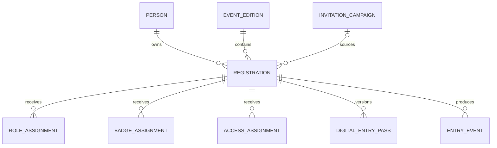
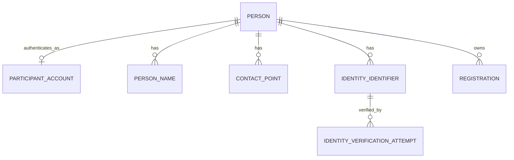
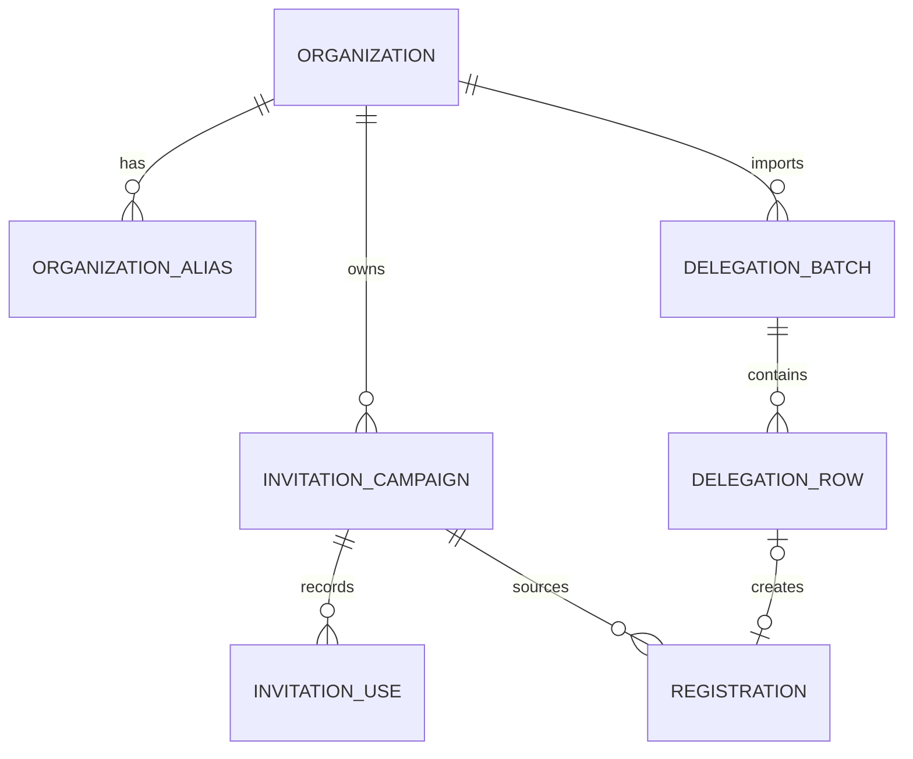
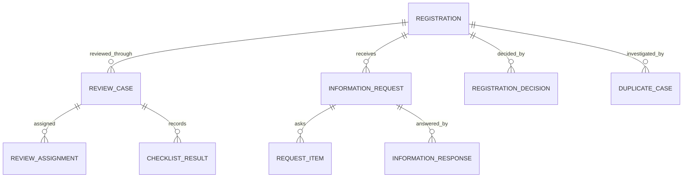
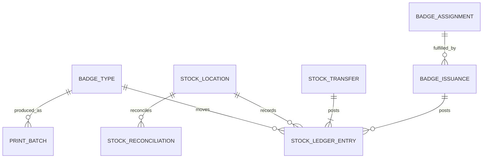

# ASC 2026 Registration Platform

## Backend Schema and Data Model Specification

**African Startup Conference 2026**  
**Web Registration, Accreditation, Badge and Entry Management Platform**

> **Document purpose**
>
> Define the authoritative logical data model, entity ownership, relationships, lifecycle fields, privacy classification, database constraints, indexes, concurrency controls and Django/PostgreSQL implementation rules for the ASC 2026 Registration Platform.

> **Central data rule**
>
> A Person is not a Registration. One Person may own multiple valid Registration Contexts, assignments, Digital Entry Passes and Entry Events. Contexts are preserved and never overwritten merely because identity matches.

| Attribute | Value |
| --- | --- |
| Document type | Backend Schema and Data Model Specification |
| Document identifier | ASC-REG-DATA |
| Status | Final |
| Version | 1.1 |
| Date | September 2026 |
| Document language | English |
| Product languages | English, French and Arabic |
| Primary stack | Django and PostgreSQL |
| Product scope | Web platform only |

---

# 1. Document Control

## 1.1 Ownership and authority

| Attribute | Value |
| --- | --- |
| Owner | ASC 2026 Registration Platform Project Team |
| Intended audience | Backend engineers, database engineers, architects, security, QA, DevOps and technical product owners |
| Product authority | ASC Registration Platform PRD |
| Technical authority | ASC Registration Platform TRD |
| Flow authority | ASC Registration Platform Application Flow Specification |
| Interaction authority | ASC Registration Platform UI/UX Design Specification |

## 1.2 Scope

This document defines:

- bounded contexts and recommended Django applications;
- logical entities and their main fields;
- required relationships and deletion behavior;
- uniqueness, check and exclusion constraints;
- privacy and encryption treatment;
- append-only history and audit rules;
- query indexes and partition candidates;
- online and offline idempotency records;
- migration and implementation order.

It does not define complete REST payloads, final Python model source, infrastructure topology, cryptographic implementation code, final retention durations or the separate ASC mobile application.

## 1.3 Normative terms

- **MUST / MUST NOT**: mandatory schema or persistence behavior.
- **SHOULD / SHOULD NOT**: recommended default.
- **MAY**: optional extension.
- **Current record**: the active version selected by a partial uniqueness rule or explicit pointer.
- **Immutable record**: an insert-only record corrected by a linked later record.
- **Snapshot**: an immutable representation of submitted or issued facts at a point in time.
- **Sensitive identifier**: NIN, passport number or another official identifier.

# 2. Data Architecture Principles

## 2.1 Required principles

| Principle | Required implementation |
| --- | --- |
| Context preservation | Registration-scoped facts and outcomes remain attached to the exact Registration. |
| Stable identity | UUID primary keys are used for business entities; public references are separate. |
| Minimum sensitive data | Sensitive identifiers are encrypted and searchable through keyed hashes. |
| Relational core | Core business data uses explicit PostgreSQL columns and foreign keys. |
| Controlled JSONB | JSONB is limited to immutable snapshots, provider metadata and flexible rule parameters. |
| Explicit history | Decisions, assignments, passes, stock and entry history use dedicated append-only records. |
| No silent hard delete | Operational records use lifecycle status, anonymization or controlled purge jobs. |
| Idempotent ingestion | Submission, communications, entry and offline synchronization have unique operation keys. |
| Concurrency safety | Mutable aggregates use versions; capacity, stock and pass replacement use row locking. |
| Scoped access | User permissions are joined to explicit event, organization and checkpoint scopes. |
| Storage separation | Document bytes remain in secure object storage, never PostgreSQL binary columns. |

## 2.2 Recommended Django application boundaries

| Django application | Owned entities |
| --- | --- |
| `core` | Person, ParticipantAccount, contact points, identity identifiers, reference values |
| `events` | EventEdition, Venue, Zone, Gate, registration windows |
| `organizations` | Organization, aliases, professional affiliations, invitations, delegations |
| `registrations` | Registration, profile, interests, submissions, source context |
| `verification` | Identity verification attempts, documents, stored object metadata |
| `reviews` | Review case, checklist, additional information, decisions, duplicate cases |
| `accreditation` | Participant Role, Badge Type, Access Profile, assignments, Digital Entry Pass |
| `badges` | Print batches, stock locations, transfers, ledger, issuance, reconciliation |
| `entry` | Devices, scopes, offline packages, sync operations, entry events, overrides |
| `accounts` | Operational user, scoped group membership, sessions and authentication events |
| `communications` | Templates, messages, campaigns, attempts and preferences |
| `privacy` | Legal documents, acceptances, consents, requests, retention and legal holds |
| `audit` | Append-only audit events and integrity checkpoints |

Cross-application imports SHOULD follow service boundaries rather than arbitrary direct writes. Database foreign keys remain authoritative for referential integrity.

## 2.3 Root relationship model

# 3. Shared Identifiers and Lifecycle Fields

## 3.1 Identifier policy

Business entities MUST use a PostgreSQL `uuid` primary key generated by the application. UUIDv7 is preferred where the supported Python runtime and chosen library provide a stable implementation; UUIDv4 is an acceptable fallback without changing the database type.

High-volume append-only tables MAY use a `bigint` physical primary key plus a globally unique UUID event identifier when this materially improves partitioning and index locality.

Public references are separate from primary keys:

| Entity | Example public reference |
| --- | --- |
| Registration | `ASC26-R-004812` |
| Invitation Campaign | `ASC26-I-0194` |
| Print Batch | `ASC26-PB-0037` |
| Privacy Request | `ASC26-DSR-0021` |

Public references MUST be unique, non-secret and safe to display. They MUST NOT be used as authentication credentials.

## 3.2 Common mutable fields

Mutable aggregate roots SHOULD contain:

| Field | PostgreSQL type | Rule |
| --- | --- | --- |
| `id` | `uuid` | Primary key |
| `created_at` | `timestamptz` | Database or application UTC timestamp |
| `updated_at` | `timestamptz` | Updated on successful mutation |
| `version` | `positive integer` | Incremented for optimistic concurrency |
| `created_by_id` | `uuid`, nullable | Operational actor where applicable |
| `updated_by_id` | `uuid`, nullable | Operational actor where applicable |

## 3.3 Lifecycle behavior

- Reference and configuration records use `status` or `is_active`; used rows are not deleted.
- Append-only records have no generic `updated_at` unless their delivery or processing state legitimately evolves.
- `deleted_at` is not a universal pattern. Use domain-specific states such as `WITHDRAWN`, `REVOKED`, `CANCELLED`, `EXPIRED` or `MERGED`.
- Controlled purge jobs may remove or anonymize eligible data only after retention checks and Legal Hold evaluation.
- Every purge or anonymization action is auditable.

## 3.4 Time and language

- Persist timestamps as timezone-aware UTC `timestamptz`.
- Persist event-local timezone as an IANA timezone name on `EventEdition`.
- Persist language codes using BCP 47-compatible values constrained to the supported set, initially `en`, `fr` and `ar`.
- Do not store preformatted localized dates or numbers.

# 4. Person, Account, Contact and Identity Model

## 4.1 Model overview

## 4.2 `Person`

The canonical natural-person record. It is independent of every Event Edition.

| Field | Type | Required | Notes |
| --- | --- | --- | --- |
| `id` | UUID | Yes | Primary key |
| `status` | Choice | Yes | `ACTIVE`, `MERGED`, `ANONYMIZED`, `ARCHIVED` |
| `display_name` | String | Yes | Operational display only; not a legal identity source |
| `birth_date` | Date | Conditional | Restricted personal data |
| `birth_country_code` | ISO code | Conditional | Prefer code over free text |
| `birth_place` | String | Optional | Collect only when required |
| `nationality_code` | ISO code | Conditional | Current declared nationality |
| `sex_code` | Choice | Optional | Only if an approved purpose exists |
| `preferred_language` | String | Yes | `en`, `fr` or `ar` |
| `merged_into_id` | UUID FK | Conditional | Required only when status is `MERGED` |
| `retention_class` | Choice | Yes | Policy lookup, not a duration literal |
| `purge_after` | Timestamp | Optional | Set only by approved policy logic |

**Constraints:**

- `merged_into_id` cannot equal `id`.
- A merged Person cannot receive new Registration Contexts.
- Person merging creates `PersonMergeEvent`; it never deletes source history.
- No official identifier is stored directly on `Person`.

## 4.3 `PersonName`

Stores structured and multi-script names.

| Field | Type | Notes |
| --- | --- | --- |
| `person_id` | FK | Owner |
| `name_type` | Choice | `LEGAL`, `PREFERRED`, `FORMER` |
| `script_code` | String | ISO 15924 where known, such as `Latn` or `Arab` |
| `given_names` | String | Structured given names |
| `family_name` | String | Structured family name |
| `full_name` | String | Source-preserving full representation |
| `normalized_search_name` | String | Accent- and case-normalized search helper |
| `is_current` | Boolean | One current name per type and script |
| `source` | Choice | Applicant, verification service, operator correction |

A partial unique constraint SHOULD enforce one current `LEGAL` name per Person and script.

## 4.4 `ParticipantAccount`

Passwordless participant authentication identity.

| Field | Type | Notes |
| --- | --- | --- |
| `id` | UUID | Primary key |
| `person_id` | One-to-one FK | Account owner |
| `primary_login_contact_id` | FK to ContactPoint | Verified active email selected as the primary login destination |
| `email_verified_at` | Timestamp | Required for active access |
| `status` | Choice | `PENDING`, `ACTIVE`, `LOCKED`, `DISABLED` |
| `last_login_at` | Timestamp | Operational metadata |

An on-behalf Registration may exist before a ParticipantAccount is created. Claiming the Draft verifies the email, creates or resolves the Person and binds the Registration. V1 permits at most one active ParticipantAccount per Person. Multiple verified email ContactPoints may be enabled as login destinations for that account without creating another active account.

## 4.5 `ContactPoint`

| Field | Type | Notes |
| --- | --- | --- |
| `person_id` | FK | Owner |
| `type` | Choice | `EMAIL`, `MOBILE` |
| `value_encrypted` | Encrypted text | Raw destination |
| `value_hash` | Fixed bytes/string | HMAC blind index for exact matching |
| `masked_value` | String | Safe display form |
| `country_code` | ISO code | Mainly for mobile numbers |
| `is_primary` | Boolean | One primary per type |
| `is_verified` | Boolean | Verification state |
| `verified_at` | Timestamp | Verification evidence |
| `login_enabled` | Boolean | Applies only to verified email ContactPoints linked to the Person's active ParticipantAccount |
| `status` | Choice | `ACTIVE`, `REPLACED`, `BOUNCED`, `DISABLED` |

Contact data may repeat in unclaimed Drafts, but one active login-enabled email hash maps to one ParticipantAccount. A Person may have multiple verified login-enabled email ContactPoints. Mobile is required for Algerian participants and optional for international participants unless an approved operational policy requires it; verified email remains mandatory for self-service.

## 4.6 `IdentityIdentifier`

Official identifiers are stored separately from Person and Registration.

| Field | Type | Notes |
| --- | --- | --- |
| `person_id` | FK | Owner |
| `identifier_type` | Choice | `NIN`, `PASSPORT` |
| `country_code` | ISO code | Algeria for NIN; issuing country for passport |
| `value_encrypted` | Encrypted text | Never used directly as an index |
| `search_hash` | Fixed bytes/string | Versioned HMAC of normalized value and scope |
| `hash_key_version` | Small integer | Supports blind-index key rotation |
| `masked_value` | String | Operational display |
| `issued_at` | Date | Optional |
| `expires_at` | Date | Passport when available |
| `status` | Choice | `DECLARED`, `VERIFIED`, `REVOKED`, `EXPIRED`, `REPLACED` |
| `verified_at` | Timestamp | Last conclusive verification |

**Uniqueness rules:**

- A verified active Algerian NIN is unique across Persons.
- A verified active passport is unique by issuing country and normalized number.
- Declared or inconclusive identifiers do not trigger automatic Person merge.
- Replaced passports remain historical and may coexist with the current passport.

The unique constraints SHOULD be partial indexes applying only to verified active rows.

# 5. Event and Registration Model

## 5.1 `EventEdition`

| Field | Type | Notes |
| --- | --- | --- |
| `id` | UUID | Primary key |
| `code` | Short string | Unique, such as `ASC2026` |
| `name` | String | Official name |
| `timezone` | IANA name | Event-local time calculations |
| `starts_at`, `ends_at` | Timestamp | Event interval |
| `registration_opens_at`, `registration_closes_at` | Timestamp | Public window |
| `status` | Choice | `DRAFT`, `REGISTRATION_OPEN`, `REGISTRATION_CLOSED`, `EVENT_OPERATIONS`, `COMPLETED`, `ARCHIVED` |
| `default_language` | String | Fallback communication language |
| `supported_languages` | Array or relation | Initially English, French and Arabic |
| `settings_version` | Positive integer | Incremented for operational configuration changes |

## 5.2 Venue structure

### `Venue`

Contains Event Edition, code, localized name, address summary and active state.

### `Zone`

Contains Venue, unique code, localized name, sensitivity level and active state. Parent zone is optional when hierarchical zones are needed.

### `Gate`

Contains Venue, code, localized name, default zone, entry/exit capabilities, offline policy and active state.

Codes are unique inside their parent scope and remain stable after operational use.

## 5.3 `Registration`

The aggregate root for one participation context.

| Field | Type | Required | Notes |
| --- | --- | --- | --- |
| `id` | UUID | Yes | Primary key |
| `public_reference` | String | Yes | Unique display reference |
| `event_edition_id` | FK | Yes | Event context |
| `person_id` | FK | Conditional | Nullable only for an unclaimed on-behalf Draft |
| `source_kind` | Choice | Yes | `OPEN`, `INVITATION`, `DELEGATION`, `ON_BEHALF`, `ON_SITE` |
| `source_context_key` | String | Yes | Stable deduplication context |
| `invitation_campaign_id` | FK | Optional | Source campaign |
| `source_organization_id` | FK | Optional | Inviting or delegating organization |
| `public_status` | Choice | Yes | Participant-facing status |
| `internal_status` | Choice | Yes | Operational status |
| `is_current_context` | Boolean | Yes | Supports duplicate resolution without deletion |
| `preferred_language` | String | Yes | Communication language |
| `current_step` | String | Optional | Draft resume marker |
| `submitted_at` | Timestamp | Optional | First valid submission |
| `withdrawn_at` | Timestamp | Optional | Participant withdrawal |
| `cancelled_at` | Timestamp | Optional | Authorized cancellation |
| `version` | Integer | Yes | Optimistic concurrency |

**Required invariants:**

- Multiple Registrations for one Person and Event Edition are allowed when source context differs.
- A generated `deduplication_key` prevents accidental duplication of the same current context.
- Invitation Campaign and Professional Organization are not interchangeable.
- Withdrawal or cancellation affects only this Registration Context.
- `person_id` becomes non-null before participant submission.

`public_status` uses the fixed values `DRAFT`, `SUBMITTED`, `UNDER_REVIEW`, `ADDITIONAL_INFORMATION_REQUIRED`, `APPROVED`, `NOT_APPROVED` and `WITHDRAWN`. Operational cancellation maps to public `WITHDRAWN` while preserving `cancelled_at`, reason and decision history.

`internal_status` uses the controlled values `PENDING_ASSIGNMENT`, `ASSIGNED`, `VERIFICATION_PENDING`, `DUPLICATE_REVIEW`, `REVIEW_IN_PROGRESS`, `AWAITING_APPLICANT`, `QUALIFICATION_COMPLETE` and `CLOSED`. Core status values and transition guards are application behavior; authorized configuration may change localized labels, not invent transitions.

## 5.4 Registration context deduplication

`deduplication_key` SHOULD be derived from Event Edition, resolved Person and source context, not from email alone. A partial unique index applies to current non-terminal contexts. A supervisor may mark one accidental duplicate as non-current and link it through `RegistrationDuplicateResolution` without deleting either row.

## 5.5 `RegistrationProfile`

Mutable, queryable current data for the Registration.

| Field group | Example fields |
| --- | --- |
| Identity presentation | Submitted names, date of birth, nationality, country of residence |
| Contact snapshot | Verified email reference, optional mobile reference |
| Professional profile | Organization snapshot, job title, department, sector, country |
| Participation facts | Objectives, interests, accessibility or operational needs when approved |
| Media | Official profile photo Document reference |

Core query fields use typed columns. Long free text is bounded and normalized. Data that is not required by the approved form is not added preemptively.

## 5.6 `ProfessionalAffiliation`

| Field | Type | Notes |
| --- | --- | --- |
| `registration_id` | One-to-one or FK | Context-specific affiliation |
| `organization_id` | FK, nullable | Matched master Organization |
| `submitted_organization_name` | String | Immutable source-preserving name |
| `job_title` | String | Submitted role |
| `department` | String | Optional |
| `sector_id` | FK | Controlled reference where possible |
| `country_code` | ISO code | Organization country |

The submitted snapshot remains unchanged when the master Organization is renamed or merged.

## 5.7 Interests

`InterestTopic` is event-configurable and translatable. `RegistrationInterest` joins Registration to InterestTopic and may store priority or optional bounded notes. It is never used to assign a Badge Type automatically.

## 5.8 `RegistrationSubmission`

Immutable evidence of each formal submission or resubmission.

| Field | Type | Notes |
| --- | --- | --- |
| `registration_id` | FK | Owner |
| `sequence` | Positive integer | Unique per Registration |
| `submission_kind` | Choice | Initial, additional-information response, authorized resubmission |
| `snapshot_json` | JSONB | Canonical immutable form snapshot |
| `snapshot_hash` | Fixed hash | Integrity evidence |
| `submitted_by_type` | Choice | Participant, authorized user, system migration |
| `submitted_by_user_id` | FK, nullable | Operational actor |
| `submitted_at` | Timestamp | Evidence time |
| `idempotency_key` | UUID/string | Unique per submission operation |

JSONB is appropriate here because the row is immutable evidence, not the primary query model.

# 6. Organizations, Invitations and Delegations

## 6.1 Model overview

## 6.2 `Organization`

| Field | Type | Notes |
| --- | --- | --- |
| `id` | UUID | Primary key |
| `official_name` | String | Current official display name |
| `normalized_name` | String | Matching helper |
| `organization_type` | Choice/reference | Ministry, public body, company, startup, institution, other |
| `country_code` | ISO code | Country |
| `status` | Choice | `ACTIVE`, `INACTIVE`, `MERGED` |
| `merged_into_id` | Self FK | Set when merged |

`OrganizationAlias` preserves alternative names, languages and historical spellings. Organization merge relinks master references but never changes submitted professional snapshots.

## 6.3 `InvitationCampaign`

| Field | Type | Notes |
| --- | --- | --- |
| `public_reference` | String | Display reference |
| `event_edition_id` | FK | Event |
| `organization_id` | FK | Inviting body |
| `name` | String | Internal campaign label |
| `token_hash` | Fixed hash | Link secret is not stored in plaintext |
| `status` | Choice | `DRAFT`, `ACTIVE`, `SUSPENDED`, `EXPIRED`, `CLOSED` |
| `valid_from`, `valid_until` | Timestamp | Link validity |
| `capacity` | Positive integer, nullable | Optional submission capacity |
| `language` | String | Invitation default |
| `fallback_mode` | Choice | Deny or offer open registration |
| `rotated_from_id` | Self FK | Link rotation history |

An Invitation Campaign MUST NOT contain default Participant Role, Badge Type or Access Profile fields.

## 6.4 `InvitationUse`

Records meaningful use without tracking unnecessary browsing data.

| Field | Type | Notes |
| --- | --- | --- |
| `campaign_id` | FK | Campaign |
| `registration_id` | FK | Created or linked context |
| `use_kind` | Choice | Draft created, claimed, submitted |
| `occurred_at` | Timestamp | Event time |
| `operation_id` | UUID | Idempotency key |

Campaign capacity is enforced transactionally at final submission using row locking or an equivalent atomic counter strategy.

## 6.5 Delegation import

### `DelegationBatch`

Contains organization, event, uploaded source object metadata, status, row counts, creator and timestamps.

### `DelegationRow`

Contains row number, normalized candidate fields, validation status, error codes, resulting Registration and claim state. Badge, role, access, decision and document content are prohibited from the import schema.

## 6.6 Organization access

Invitation use does not create access. Organization workspace access is represented by `ScopedGroupMembership` with an explicit `organization_id`. Optional row-level grants may use `OrganizationRegistrationGrant` when access must be narrower than all organization-linked contexts.

# 7. Verification and Document Model

## 7.1 `IdentityVerificationAttempt`

Every external or manual verification attempt is immutable.

| Field | Type | Notes |
| --- | --- | --- |
| `identity_identifier_id` | FK | Identifier checked |
| `registration_id` | FK, nullable | Triggering context |
| `method` | Choice | External service, manual document, supervised correction |
| `provider_code` | String | Approved integration identifier |
| `request_reference` | String | Provider correlation reference, not full request |
| `result` | Choice | `MATCH`, `NO_MATCH`, `INCONCLUSIVE`, `UNAVAILABLE`, `ERROR` |
| `matched_fields` | JSONB | Minimal field-level result flags |
| `provider_metadata` | JSONB | Redacted and bounded technical metadata |
| `attempted_at` | Timestamp | Evidence time |
| `performed_by_user_id` | FK, nullable | Manual verifier |

Full upstream payloads are not retained unless an approved legal and security need exists.

## 7.2 `StoredObject`

Metadata for a file held in secure object storage.

| Field | Type | Notes |
| --- | --- | --- |
| `id` | UUID | Primary key |
| `storage_key` | String | Opaque object reference |
| `bucket_class` | Choice | Restricted or standard protected store |
| `content_type` | String | Validated MIME type |
| `size_bytes` | Big integer | Enforced maximum |
| `sha256` | Fixed hash | Integrity and duplicate aid |
| `encryption_key_ref` | String | Key-management reference only |
| `malware_scan_status` | Choice | Pending, clean, rejected, failed |
| `created_at` | Timestamp | Upload time |
| `purge_after` | Timestamp, nullable | Policy-controlled |
| `legal_hold` | Boolean | Fast enforcement projection |

PostgreSQL MUST NOT contain the document binary.

## 7.3 `Document`

| Field | Type | Notes |
| --- | --- | --- |
| `stored_object_id` | One-to-one FK | File metadata |
| `registration_id` | FK | Context owner |
| `person_id` | FK, nullable | Canonical relation when justified |
| `document_type` | Choice | Profile photo, passport identity page, requested evidence, other approved type |
| `purpose_code` | String | Specific processing purpose |
| `information_request_item_id` | FK, nullable | Request that required the document |
| `status` | Choice | `ACTIVE`, `REPLACED`, `REJECTED`, `PURGED` |
| `replaced_by_id` | Self FK | History |
| `verified_at` | Timestamp, nullable | Manual evidence review |
| `verified_by_user_id` | FK, nullable | Reviewer |

Passport identity-page storage is conditional, never universally required by schema. Document access is purpose-bound and written to AuditEvent.

# 8. Review, Additional Information and Decisions

## 8.1 Model overview

## 8.2 `ReviewCase`

| Field | Type | Notes |
| --- | --- | --- |
| `registration_id` | FK | Registration under review |
| `case_type` | Choice | Standard, identity, duplicate, restricted, information response |
| `status` | Choice | Queued, assigned, in progress, waiting, completed, cancelled |
| `queue_code` | String | Configurable queue |
| `priority` | Small integer | Bounded operational priority |
| `opened_at`, `closed_at` | Timestamp | Lifecycle |
| `version` | Integer | Concurrency control |

`ReviewAssignment` is append-only and records assigned user or group, scope, start, end and assignment reason. Only one current assignment is allowed per ReviewCase.

## 8.3 Checklist

`ReviewChecklistDefinition` is versioned by Event Edition and case type. `ReviewChecklistResult` records item code, result, bounded note, actor and timestamp. Historical results retain their definition version.

## 8.4 Additional information

### `InformationRequest`

Contains Registration, sequence, status, participant-safe message, optional deadline, sent/closed timestamps, creator and cancellation reason.

Only one active request per Registration is recommended and can be enforced by partial unique index.

### `RequestItem`

| Field | Type | Notes |
| --- | --- | --- |
| `request_id` | FK | Parent request |
| `item_type` | Choice | Field correction, document upload, clarification |
| `field_code` | Controlled string | Approved editable field |
| `document_type` | Choice, nullable | Approved document type |
| `required` | Boolean | Submission rule |
| `instructions` | Translatable content reference | No internal notes |

### `InformationResponse`

Contains request, sequence, immutable response snapshot, snapshot hash, participant actor, submitted time and idempotency key. `ResponseItem` links submitted values or Documents to exact RequestItems.

## 8.5 `RegistrationDecision`

Immutable decision history.

| Field | Type | Notes |
| --- | --- | --- |
| `registration_id` | FK | Context decided |
| `sequence` | Positive integer | Unique per Registration |
| `outcome` | Choice | `APPROVED`, `NOT_APPROVED` |
| `reason_code` | FK/reference | Required for Not Approved |
| `internal_note_encrypted` | Encrypted text, nullable | Restricted and bounded |
| `public_reason_code` | FK/reference, nullable | Approved participant-facing reason |
| `is_current` | Boolean | One current decision |
| `supersedes_id` | Self FK | Reopen history |
| `decided_by_user_id` | FK | Authorized actor |
| `decided_at` | Timestamp | Evidence time |

A partial unique index enforces one current decision per Registration. Reopening inserts a later row and clears `is_current` transactionally.

## 8.6 Duplicate resolution

`DuplicateCase` links the subject Registration to candidate Persons or Registrations through `DuplicateCandidate`. Outcome values distinguish same Person with valid separate context, accidental same-context duplicate, different Person, insufficient evidence and escalation.

`PersonMergeEvent` records source Person, target Person, reason, actor and time. Foreign-key history remains resolvable; sensitive identifiers are reassigned only through a controlled transaction.

# 9. Roles, Badges, Access and Digital Passes

## 9.1 Configuration entities

### `ParticipantRole`

Event-scoped code, localized name, description, active state and sort order.

### `BadgeType`

Event-scoped code, localized name, artwork version, color metadata, active state and participant visibility policy. It contains no participant identity.

### `AccessProfile`

Event-scoped code, localized name, validity window, re-entry policy, offline policy and active state.

### `AccessRule`

Joins AccessProfile to Zone and optional Gate, with allowed event type, valid-from/to and rule effect. V1 SHOULD use allow rules and explicit restrictions rather than a complex policy language.

## 9.2 Assignment entities

Separate tables preserve separate permissions and histories:

| Entity | Target | Configuration FK |
| --- | --- | --- |
| `RoleAssignment` | Registration | ParticipantRole |
| `BadgeAssignment` | Registration | BadgeType |
| `AccessAssignment` | Registration | AccessProfile |

Each table contains:

- UUID primary key;
- Registration FK;
- assigned configuration FK;
- status: `ACTIVE`, `REVOKED`, `REPLACED`, `EXPIRED`;
- valid-from and optional valid-until;
- assignment source and reason;
- actor and timestamp;
- `supersedes_id`;
- revocation actor, time and reason when applicable.

A partial unique constraint enforces one active assignment of each category per Registration. The same Person can have other active assignments through other Registrations.

## 9.3 `DigitalEntryPass`

| Field | Type | Notes |
| --- | --- | --- |
| `id` | UUID | Internal pass identifier |
| `registration_id` | FK | Exact context |
| `version` | Positive integer | Unique per Registration |
| `status` | Choice | `READY`, `ACTIVE`, `REPLACED`, `REVOKED`, `EXPIRED` |
| `role_assignment_id` | FK, nullable | Snapshot source |
| `badge_assignment_id` | FK | Snapshot source |
| `access_assignment_id` | FK | Snapshot source |
| `event_code` | String | Signed payload field |
| `badge_type_code` | String | Signed payload field; no PII |
| `access_profile_code` | String | Signed payload field; no PII |
| `payload_version` | Small integer | QR schema version |
| `signing_key_id` | String | Public key reference, never private key material |
| `payload_hash` | Fixed hash | Integrity and regeneration evidence |
| `nonce` | Random bytes/string | Prevents predictable credentials |
| `valid_from`, `valid_until` | Timestamp | Credential interval |
| `activated_at`, `revoked_at` | Timestamp | Lifecycle |
| `replaced_by_id` | Self FK | Version chain |

One current active or ready pass is allowed per Registration. Pass replacement, activation and revocation use a transaction and row lock.

## 9.4 QR payload boundary

The signed payload may include:

- payload schema version;
- Event Edition code;
- pass UUID or opaque credential identifier;
- pass version;
- Badge Type code;
- Access Profile code or compact rules version;
- issued and expiry timestamps;
- nonce;
- signing key identifier;
- digital signature.

It MUST NOT include name, NIN, passport number, email, phone, document link or internal note.

# 10. Badge Production, Stock and Issuance

## 10.1 Model overview

## 10.2 `PrintBatch`

Contains public reference, Event Edition, Badge Type, artwork version, planned quantity, produced quantity, accepted quantity, damaged quantity, status, supplier reference, production dates and creator.

Lifecycle: `DRAFT`, `READY`, `IN_PRODUCTION`, `RECEIVED`, `RECONCILED`, `CLOSED`, with cancellation before production.

## 10.3 `StockLocation`

Event-scoped central store or checkpoint stock location with code, name, type, Venue/Gate scope, responsible group and active state.

## 10.4 `BadgeStockLedgerEntry`

Append-only authoritative quantity ledger.

| Field | Type | Notes |
| --- | --- | --- |
| `operation_id` | UUID | Unique idempotency key |
| `event_edition_id` | FK | Event |
| `badge_type_id` | FK | Generic badge category |
| `location_id` | FK | Balance location |
| `entry_type` | Choice | Receive, transfer in/out, issue, return, damage, adjustment, reconciliation |
| `quantity_delta` | Signed integer | Non-zero |
| `print_batch_id` | FK, nullable | Receive source |
| `transfer_id` | FK, nullable | Transfer source |
| `issuance_id` | FK, nullable | Issue or return source |
| `reconciliation_id` | FK, nullable | Count source |
| `occurred_at` | Timestamp | Physical event time |
| `recorded_at` | Timestamp | Server persistence time |
| `recorded_by_user_id` | FK | Actor |
| `device_id` | FK, nullable | Offline-capable source |

A check constraint ensures the reference fields match `entry_type`. Ledger rows are never updated or deleted.

## 10.5 `StockTransfer`

Contains source location, destination location, Badge Type, quantity, status, initiator, receiver and timestamps. Posting a completed transfer creates balanced `TRANSFER_OUT` and `TRANSFER_IN` ledger rows in one transaction.

## 10.6 `BadgeIssuance`

| Field | Type | Notes |
| --- | --- | --- |
| `badge_assignment_id` | FK | Exact Registration assignment |
| `location_id` | FK | Issuing stock |
| `operation_id` | UUID | Unique online/offline operation |
| `status` | Choice | `ISSUED`, `REPLACED`, `RETURNED`, `VOIDED` |
| `optional_serial_number` | String, nullable | Used only if serialization is enabled |
| `issued_by_user_id` | FK | Operator |
| `device_id` | FK, nullable | Entry device |
| `issued_at` | Timestamp | Physical issuance |
| `replaces_id` | Self FK, nullable | Replacement history |

Issuance and its negative stock movement are committed atomically. Stock cannot become negative unless a separately authorized reconciliation policy permits and records the exception.

## 10.7 Balance projection

`BadgeStockBalance` MAY be a maintained projection keyed by Event Edition, Badge Type and Stock Location. The ledger remains authoritative. Any projection mismatch creates a reconciliation alert.

# 11. Entry, Devices and Offline Synchronization

## 11.1 Device entities

### `EntryDevice`

| Field | Type | Notes |
| --- | --- | --- |
| `id` | UUID | Device identity |
| `public_name` | String | Operational label |
| `status` | Choice | Pending, enrolled, offline ready, suspended, revoked, expired |
| `device_key_id` | String | Secure key reference |
| `enrolled_at`, `expires_at` | Timestamp | Lifecycle |
| `last_seen_at`, `last_sync_at` | Timestamp | Health |
| `app_version` | String | Compatibility check |
| `data_wipe_requested_at` | Timestamp, nullable | Loss response |

### `DeviceScope`

Explicitly joins device to Event Edition, Venue, Gate, permitted Zones, verification methods and offline capability. Scope versions support package regeneration.

## 11.2 `OfflinePackage`

Metadata only; package bytes are encrypted client artifacts or protected objects.

| Field | Type | Notes |
| --- | --- | --- |
| `device_id` | FK | Target device |
| `event_edition_id` | FK | Event |
| `package_version` | Big integer | Monotonic device package version |
| `scope_version` | Integer | DeviceScope version |
| `data_cutoff_at` | Timestamp | Snapshot freshness |
| `status` | Choice | Building, ready, downloaded, superseded, expired, revoked |
| `manifest_hash` | Fixed hash | Integrity |
| `object_id` | FK, nullable | Protected package object |
| `expires_at` | Timestamp | Hard offline expiry |

## 11.3 `SyncOperation`

Durable inbox for an operation produced by an offline device or Event Edge.

| Field | Type | Notes |
| --- | --- | --- |
| `operation_id` | UUID | Global idempotency key |
| `device_id` | FK | Source |
| `device_sequence` | Big integer | Monotonic per device where available |
| `operation_type` | Choice | Entry, exit, badge issuance, override or supported correction |
| `payload_json` | JSONB | Minimal validated operation body |
| `payload_hash` | Fixed hash | Integrity and duplicate comparison |
| `occurred_at` | Timestamp | Device event time |
| `received_at` | Timestamp | Server time |
| `package_version` | Big integer | Knowledge baseline |
| `status` | Choice | Pending, processing, applied, duplicate, conflict, rejected, reconciliation required |
| `result_reference` | UUID, nullable | Resulting domain record |
| `error_code` | String, nullable | Stable machine-readable outcome |

Unique constraints apply to `operation_id` and optionally `(device_id, device_sequence)`.

## 11.4 `EntryEvent`

Immutable physical entry evidence.

| Field | Type | Notes |
| --- | --- | --- |
| `operation_id` | UUID | Unique online or offline operation |
| `event_edition_id` | FK | Event |
| `registration_id` | FK | Exact context |
| `digital_entry_pass_id` | FK, nullable | Pass version used |
| `badge_assignment_id` | FK, nullable | Context badge |
| `gate_id`, `zone_id` | FK | Location |
| `device_id` | FK | Device |
| `operator_user_id` | FK | Human actor |
| `event_type` | Choice | `ENTRY`, `EXIT` |
| `verification_method` | Choice | QR, NIN, passport, reference, manual |
| `result` | Choice | Allowed, advisory, denied, manual review |
| `decision` | Choice | Admit, do not admit, redirected |
| `occurred_at` | Timestamp | Physical event time |
| `recorded_at` | Timestamp | Server time |
| `offline` | Boolean | Continuity indicator |
| `package_version` | Big integer, nullable | Offline knowledge version |
| `override_id` | FK, nullable | Exceptional authority |

Entry and Exit are supported by schema even when V1 screens record Entry only.

## 11.5 `EntryOverride`

Contains Registration, original result, final decision, approved reason code, bounded encrypted note, user, gate, device and time. A restriction marked non-overrideable cannot be linked to a successful override.

## 11.6 Restrictions

`SecurityRestriction` has explicit nullable `person_id` and `registration_id` foreign keys with a check constraint requiring exactly one target. It stores severity, category, start/end, overrideability, encrypted reason, creator and revocation history. Entry interfaces receive only the decision-relevant projection.

## 11.7 `ReconciliationCase`

Links one or more SyncOperations and resulting domain records. It records conflict type, device-known state, server-authoritative state, operational fact, resolution, actor and closure time. Reconciliation does not rewrite the original EntryEvent.

# 12. Operational Users, Groups and Permissions

## 12.1 `OperationalUser`

Use a custom Django user model from the first migration.

| Field | Type | Notes |
| --- | --- | --- |
| `id` | UUID | Primary key |
| `email_normalized` | Case-insensitive string | Unique login identifier |
| `display_name` | String | Operational name |
| `account_type` | Choice | Internal, external security, organization, support |
| `status` | Choice | Invited, active, suspended, expired, disabled |
| `authentication_source` | Choice | Local, SSO |
| `mfa_state` | Choice | Pending, active, reset required |
| `active_from`, `active_until` | Timestamp, nullable | Time-bound access |
| `last_login_at` | Timestamp | Security metadata |

## 12.2 Django Group and Permission

Django `Group` and `Permission` remain the atomic authorization catalogue. No custom policy language is required for V1.

## 12.3 `ScopedGroupMembership`

| Field | Type | Notes |
| --- | --- | --- |
| `user_id` | FK | Operational user |
| `group_id` | FK | Django Group |
| `event_edition_id` | FK, nullable | Event scope |
| `organization_id` | FK, nullable | Organization scope |
| `venue_id` | FK, nullable | Venue scope |
| `gate_id` | FK, nullable | Gate scope |
| `active_from`, `active_until` | Timestamp, nullable | Time scope |
| `status` | Choice | Active, suspended, expired |
| `granted_by_user_id` | FK | Granting actor |
| `reason` | String | Bounded administrative reason |

Null scope means broad scope only when the granting user is allowed to grant it. Application services calculate effective permissions; navigation is not an authorization boundary.

## 12.4 Authentication challenge

`AuthenticationChallenge` stores challenge type, recipient hash, OTP hash, issued/expiry timestamps, attempt count, consumed timestamp and request metadata. It never stores the OTP value or unrestricted raw destination.

# 13. Communications Model

## 13.1 `MessageTemplate` and `MessageTemplateVersion`

`MessageTemplate` owns stable code, channel and purpose. Version rows own language, subject, body, allowed variables, status, effective dates, creator and content hash. Sent messages always retain the exact version reference.

## 13.2 `CommunicationMessage`

| Field | Type | Notes |
| --- | --- | --- |
| `id` | UUID | Message identity |
| `event_edition_id` | FK, nullable | Context |
| `registration_id` | FK, nullable | Exact Registration Context |
| `person_id` | FK, nullable | Recipient owner |
| `template_version_id` | FK | Exact content version |
| `channel` | Choice | Email or SMS |
| `language` | String | Resolved language |
| `destination_encrypted` | Encrypted text | Snapshot for delivery |
| `destination_hash` | Fixed hash | Matching and suppression |
| `variable_snapshot` | Encrypted JSONB | Approved variables only |
| `content_hash` | Fixed hash | Rendered integrity evidence |
| `idempotency_key` | String/UUID | Unique business-trigger message |
| `status` | Choice | Queued, sending, sent, delivered, deferred, failed, bounced, undeliverable, suppressed, cancelled |
| `suppression_reason` | String, nullable | Machine-readable reason |
| `queued_at`, `sent_at`, `delivered_at` | Timestamp | Lifecycle |

OTP content is never persisted in rendered message data.

## 13.3 `DeliveryAttempt`

Append-only provider attempt with message, attempt number, provider code, provider reference, status, redacted response code, started/completed timestamps and next retry time.

## 13.4 Bulk communication

`CommunicationCampaign` stores bounded audience filters, template family, creator, status, expected count and execution timestamps. `CampaignRecipient` stores the resolved Registration or Person, selected language, Message link and exclusion reason. The resolved audience is immutable after send begins.

## 13.5 Preferences and suppression

`CommunicationPreference` is purpose-specific and records Person, purpose, channel, state and source ConsentRecord. Operational messages bypass optional marketing preference only when their purpose is contractually or operationally necessary.

`SuppressionEntry` stores channel, destination hash, reason, provider evidence and active interval. It does not require plaintext destination.

# 14. Privacy, Notices, Consent and Retention

The Ministry of Knowledge Economy, Start-ups and Micro-enterprises is the Data Controller and platform operator. The schema shall preserve the evidence and controls required to support processing under Algerian Law No. 18-07 on the protection of natural persons with regard to the processing of personal data, as amended and supplemented by Law No. 25-11. Final legal text, lawful bases, contact details and retention durations remain subject to approved legal and data-protection governance.

## 14.1 Legal documents

### `LegalDocument`

Stable code and type: Privacy Notice, Terms or another approved legal notice.

### `LegalDocumentVersion`

Contains document, language, version label, content or protected published URL, content hash, effective dates and status. A published version is immutable.

## 14.2 `AcceptanceRecord`

| Field | Type | Notes |
| --- | --- | --- |
| `person_id` | FK | Accepting person |
| `registration_id` | FK | Context |
| `legal_document_version_id` | FK | Exact accepted version |
| `action` | Choice | Accepted, acknowledged |
| `accepted_at` | Timestamp | Evidence |
| `language` | String | Presented language |
| `source` | Choice | Public web, assisted registration, migration |
| `session_reference` | String | Non-secret correlation value |

Acceptance of Terms and acknowledgement of the Privacy Notice are separate records from optional marketing consent.

## 14.3 Optional consent

`ConsentPurpose` defines stable optional purposes. `ConsentRecord` is append-only and records Person, purpose, action `GRANTED` or `WITHDRAWN`, source, timestamp and relevant notice version. Current consent is derived from the latest valid record.

## 14.4 `DataSubjectRequest`

Contains public reference, requester Person, request type, verification state, status, received date, due date, assigned Privacy Officer, decision, response date and restricted notes. Related Registrations and Documents use explicit join tables.

## 14.5 Retention

### `RetentionPolicy`

Defines policy code, data category, trigger event, configurable duration, disposal action and effective version. Durations are not fixed in this specification.

### `LegalHold`

Links a hold to explicit Person, Registration, Document, Export or other approved target through dedicated join tables. It records reason, authority, start, release and actor.

Eligible records may be:

- retained unchanged;
- restricted from normal access;
- anonymized while preserving operational statistics;
- purged from object storage and then marked purged in PostgreSQL.

# 15. Audit and Security Records

## 15.1 `AuditEvent`

AuditEvent is append-only and is the only recommended place for a controlled generic target reference.

| Field | Type | Notes |
| --- | --- | --- |
| `id` | Big integer | Partition-friendly physical key |
| `event_uuid` | UUID | Global event identifier |
| `occurred_at` | Timestamp | Event time and partition key |
| `actor_type` | Choice | Participant, operational user, system, device |
| `actor_user_id` | FK, nullable | Operational actor |
| `actor_person_id` | FK, nullable | Participant actor |
| `device_id` | FK, nullable | Device source |
| `action_code` | String | Stable event catalogue code |
| `target_type` | String | Controlled entity label |
| `target_uuid` | UUID, nullable | Target business ID |
| `event_edition_id` | FK, nullable | Event scope |
| `result` | Choice | Success, failure, denied |
| `reason_code` | String, nullable | Stable reason |
| `before_summary` | JSONB, nullable | Redacted changed fields |
| `after_summary` | JSONB, nullable | Redacted changed fields |
| `correlation_id` | UUID/string | Request or workflow trace |
| `network_fingerprint` | Hash, nullable | Privacy-reduced network evidence |

Audit content MUST NOT include OTP values, passwords, tokens, private keys, document bytes or full sensitive identifiers.

## 15.2 Integrity and partitions

- AuditEvent SHOULD be partitioned by time when expected volume justifies it.
- EntryEvent, SyncOperation and DeliveryAttempt are additional partition candidates.
- `AuditIntegrityCheckpoint` MAY store periodic chain or batch hashes in protected storage.
- Application roles receive insert-only access to audit partitions; reporting uses a read-only role.

## 15.3 Security events

Authentication failure, MFA change, privilege grant, device enrollment, document access, sensitive search, export, override and restriction changes all produce explicit AuditEvent action codes.

# 16. Constraints, Indexes and Concurrency

## 16.1 Required database constraints

| Domain | Constraint |
| --- | --- |
| Person | Merged Person points to another Person; no self-merge |
| Identity | Verified active NIN unique; verified active passport unique by issuer and hash |
| Registration | Public reference unique; one current deduplication key per context |
| Information request | At most one active request per Registration by default |
| Decision | One current RegistrationDecision per Registration |
| Assignments | One active role, badge and access assignment per Registration category |
| Pass | One current Ready/Active Digital Entry Pass per Registration |
| Campaign | Token hash unique; capacity non-negative |
| Stock | Quantity delta non-zero; typed source reference valid |
| Entry | Operation ID unique |
| Offline sync | Operation ID unique; device sequence unique when supplied |
| Communications | Idempotency key unique within event and trigger namespace |
| Restriction | Exactly one of Person or Registration target is set |

Use PostgreSQL partial unique indexes and `CheckConstraint` through Django migrations. Cross-row stock and capacity rules require transactions and locks rather than check constraints alone.

## 16.2 Recommended indexes

### Registration and review

- `(event_edition_id, public_status, created_at)`
- `(event_edition_id, internal_status, updated_at)`
- `(person_id, event_edition_id)`
- `(invitation_campaign_id, submitted_at)`
- `(source_organization_id, event_edition_id)`
- ReviewCase `(queue_code, status, priority, opened_at)`

### Identity and search

- IdentityIdentifier `(identifier_type, country_code, search_hash)` partial by active state
- ContactPoint partial unique index on active login-enabled email `value_hash`
- PersonName trigram index on `normalized_search_name` only if search quality requires it

### Entry and offline

- EntryEvent `(event_edition_id, occurred_at)`
- EntryEvent `(registration_id, occurred_at desc)`
- EntryEvent `(gate_id, occurred_at)`
- SyncOperation `(device_id, status, occurred_at)`
- OfflinePackage `(device_id, package_version desc)`

### Communications and audit

- CommunicationMessage `(status, queued_at)`
- DeliveryAttempt `(message_id, attempt_number)`
- AuditEvent `(event_edition_id, occurred_at)`
- AuditEvent `(target_type, target_uuid, occurred_at)`
- AuditEvent `(actor_user_id, occurred_at)`

Indexes on encrypted plaintext fields are prohibited. Use blind indexes only for exact matching and dedicated normalized search fields for approved name search.

## 16.3 Optimistic concurrency

Registration, ReviewCase, InvitationCampaign, EventEdition, mutable templates and device scope use a `version` integer. Updates include the expected version in the `WHERE` clause and fail clearly when stale.

## 16.4 Pessimistic locking

Use `SELECT ... FOR UPDATE` or equivalent transactional locking for:

- invitation capacity reservation;
- current decision replacement;
- assignment replacement;
- pass activation, replacement and revocation;
- stock issuance and transfer posting;
- Person merge;
- reconciliation closure.

## 16.5 Transaction boundaries

Domain action and AuditEvent creation SHOULD commit in the same database transaction when both are in PostgreSQL. External side effects use an Outbox pattern.

`OutboxEvent` contains event UUID, type, aggregate type/id, payload, occurred time, publication state and retry metadata. It is inserted with the domain transaction and consumed asynchronously for email, SMS, offline-delta building and integrations.

# 17. Data Classification and Protection

## 17.1 Classification levels

| Level | Examples | Baseline controls |
| --- | --- | --- |
| Public | Event dates, public Badge Type label | Standard integrity controls |
| Internal | Queue state, generic stock quantity | Authenticated scoped access |
| Personal | Name, email and professional profile | Encryption, masking, scoped permission and audit |
| Restricted | NIN, passport number, photograph, identity document, security restriction and protected audit content | Field/object encryption, purpose-bound permission, strong audit |
| Secret | Signing keys, API credentials and recovery codes | External secret-management service, rotation and no application logging |

Security-restricted, audit-protected and temporary-sensitive are handling tags applied in addition to the base class. Temporary imports, exports, Offline Packages and generated files require explicit expiry and removal controls.

## 17.2 Protection matrix

| Entity or field | Class | Storage rule |
| --- | --- | --- |
| Person names and birth facts | Personal | Encrypted storage volume; masked views where possible |
| ContactPoint raw value | Personal | Application-level encryption plus HMAC index |
| IdentityIdentifier raw value | Restricted | Application-level encryption plus versioned HMAC index |
| Document bytes | Restricted | Encrypted object storage, malware scanning, short-lived access |
| SecurityRestriction reason | Restricted | Encrypted bounded text |
| Registration status | Internal | Scoped query access |
| QR payload | Internal credential | Signed, minimal and PII-free |
| Audit summaries | Internal / Restricted | Redacted, append-only, access logged |
| Export files | Derived classification | Encrypted temporary object with expiry |

## 17.3 Key handling

- Encryption and HMAC keys live in the approved key-management service, not database tables or settings committed to source control.
- Ciphertext records carry key-version metadata where rotation requires it.
- QR private signing keys never enter application tables; only public key or key identifiers are stored.
- Backups inherit the highest contained classification.

## 17.4 Database access

Use separate database roles for migrations, application read/write, background workers, reporting and audit reading. The application remains the primary authorization layer. PostgreSQL Row-Level Security MAY add defense in depth for selected high-risk tables but is not a substitute for service-layer permission checks.

# 18. Reporting and Derived Data

Operational dashboards SHOULD query read models or materialized views when aggregation becomes expensive. Derived views MUST retain Event Edition and scope columns for authorization.

Recommended projections include:

- registration status counts;
- review queue workload;
- country and organization distribution;
- active assignment and pass readiness;
- stock balance by location and Badge Type;
- entry volume by gate and time;
- offline device and pending-operation health;
- communication delivery summary.

Analytics exports SHOULD use anonymized or aggregated data where participant-level detail is unnecessary. A projection can be rebuilt from authoritative tables and is never the sole copy of a decision or audit fact.

# 19. Deletion, Merge and Anonymization Rules

| Entity | Normal delete behavior |
| --- | --- |
| Person | Merge, restrict, anonymize or policy-driven purge; never casual hard delete |
| Registration | Withdraw or cancel; preserve context and evidence |
| IdentityIdentifier | Revoke, replace, encrypt-erasure or purge under policy |
| Document | Purge object bytes when eligible; retain minimal purged metadata |
| Decision / Assignment / Pass | Revoke or supersede; preserve history |
| Stock / Entry / Audit | Append-only; corrections create linked records |
| Invitation | Close, suspend or expire; preserve linked Registration sources |
| User | Disable or expire; retain actor reference |
| Export | Delete temporary file after expiry; retain audit metadata |

Anonymization MUST preserve referential integrity and operational totals while removing or irreversibly transforming direct identifiers. Legal Hold blocks purge and anonymization for linked targets.

# 20. Implementation Sequence

Recommended migration and service order:

1. Custom OperationalUser and foundational UUID/time utilities.
2. EventEdition, Venue, Zone and Gate.
3. Person, names, ParticipantAccount, contact and identity identifiers.
4. Organization and aliases.
5. Registration, profile, affiliation, interests and immutable submission.
6. Legal documents, acceptance and optional consent.
7. StoredObject, Document and identity verification.
8. Invitation, delegation and source linkage.
9. Review, information request, decision and duplicate resolution.
10. Role, Badge Type, Access Profile, assignments and Digital Entry Pass.
11. Print batches, stock ledger, transfer, issuance and reconciliation.
12. Operational Groups, scoped membership, devices and offline packages.
13. Entry, override, restrictions, synchronization and reconciliation.
14. Communications, delivery attempts and outbox consumers.
15. Audit partitions, reporting projections, retention and privacy requests.

Each stage includes data migrations, constraints, indexes, permission tests and rollback planning before dependent stages begin.

# 21. Schema Acceptance Criteria

The schema is acceptable only when tests prove that:

1. one Person can hold multiple active Registrations for different valid contexts;
2. accidental duplication of the same current context is prevented or explicitly resolved;
3. verified identifiers are unique without exposing plaintext indexes;
4. unverified identifier matches never merge Persons automatically;
5. invitation use never assigns role, badge or access and never grants organization access;
6. participant submission creates immutable evidence and is idempotent;
7. decisions and assignments have one current row with preserved history;
8. a pass replacement invalidates only the prior version for the same context;
9. QR persistence contains no direct personal data or private signing key;
10. badge stock is reconstructable from the append-only ledger;
11. offline operations deduplicate and retain conflicts without erasing physical facts;
12. external security users cannot query unrelated events, gates or documents;
13. communications cannot persist OTP values or prohibited template variables;
14. every sensitive document view, export, override and permission change is auditable;
15. Legal Hold prevents eligible purge jobs;
16. all migrations and constraints operate correctly under concurrent submission, pass and stock tests.

# 22. Implementation Configuration Register

The data model is final as a baseline. The following confirmed defaults and remaining implementation-specific values do not change its core structure.

| ID | Decision | Baseline |
| --- | --- | --- |
| OD-DATA-01 | UUID generation version | UUIDv7 where supported; UUIDv4 fallback |
| OD-DATA-02 | Operational authentication source | SSO where approved, local contingency |
| OD-DATA-03 | International mobile | Optional; Algerian mobile remains required |
| OD-DATA-04 | Passport page collection | Policy- or request-driven only |
| OD-DATA-05 | Badge serialization | Quantity ledger; optional serial field |
| OD-DATA-06 | Entry and Exit screens | Schema supports both; V1 may expose Entry only |
| OD-DATA-07 | Participant Badge Type visibility | Configurable; post-assignment operational display |
| OD-DATA-08 | Local Event Edge | Optional after the operational go/no-go decision; enrolled-device PWA continuity remains mandatory |
| OD-DATA-09 | Retention durations | Defined by versioned RetentionPolicy later |
| OD-DATA-10 | Table partition thresholds | Set after load testing and volume estimates |
| OD-DATA-11 | PostgreSQL RLS scope | Optional defense in depth for selected restricted tables |
| OD-DATA-12 | Physical stock negative-balance exception | Disabled by default; controlled reconciliation only |

---

**End of Backend Schema and Data Model Specification**
