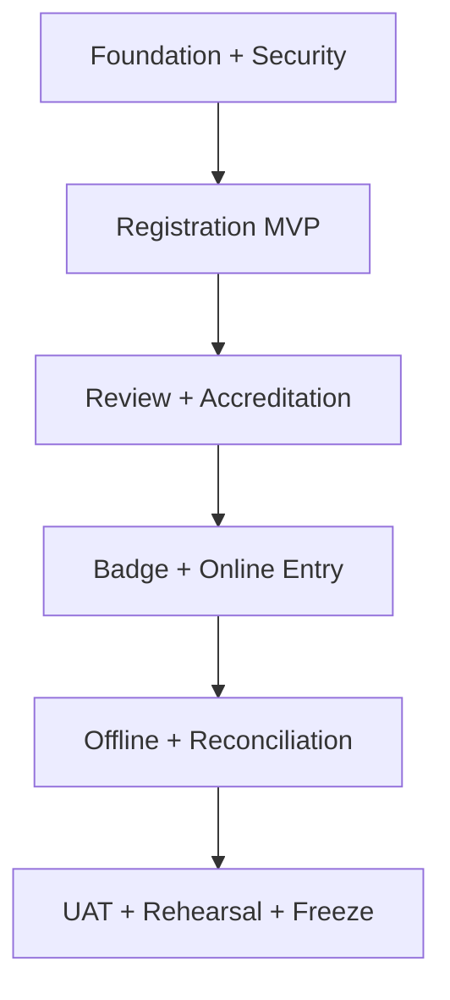
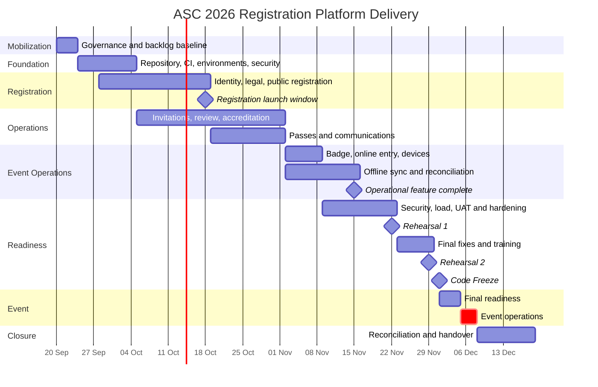
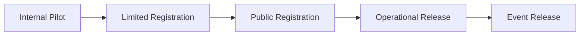

# ASC 2026 Registration Platform

## Implementation Plan

**African Startup Conference 2026**  
**Web Registration, Accreditation, Badge and Entry Management Platform**

> **Document purpose**
>
> Convert the approved product, technical, design, application-flow and data-model specifications into a staged delivery plan with dates, ownership, dependencies, acceptance gates, testing, release, training and event-operation readiness for 5-7 December 2026.

> **Delivery principle**
>
> The team releases a safe Registration MVP early, then completes review, accreditation, badge and entry operations behind controlled gates. Online operation is Plan A; enrolled-device offline continuity is Plan B.

| Attribute | Value |
| --- | --- |
| Document type | Implementation Plan |
| Document identifier | ASC-REG-IMP |
| Status | Final |
| Version | 1.1 |
| Date | September 2026 |
| Planning window | 20 September - 18 December 2026 |
| Event dates | 5-7 December 2026 |
| Product scope | Web platform only |
| Primary stack | Django, PostgreSQL, Django Templates, HTMX, Bootstrap 5 |

---

# 1. Document Control

## 1.1 Authority and audience

| Attribute | Value |
| --- | --- |
| Owner | ASC 2026 Registration Platform Project Team |
| Intended audience | Project leadership, engineering, QA, security, DevOps, registration, badge, entry, support and privacy teams |
| Product authority | ASC Registration Platform PRD |
| Technical authority | ASC Registration Platform TRD |
| Interaction authority | ASC Registration Platform UI/UX Design Specification |
| Flow authority | ASC Registration Platform Application Flow Specification |
| Data authority | ASC Registration Platform Backend Schema and Data Model Specification |

## 1.2 Change control

Material changes to scope, launch dates, security controls, offline continuity or data collection require:

1. impact analysis;
2. named decision owner;
3. change record;
4. updated acceptance criteria;
5. synchronized changes to affected specifications and tests;
6. release and operational impact review.

After Code Freeze, only documented critical fixes may enter Production.

## 1.3 Planning labels

- **Milestone**: a dated outcome.
- **Exit Gate**: evidence required before the next release state.
- **Blocking dependency**: work that prevents safe progression.
- **Feature Flag**: configuration that permits deployment without immediate exposure.
- **Release Candidate**: version that has passed automated checks and is ready for UAT or Production review.

# 2. Delivery Objectives and V1 Scope

## 2.1 V1 objectives

The project will deliver a production-ready web platform that supports:

- universal public and invitation registration;
- passwordless participant access;
- identity verification with manual fallback;
- organization invitations and on-behalf Drafts;
- administrative review and targeted information requests;
- direct authorized decisions and assignments;
- Digital Entry Pass generation and replacement;
- generic badge production, stock and issuance;
- online entry verification;
- enrolled-device PWA offline entry and synchronization;
- trilingual English, French and Arabic operation with RTL;
- operational communications;
- groups, scoped permissions, temporary external security accounts;
- privacy notice, terms, consent evidence and data-subject request support;
- immutable audit and operational reporting.

## 2.2 Deferred beyond V1

- ASC mobile application;
- Apple Wallet and Google Wallet integration;
- automatic or AI-based participant classification;
- strict global anti-passback across disconnected devices;
- mandatory per-item physical badge serialization;
- advanced marketing automation;
- unrestricted organization analytics portals;
- self-service privacy data export;
- complex policy-language authorization;
- Local Event Edge unless rehearsal evidence justifies deployment.

## 2.3 V1 release boundary

# 3. Delivery Assumptions and Principles

## 3.1 Approved assumptions

| Area | Baseline |
| --- | --- |
| Architecture | Django/PostgreSQL modular monolith in one repository |
| Frontend | Django Templates, HTMX and Bootstrap 5 |
| Finder template | Visual and asset reference; necessary components are ported, not used as a React SPA |
| Hosting | Approved Algerian hosting by default |
| Environments | Development, CI, Staging and Production separated |
| Public launch | Registration MVP target window: 12-18 October 2026 |
| Operational completion | Review, Badge, Entry and Offline ready by 15 November 2026 |
| Rehearsals | Full rehearsals by 22 and 29 November 2026 |
| Freeze | 1 December 2026 |
| Event | 5-7 December 2026 |
| Performance | Load test at no less than twice the approved peak forecast |
| Engineering tooling | Tools may accelerate work; human review and tests remain mandatory |

## 3.2 Delivery principles

- Deliver vertical, testable slices rather than disconnected layers.
- Keep Registration launch independent from unfinished event-day features.
- Keep external services behind adapters and provide safe fallback paths.
- Use feature flags for incomplete or high-risk capabilities.
- Make security, privacy and audit part of each feature, not a late phase.
- Do not use Production personal data in Development or generic AI prompts.
- Prefer reversible migrations and releases.
- Protect the event-day critical path from non-essential scope.
- Treat offline behavior as an operational workflow requiring rehearsal, not only a browser feature.

# 4. Governance and Team Model

## 4.1 Required roles

| Role | Main accountability |
| --- | --- |
| Project Sponsor / Product Owner | Scope, priority, launch and business acceptance |
| Technical Lead | Architecture, code quality, security decisions and integration |
| Full-stack Engineer(s) | Django services, templates, HTMX, tests and migrations |
| QA Lead | Test strategy, regression, evidence and release recommendation |
| DevOps / Security Engineer | Environments, CI/CD, monitoring, hardening, backup and incident readiness |
| Registration Operations Lead | Form, review, invitation and support acceptance |
| Badge Operations Lead | Production, stock, transfer and issuance acceptance |
| Entry and Security Lead | Gate workflow, device scope, offline operation and rehearsal |
| Privacy / Legal Representative | Notices, Terms, consent, access and retention review |
| Support and Training Lead | Runbooks, training, escalation and event help desk |

One person may fill multiple roles in a small team. Security review, QA evidence and operational acceptance must still be performed by named responsible people.

## 4.2 Decision ownership

| Decision | Accountable role |
| --- | --- |
| V1 scope and priority | Product Owner |
| Architecture and schema deviation | Technical Lead |
| Production release | Product Owner + Technical Lead + QA Lead |
| Security exception | Technical Lead + Security Engineer |
| Privacy wording and data purpose | Privacy / Legal Representative |
| Entry override policy | Entry and Security Lead |
| Offline go-live | Technical Lead + Entry Lead + QA Lead |
| Local Event Edge go/no-go | Technical Lead + DevOps + Entry Lead |
| Event-day hotfix | Incident Commander + Technical Lead |

## 4.3 RACI summary

| Workstream | Product | Tech | QA | DevOps/Sec | Operations | Privacy |
| --- | --- | --- | --- | --- | --- | --- |
| Registration | A | R | C | C | R | C |
| Identity and documents | C | R | C | C | C | A |
| Review and accreditation | A | R | C | I | R | C |
| Badge and entry | C | R | C | C | A/R | I |
| Offline continuity | I | A/R | R | R | C | I |
| Production deployment | A | R | C | R | I | I |
| Privacy and retention | C | R | C | C | I | A |

`R` = Responsible, `A` = Accountable, `C` = Consulted, `I` = Informed.

# 5. Delivery Method and Engineering Workflow

## 5.1 Iteration model

- Two-week Sprints organize the engineering backlog.
- Weekly integrated demonstrations validate vertical progress.
- Daily short coordination is used during the final three weeks and event operations.
- Exit Gates, not calendar completion alone, authorize public or operational release.
- Critical-path defects take priority over new non-essential features.

## 5.2 Definition of Ready

A task is ready when it has:

- a source requirement or approved decision;
- actor and business outcome;
- acceptance criteria;
- permission and data classification;
- UI state or API boundary where relevant;
- error, retry and audit behavior;
- identified dependencies;
- test approach;
- localization impact.

## 5.3 Definition of Done

A feature is done only when:

- implementation is reviewed;
- migrations are reversible or have an approved recovery plan;
- automated tests pass;
- permission-denial tests exist;
- audit events are verified;
- English, French and Arabic behavior is checked where user-facing;
- accessibility expectations are satisfied;
- observability and support behavior are included;
- documentation and runbooks are updated;
- QA evidence is attached;
- no unresolved critical or high defect remains for the release scope.

## 5.4 Branch and review policy

- Protect the main branch.
- Use short-lived feature branches or an equivalent reviewed workflow.
- Require review before merge.
- Require passing CI checks.
- Prohibit secrets, credentials and Production exports from source control.
- Link each change to a task and acceptance criteria.
- Keep schema and code changes in the same reviewed delivery when they are inseparable.

# 6. Master Timeline and Milestones

## 6.1 Timeline

## 6.2 Milestone register

| ID | Target | Milestone | Required evidence |
| --- | --- | --- | --- |
| M0 | 23 Sep | Delivery baseline approved | Named roles, backlog, repository decision, risk owner |
| M1 | 4 Oct | Foundation ready | CI green, Staging reachable, auth baseline, backup configured |
| M2 | 11 Oct | Registration pilot candidate | Critical public journey and legal evidence pass in Staging |
| M3 | 12-18 Oct | Public registration launch | Launch Gate approved and monitoring active |
| M4 | 1 Nov | Review and accreditation ready | Review, decisions, assignments and pass lifecycle pass UAT |
| M5 | 8 Nov | Badge and online entry ready | Stock and online gate flows pass integrated tests |
| M6 | 15 Nov | Operational feature complete | Offline sync, admin, audit and privacy critical paths pass |
| M7 | 22 Nov | Rehearsal 1 complete | Full scenario evidence and defect list |
| M8 | 29 Nov | Rehearsal 2 complete | No unresolved release-blocking rehearsal defect |
| M9 | 1 Dec | Code Freeze | Release Candidate signed off |
| M10 | 4 Dec | Event readiness | Devices, stock, accounts, monitoring, backup and teams ready |
| M11 | 5-7 Dec | Event operations | Daily readiness and closure evidence |
| M12 | 18 Dec | Post-event handover | Reconciliation, report, archive and lessons learned |

# 7. Phase 0 - Mobilization and Governance

**Dates:** 20-23 September 2026

## 7.1 Work

- Name accountable roles and escalation contacts.
- Create the delivery backlog from the six approved documents.
- Classify features as V1 Required, Conditional or Deferred.
- Confirm the repository, review policy and issue-tracking workflow.
- Confirm the registration-launch target within 12-18 October.
- Establish the capacity-forecast task and owners.
- Register open provider, hosting, legal and hardware decisions.
- Create the initial risk register.

## 7.2 Exit Gate G0

- Named Product Owner and Technical Lead.
- Prioritized critical path.
- No undocumented V1 feature.
- Weekly demonstration calendar.
- Decision deadlines and owners recorded.
- Development may begin without waiting for non-blocking provider choices.

# 8. Phase 1 - Foundation and Infrastructure

**Dates:** 24 September - 4 October 2026

## 8.1 Engineering foundation

- Initialize Django project and modular applications.
- Configure PostgreSQL, Redis, Celery workers/scheduler and protected object storage.
- Implement the custom OperationalUser in the first migration.
- Establish UUID, time, localization, audit and outbox foundations.
- Establish the canonical Public, Internal, Personal, Restricted and Secret classification model with security, audit and temporary handling tags.
- Implement fixed core workflow states and configurable localized labels without permitting arbitrary status transitions.
- Implement environment-based configuration and secret handling.
- Configure structured logs, correlation IDs and health checks.
- Establish the Finder-to-Django component inventory and licensing record.
- Port only the required Bootstrap-compatible visual tokens and layouts.

## 8.2 Environments

| Environment | Purpose | Data rule |
| --- | --- | --- |
| Local Development | Individual coding and unit tests | Synthetic fixtures only |
| CI / Ephemeral | Automated validation | Generated test data |
| Staging | Integrated QA, UAT and rehearsal | Synthetic or approved anonymized data |
| Production | Live processing | Real participant data |

Staging SHOULD match Production versions, storage behavior, background workers and security configuration as closely as practical.

## 8.3 CI/CD baseline

Every change runs:

1. formatting and linting;
2. static checks;
3. unit and integration tests;
4. migration graph and missing-migration checks;
5. security and dependency scans;
6. template and localization checks;
7. build and deployment validation.

Production deployment requires a reviewed Release Candidate and manual release authorization.

## 8.4 Infrastructure Gate G1

- Hosting direction approved and Algerian data location confirmed.
- Staging environment reachable through HTTPS.
- Database backup and restore smoke test succeeds.
- Object storage access is private and signed.
- CI is mandatory on protected branches.
- Monitoring receives application and worker health.
- Secrets are not stored in repository or generic documentation.

# 9. Phase 2 - Identity, Registration and Legal Baseline

**Dates:** 28 September - 18 October 2026

## 9.1 Vertical slices

### Slice REG-01: Participant access

- Email OTP request, verification, throttling and generic anti-enumeration behavior.
- One active ParticipantAccount per Person, multiple verified Contact Points and controlled Person resolution.
- Draft start and resume.
- Session expiry and recovery.

### Slice REG-02: Universal form

- Personal, contact and professional information.
- International and Algerian conditional paths.
- Mobile required for Algerian participants and optional for international participants, with mandatory verified email for self-service.
- Interests and objectives.
- Official profile photo where required.
- Autosave, validation and conflict handling.
- English, French and Arabic with RTL.

### Slice REG-03: Identity verification

- NIN adapter interface.
- Mock service for CI and Staging.
- Conclusive, inconclusive, unavailable and error handling.
- Encrypted identifier storage and blind lookup indexes.
- Passport path with policy-driven identity-page upload.

### Slice REG-04: Legal and submission

- Versioned Privacy Notice and Terms identifying the Ministry of Knowledge Economy, Start-ups and Micro-enterprises as Data Controller and platform operator.
- Requirements traceability for Algerian Law No. 18-07, as amended and supplemented by Law No. 25-11, subject to final legal wording approval.
- Separate optional communications consent.
- Review screen and immutable submission snapshot.
- Registration Reference and submission confirmation.
- Privacy links and official support contact.

### Slice REG-05: Authorized on-site registration

- Reuse the universal form in an assisted operational mode with `source_kind = ON_SITE`.
- Preserve identity, duplicate, legal-notice, permission and audit controls.
- Operate online by default.
- Permit offline creation only through an approved Event Edge; otherwise activate the controlled manual contingency runbook.

## 9.2 Registration Launch Gate G2

- Open and invitation entry points cannot expose role, badge or access selection.
- All required public paths pass trilingual E2E tests.
- Identity-service outage routes to manual review and never automatic rejection.
- Sensitive data is encrypted and masked.
- Core public, internal, decision and Digital Entry Pass statuses remain separate and follow the canonical transition rules.
- The on-site feature can remain disabled until event operations, but its online path and unavailable-state contingency pass Staging tests.
- Submission is idempotent.
- Notice versions and acceptance evidence are correct.
- Email delivery, bounce visibility and support fallback are ready.
- Accessibility review finds no critical blocker.
- Monitoring, error tracking, backup and rollback are active.
- Product, QA and Privacy representatives approve launch.

# 10. Phase 3 - Organizations and Invitations

**Dates:** 5-18 October 2026

## 10.1 Work packages

- Organization master records and aliases.
- Invitation Campaign lifecycle and opaque reusable links.
- Link rotation, suspension, close and expiry.
- Source Organization distinct from Professional Organization.
- On-behalf Unclaimed Draft creation and participant claim.
- Delegation CSV validation, preview and per-row result.
- Explicit Organization membership and limited data scope.
- Capacity handling using transactional reservation where enabled.

## 10.2 Exit Gate G3

- Invitation cannot assign role, badge, access or approval.
- Link usage does not grant organization workspace access.
- Multiple valid contexts for one Person remain separate.
- CSV cannot contain decisions, documents or assignments.
- Rotation invalidates the old link without breaking existing Registrations.
- Organization users cannot query unrelated records.

# 11. Phase 4 - Review, Decisions and Accreditation

**Dates:** 12 October - 1 November 2026

## 11.1 Review packages

- Intake queues and scoped assignment.
- Review checklist and concurrency indicator.
- Identity evidence view with restricted document access.
- Duplicate-case resolution without automatic merge.
- Targeted Additional Information Request and participant response.
- Approved and Not Approved decisions with separate internal/public reasons.
- Reopen, withdrawal and cancellation history.

## 11.2 Accreditation packages

- Participant Role configuration and assignment.
- Badge Type configuration and assignment.
- Access Profile, Zone and Gate rules.
- Direct authorized actions without secondary approval chains.
- Context-specific replacement and revocation.
- Controlled bulk assignment with preview and per-item result.

## 11.3 Exit Gate G4

- Permission tests prove each action is independently controlled.
- One Person can hold different valid assignments through different Registrations.
- Review and decisions preserve history.
- Bulk approval and bulk Not Approved are unavailable in V1.
- Qualification status is derived correctly.
- Audit evidence exists for document access, decision and assignment.

# 12. Phase 5 - Digital Pass and Communications

**Dates:** 19 October - 1 November 2026

## 12.1 Digital Entry Pass

- Signed PII-free payload and key-ID handling.
- Ready, Active, Replaced, Revoked and Expired states.
- Context-specific replacement and revocation.
- Participant web display and secure printable PDF download.
- Offline validation test vectors.
- Key rotation and previous-version validation behavior.

## 12.2 Communications

- Versioned templates in English, French and Arabic.
- Approved variable catalogue.
- Email provider adapter and delivery status ingestion.
- SMS adapter boundary, enabled only after provider readiness.
- Idempotent operational messages.
- Retry, suppression, bounce and manual resend.
- Restricted bulk messaging with preview and test delivery.

## 12.3 Exit Gate G5

- QR contains no direct personal data.
- Private signing keys are external to application tables and repository.
- Old pass versions reject correctly after replacement.
- Participant sees only the current pass.
- OTP values never enter logs or stored message bodies.
- Decision messages do not expose internal reasons.
- Failed provider delivery is visible to support.

# 13. Phase 6 - Badge Production and Stock

**Dates:** 2-8 November 2026

## 13.1 Work packages

- Badge Type artwork version and production quantity estimate.
- Print Batch lifecycle.
- Central and checkpoint Stock Locations.
- Append-only stock ledger.
- Receive, transfer, issue, return, damage, adjustment and reconciliation.
- Context-specific issuance and replacement.
- Quantity balance projection and discrepancy alerts.
- Offline issuance operation contract.

## 13.2 Operational preparation

- Confirm badge artwork and production supplier process.
- Confirm operational buffer by Badge Type.
- Define stock locations and named custodians.
- Produce reconciliation forms and runbook.
- Confirm that physical badges are produced before the event.
- Do not plan normal gate printing.

## 13.3 Exit Gate G6

- Ledger reconstructs every location balance.
- Concurrent issuance cannot overspend stock.
- Wrong Badge Type is never substituted automatically.
- Replacement links prior issuance.
- Offline operation is idempotent after synchronization.
- Badge and security teams agree that the generic badge is not primary identity proof.

# 14. Phase 7 - Online Entry

**Dates:** 2-8 November 2026

## 14.1 Work packages

- Device enrollment and checkpoint scope.
- QR camera/scanner workflow.
- NIN, passport, Registration Reference and restricted manual lookup.
- Multiple-context selection.
- Profile-photo identity comparison.
- Allowed, advisory, manual-review and denied results.
- Explicit Admit, Do Not Admit and Redirect decisions.
- Re-entry advisory and configurable rules.
- Authorized override and restricted manual desk.
- Entry and optional Exit event schema.

## 14.2 Online Entry Gate G7

- A generic physical badge alone cannot authorize entry.
- Old, revoked, wrong-event and wrong-zone passes behave correctly.
- Manual search reveals minimum data and is audited.
- Entry Event writes only after explicit operator decision.
- Repeated technical requests do not create duplicate events.
- Entry latency passes the provisional target under approved load.
- Entry operators cannot open documents or exports.

# 15. Phase 8 - Offline Entry and Synchronization

**Dates:** 2-15 November 2026

## 15.1 PWA continuity packages

- Service worker and approved asset cache.
- Enrolled-device local secure store.
- Signed and encrypted Offline Event Package.
- Package Fresh, Aging, Stale and Expired behavior.
- Offline QR validation.
- Protected local NIN/passport lookup index where checkpoint policy permits.
- Durable operation queue with unique operation IDs.
- Reconnection, upload, deduplication and delta refresh.
- Conflict and reconciliation workspace.
- Device suspend, revoke, expiry and wipe request.

## 15.2 Required failure scenarios

- Internet fails before scan.
- Internet fails during an admission operation.
- Connection repeatedly switches online/offline.
- Pass was revoked after the device's last synchronization.
- Same operation uploads more than once.
- Two disconnected devices admit the same pass.
- Device clock is inaccurate.
- Package is Stale or Expired.
- User session grace period expires.
- Device is reported lost.
- Local storage quota or browser update affects cached data.

## 15.3 Offline Gate G8

- No new operational login is possible offline.
- Package is device-bound, scoped, encrypted and expiring.
- Documents and broad contact data are absent.
- Offline decision and package knowledge version are preserved.
- Synchronization is idempotent.
- Conflict never erases the physical fact.
- Reconciliation has named ownership and closure evidence.
- Entry team completes a supervised no-internet exercise.

## 15.4 Local Event Edge decision

The Edge implementation is authorized only if one or more conditions apply:

- external internet reliability is below the accepted operational level;
- expected disconnected-device concurrency creates unacceptable anti-passback risk;
- rehearsal shows synchronization or throughput limitations;
- the venue can support and operate the required local network and server safely.

Otherwise, the tested PWA offline model remains the V1 fallback.

# 16. Phase 9 - Administration, Audit and Privacy

**Dates:** 24 September - 15 November 2026, delivered incrementally

## 16.1 Administration

- Operational users and MFA.
- Django Groups and atomic Permissions.
- Scoped Group memberships.
- Time-bound external security accounts.
- Event Edition, Venue, Zone, Gate and reference configuration.
- Device and Offline Package administration.
- Controlled export and short-lived download.

## 16.2 Audit and privacy

- Append-only AuditEvent catalogue.
- Sensitive search, document access, export and override events.
- Data-subject request register.
- Retention Policy configuration without fixed durations.
- Legal Hold enforcement.
- Purge and anonymization dry-run tooling.
- Versioned legal notices and acceptance evidence.

## 16.3 Exit Gate G9

- Navigation and server permission decisions match.
- External users are limited by event, gate and active dates.
- No privileged action is available only because a button is hidden.
- Export excludes restricted fields by default and expires.
- Audit content contains no OTP, secret or full identifier.
- Legal Hold blocks test purge.
- Privacy representative validates notices, purpose and contact details.

# 17. Security, Performance and Reliability Program

## 17.1 Security work

- Threat model public registration, operational access, QR, documents, exports and offline storage.
- Review OWASP web risks and Django security configuration.
- Validate CSRF, session, cookie, CORS and trusted-host settings.
- Enforce MFA and rate limits.
- Scan dependencies and container images where used.
- Scan repository and deployment configuration for secrets.
- Test horizontal and vertical permission escalation.
- Test malicious upload, MIME mismatch and malware workflow.
- Test QR tampering and old-version replay.
- Verify audit immutability and redaction.

## 17.2 Capacity baseline

Phase 0 creates a signed Capacity Baseline containing:

- expected total Registrations;
- public peak concurrent users;
- submission peak per minute;
- number of Gates and devices;
- expected scans per minute per Gate;
- maximum disconnected duration;
- badge quantities and checkpoint stock;
- email and SMS peak volume;
- report and export expectations.

The final load suite tests at least twice the approved peak forecast, including background tasks and database contention.

## 17.3 Provisional performance objectives

These values are validated against infrastructure and may be tightened after measurement:

| Journey | Provisional objective |
| --- | --- |
| Normal public and back-office page | p95 under 2 seconds, excluding external service latency |
| Online QR decision | p95 under 1.5 seconds after successful scan |
| Draft autosave | No user-visible blocking; durable confirmation within normal request target |
| Offline QR decision | Local response suitable for continuous gate operation |
| Reconnection sync | Background operation without blocking new scans |

## 17.4 Reliability work

- Automated database backup.
- Tested point-in-time or equivalent recovery where supported.
- Object-storage recovery and retention controls.
- Worker retry and dead-letter visibility.
- Health checks for web, database, queue, email/SMS adapter and object storage.
- Alert thresholds for error rate, latency, queue growth, disk/storage, failed backups and device sync age.
- Restore rehearsal before Code Freeze.

# 18. Test Strategy

## 18.1 Test layers

| Layer | Required evidence |
| --- | --- |
| Unit | Domain rules, state transitions, permission predicates and validators |
| Model / migration | Constraints, partial indexes, forward and recovery behavior |
| Integration | PostgreSQL transactions, object storage, providers and outbox |
| Contract | NIN, email, SMS and optional SSO adapters |
| E2E | Critical participant, reviewer, badge, entry and privacy journeys |
| Security | Authentication, authorization, uploads, QR, rate limits and exports |
| Localization | English, French, Arabic, RTL, content length and date behavior |
| Accessibility | Keyboard, focus, labels, errors, contrast and screen-reader-critical paths |
| Performance | Public, review, pass, entry, sync, message and reporting workload |
| Resilience | Provider outage, queue failure, internet loss, database fail/recovery and device loss |
| Operational | Rehearsal with real roles, devices, stock and escalation |

## 18.2 Critical E2E scenarios

1. Open Registration from OTP to submission.
2. Organization invitation with source association.
3. On-behalf Draft claimed and submitted by participant.
4. Authorized on-site registration online, plus cloud-unavailable contingency without Event Edge.
5. NIN service unavailable with manual-review continuation.
6. International passport path with conditional document request and optional international mobile.
7. Same Person with two valid Registration Contexts and different badges.
8. Additional Information Request and response.
9. Approval, separate role/badge/access assignment and pass activation.
10. Pass replacement and rejection of old version.
11. Generic badge stock transfer, issuance and reconciliation.
12. Online QR admission and re-entry advisory.
13. Offline admission, reconnect, duplicate upload and conflict.
14. Temporary external security account expiry.
15. Controlled export and expiry.
16. Privacy request and Legal Hold behavior.

## 18.3 Defect severity

| Severity | Meaning | Release treatment |
| --- | --- | --- |
| Critical | Data exposure/loss, unsafe admission, unrecoverable outage | Blocks release and event readiness |
| High | Critical journey unavailable or incorrect without safe workaround | Blocks affected gate |
| Medium | Limited defect with safe workaround | Requires owner and scheduled fix |
| Low | Cosmetic or non-critical improvement | May defer |

Global test coverage percentage is not the acceptance goal. Critical domain and permission behavior must have direct tests regardless of aggregate percentage.

# 19. UAT, Training and Operational Rehearsals

## 19.1 UAT groups

- Registration operators.
- Review and accreditation users.
- Organization invitation managers.
- Badge production and stock team.
- Entry operators and supervisors.
- External security representatives.
- Privacy and support representatives.

## 19.2 Training packages

Each role receives:

- role-specific quick guide;
- permitted and prohibited actions;
- normal workflow;
- exception and escalation path;
- offline behavior where relevant;
- privacy and device-handling rules;
- short practical exercise;
- support contact and incident channel.

## 19.3 Rehearsal 1 - 22 November

Scope:

- end-to-end participant creation;
- authorized on-site registration and cloud-unavailable contingency;
- review and assignment;
- pass display and scanning;
- badge stock allocation and issuance;
- online Gate operation;
- simulated internet outage;
- reconnect and reconciliation;
- security restriction and override;
- support and incident escalation.

Output: timestamped evidence, throughput measurements, defects, runbook corrections and Edge go/no-go recommendation.

## 19.4 Rehearsal 2 - 29 November

The second rehearsal uses the intended Production release, near-final venue topology, enrolled devices, final user groups, representative stock and operational shifts.

Exit conditions:

- no unresolved Critical or High rehearsal defect;
- entry throughput accepted;
- offline continuity accepted;
- operators demonstrate assigned tasks;
- backup contacts and escalation work;
- device, network, power and spare-equipment lists are complete;
- final Event Edge decision recorded.

# 20. Hardware and Venue Readiness

## 20.1 Required categories

- supported laptops, tablets or devices for checkpoints;
- camera or QR scanners compatible with the selected browser;
- secure device stands and charging equipment;
- spare devices and chargers;
- venue Wi-Fi and wired connectivity where available;
- controlled operational LAN if Event Edge is approved;
- UPS or backup power for critical network and operational equipment;
- central and checkpoint badge stock containers;
- secure storage for restricted operational devices;
- supervisor devices for exception handling.

## 20.2 Procurement and readiness dates

| Target | Requirement |
| --- | --- |
| 1 Nov | Device and network quantities approved |
| 8 Nov | Primary hardware available for integration testing |
| 15 Nov | Venue connectivity test and offline fallback equipment available |
| 22 Nov | Devices enrolled for Rehearsal 1 |
| 29 Nov | Final and spare devices enrolled for Rehearsal 2 |
| 4 Dec | Charged, updated, scoped and assigned to named teams |

Physical badges are pre-produced. Normal entrance operations do not depend on badge printers.

# 21. Release and Deployment Plan

## 21.1 Release stages

## 21.2 Production release checklist

- Release scope and known issues approved.
- CI green on immutable release commit.
- Database migration plan reviewed.
- Backup completed and restore path known.
- Configuration and secrets validated.
- Feature Flags set explicitly.
- Provider and integration health checked.
- Monitoring dashboards and alerts active.
- Rollback owner named.
- Release Notes and support notice ready.
- Post-deployment smoke test assigned.

## 21.3 Migration strategy

- Prefer additive migrations.
- Use expand, migrate and contract for risky structural changes.
- Avoid long table locks during active registration.
- Test migrations against production-scale synthetic data.
- Do not combine unrelated schema changes.
- No destructive migration after 15 November without explicit critical approval.
- No routine schema change during the event.

## 21.4 Code Freeze

From 1 December:

- no new feature enters the Event Release;
- configuration changes use reviewed Event settings or Feature Flags;
- fixes require defect evidence, risk review and rollback plan;
- critical fixes pass targeted automated and manual regression;
- Emergency Release Notes are mandatory.

# 22. Event Operations Plan

## 22.1 Command structure

| Role | Responsibility |
| --- | --- |
| Incident Commander | Overall operational decision and escalation |
| Technical Lead on duty | Technical triage and release decision |
| DevOps on duty | Infrastructure, monitoring and recovery |
| Entry Operations Lead | Gates, devices, staff and manual review desk |
| Badge Operations Lead | Stock, issuance and reconciliation |
| Registration Support Lead | Participant and review support |
| Security Contact | Restrictions, overrides and physical escalation |
| Privacy Contact | Data incident and privacy escalation |

## 22.2 Daily pre-opening checklist

- Production and provider health green.
- Latest backup successful.
- Monitoring and incident channel active.
- Gates, Zones and device scopes confirmed.
- Devices charged, time-synchronized and updated.
- Offline Packages Fresh.
- Test QR succeeds online and offline.
- Checkpoint stock counted and assigned.
- Temporary accounts active for correct shift.
- Manual review desk ready.
- Spare devices, network and power available.

## 22.3 During operations

- Monitor latency, error rate, queue depth, provider state and sync age.
- Monitor entry volume and denial/advisory patterns by Gate.
- Keep incident decisions in the operational log.
- Use offline mode only when qualified; do not improvise new devices.
- Route identity exceptions to the manual desk.
- Reconcile stock at shift boundaries.
- Escalate suspected security or privacy incidents immediately.

## 22.4 Daily closure

- Confirm all devices synchronized or record exceptions.
- Reconcile Entry Events and conflicts.
- Reconcile badge stock and issuance.
- Close or hand over open incidents.
- Expire shift accounts where applicable.
- Capture operational metrics and lessons for the next day.
- Confirm backup and overnight monitoring.

# 23. Incident and Runbook Catalogue

Required runbooks:

1. NIN service unavailable.
2. Email or SMS provider outage.
3. Public registration traffic spike.
4. Database or web service outage.
5. Background queue backlog.
6. Object storage or document upload outage.
7. QR signing or key-reference incident.
8. Pass replacement or emergency revocation.
9. Venue internet outage and Offline Mode activation.
10. Device lost, stolen or compromised.
11. Offline synchronization conflict.
12. Badge stock discrepancy or shortage.
13. Security restriction and override escalation.
14. Suspected personal-data incident.
15. Backup restore and disaster recovery.
16. Emergency release and rollback.

Each runbook identifies trigger, authority, safe actions, prohibited actions, communication, evidence and recovery completion.

# 24. Engineering Tooling Rules

## 24.1 Permitted assistance

Development tools, including code-generation tools, may assist with:

- breaking approved requirements into engineering tasks;
- scaffolding Django models, services, forms and tests;
- porting selected Finder layouts to Django Templates and HTMX;
- reviewing code for consistency with specifications;
- generating synthetic fixtures and test scenarios;
- explaining migration and debugging options;
- drafting technical documentation and runbooks.

## 24.2 Task description

Every delegated engineering task SHOULD include:

- exact objective;
- relevant specification sections;
- affected Django applications and models;
- acceptance criteria;
- security and privacy constraints;
- expected tests;
- files allowed to change;
- non-goals;
- required English-only code and documentation.

## 24.3 Safety and review rules

- Never provide Production secrets, tokens or personal data to any tool.
- Use synthetic examples.
- Inspect every generated diff.
- Run tests and migration checks locally or in CI.
- Do not permit any automated tool to deploy directly to Production.
- Do not accept generated authorization or cryptography without expert review.
- Keep final architecture and operational decisions under human ownership.
- Update the source specifications when an approved implementation decision changes them.

# 25. Risk Register

| ID | Risk | Impact | Mitigation | Owner |
| --- | --- | --- | --- | --- |
| R-01 | Registration launch delay | Reduced registration window | Vertical MVP, strict gate, defer non-critical features | Product + Tech |
| R-02 | Hosting decision delay | Blocks Staging/Production | Decision deadline in Phase 1; provider-neutral automation | Sponsor + DevOps |
| R-03 | NIN service unavailable | Identity verification blocked | Adapter, mock and manual review fallback | Tech + Registration |
| R-04 | Email/SMS delivery failure | OTP or action message unavailable | Provider monitoring, retry, alternate verified channel | Tech + Support |
| R-05 | Scope growth | Critical path slips | V1 boundary, change control, Feature Flags | Product |
| R-06 | Small team overload | Quality and schedule risk | Role clarity, daily critical-path review, defer low-value work | Product + Tech |
| R-07 | Finder React port complexity | UI delay | Port only needed Bootstrap-compatible patterns | Frontend Lead |
| R-08 | Localization late defects | Public and operational failure | Trilingual tests from first vertical slice | QA |
| R-09 | Permission error | Data exposure or unauthorized action | Permission matrix and negative tests | Tech + Security |
| R-10 | Event connectivity failure | Entry disruption | PWA offline package, rehearsal and optional Edge | DevOps + Entry |
| R-11 | Offline conflict volume | Manual reconciliation overload | Fresh packages, sync monitoring and clear ownership | Entry Lead |
| R-12 | Peak load exceeds forecast | Slow registration or entry | Capacity baseline, 2x load test, scaling runbook | DevOps |
| R-13 | Badge stock discrepancy | Incorrect issuance or shortage | Append-only ledger, custodians and shift reconciliation | Badge Lead |
| R-14 | Device loss | Offline data exposure | Encryption, expiry, revoke, wipe request and inventory | Security |
| R-15 | Late critical defect | Freeze instability | Two rehearsals, rollback, emergency policy | QA + Tech |
| R-16 | Personal-data incident | Legal and reputational impact | Minimization, encryption, audit and incident runbook | Privacy + Security |

Risks are reviewed weekly, then daily from 22 November through event closure.

# 26. Deliverable Register

| Category | Required deliverables |
| --- | --- |
| Source | Reviewed repository, dependency lock files and licenses |
| Database | Django migrations, constraints, indexes, seed configuration and recovery notes |
| Application | Public, participant, organization, operations and entry web spaces |
| Tests | Unit, integration, E2E, security, load, offline and rehearsal suites/evidence |
| Infrastructure | Environment configuration, deployment automation, backup and monitoring |
| Security | Threat model, scan results, permission matrix and exceptions |
| Privacy | Notice versions, Terms, consent rules, DSR process and retention configuration |
| Operations | Runbooks, contact tree, Event checklist, device and stock procedures |
| Training | Role guides, exercises, attendance and acceptance evidence |
| Release | Release Notes, migration plan, rollback plan and approval record |
| Handover | Architecture summary, admin guide, post-event report and open backlog |

# 27. Readiness Gates Summary

| Gate | Latest target | Release-blocking evidence |
| --- | --- | --- |
| G0 Mobilization | 23 Sep | Named owners, approved V1, backlog and risks |
| G1 Foundation | 4 Oct | CI, Staging, security baseline, backup and monitoring |
| G2 Registration Launch | 12-18 Oct | Trilingual E2E, legal, identity fallback, email and rollback |
| G3 Invitations | 18 Oct | Source integrity, organization isolation and CSV safety |
| G4 Review/Accreditation | 1 Nov | Permission, history, multi-context and audit tests |
| G5 Pass/Communications | 1 Nov | PII-free QR, replacement and delivery evidence |
| G6 Badge | 8 Nov | Ledger, concurrency, issuance and reconciliation |
| G7 Online Entry | 8 Nov | Correct results, minimal data and throughput |
| G8 Offline | 15 Nov | Qualified package, idempotent sync and no-internet exercise |
| G9 Admin/Privacy | 15 Nov | Scoped access, audit, export and Legal Hold |
| G10 Rehearsal 1 | 22 Nov | End-to-end evidence and owned defect plan |
| G11 Rehearsal 2 | 29 Nov | No Critical/High blocker and final operational acceptance |
| G12 Code Freeze | 1 Dec | Signed Release Candidate and rollback readiness |
| G13 Event Ready | 4 Dec | Devices, stock, teams, providers, backup and monitoring |

# 28. Post-Event Closure

**Dates:** 8-18 December 2026

Required actions:

- synchronize every device and resolve exceptions;
- close reconciliation cases;
- reconcile badge stock;
- revoke or expire temporary accounts and device scopes;
- remove or expire Offline Packages;
- close Invitation Campaigns;
- complete backup and archive checks;
- produce final registration, badge, entry, delivery and incident reports;
- register privacy or security follow-up actions;
- review retention and purge schedules without executing unapproved deletion;
- hold a lessons-learned session;
- classify deferred backlog for the next edition;
- complete operational and technical handover.

# 29. Open Decisions and Decision Deadlines

| ID | Decision | Target deadline | Default if unresolved |
| --- | --- | --- | --- |
| OD-IMP-01 | Named team and role allocation | 23 Sep | Escalate schedule risk; protect critical path |
| OD-IMP-02 | Exact Registration launch day | 4 Oct | Use 18 Oct as latest target |
| OD-IMP-03 | Hosting provider and Production topology | 30 Sep | Use approved provider-neutral Staging; block public launch without legal hosting confirmation |
| OD-IMP-04 | Capacity forecast | 4 Oct | Use conservative test data; no final performance sign-off |
| OD-IMP-05 | Email provider | 4 Oct | Public launch blocked if verified email cannot be delivered reliably |
| OD-IMP-06 | SMS provider and scope | 18 Oct | Email remains primary; SMS feature disabled |
| OD-IMP-07 | Operational SSO readiness | 1 Nov | Secure local accounts with MFA |
| OD-IMP-08 | Final legal wording and privacy contact | 4 Oct | Public launch blocked |
| OD-IMP-10 | Badge artwork and production quantities | 1 Nov | Escalate production risk |
| OD-IMP-11 | Gate, device and hardware quantities | 1 Nov | Cannot approve final capacity or procurement |
| OD-IMP-12 | Local Event Edge | 23 Nov after Rehearsal 1 | PWA offline fallback only |
| OD-IMP-13 | Retention durations | Post-event policy milestone | Keep data restricted; do not purge without approval |

# 30. Final Acceptance

The project is ready for event use only when:

1. all critical V1 Exit Gates are approved;
2. Registration, review, badge, entry and offline flows have current evidence;
3. no unresolved Critical or High release defect remains;
4. Production backup and restore readiness are proven;
5. device, network, power and stock readiness are confirmed;
6. operational users are trained and scoped;
7. privacy and security contacts are active;
8. runbooks and escalation channels are tested;
9. the Event Release and rollback plan are signed off;
10. the final daily readiness check succeeds before gates open.

---

**End of Implementation Plan**
